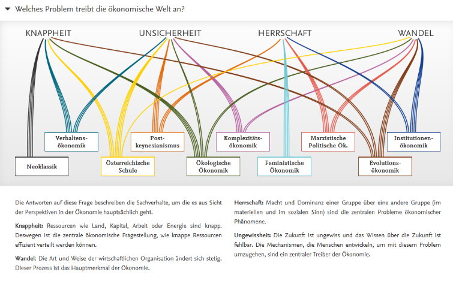

::: {.callout-note .leitfrage}
### Leitfrage

Was ist eigentlich Ökonomie – und weshalb gibt es so unterschiedliche Vorstellungen davon, was als „ökonomisch“ gilt und wie wirtschaftliches Handeln gedacht werden sollte?
:::


## Was ist Ökonomie?


*↗ Lehrbuchkapitel 1 und 2*


Der Begriff der Ökonomie ist in unserem Alltag allgegenwärtig. Ökonomische Themen nehmen beispielsweise in Zeitungen, unseren alltäglichen Diskussionen, in politischen Debatten sowie in den sozialen Medien einen prominenten Platz ein. Und in der Tagesschau werden Themen verschiedentlich von Ökonom\*innen aus einer *ökonomischen Perspektive* eingeordnet. Aber was ist genau diese ökonomische Perspektive? Es erscheint schnell der Eindruck, dass alle genau wissen, was mit dieser ökonomischen Perspektive gemeint ist. Intuitiv verbinden wir diese häufig mit Begriffen wie Märkten, Preisen und Finanzwirtschaft. Tatsächlich ist jedoch weder in der Geschichte des Begriffs noch in der Gegenwart abschliessend geklärt, was mit Ökonomie und somit dem Gegenstandsbereich der Volkswirtschaftslehre gemeint ist. Da Volkswirtschaftslehre eine Sozialwissenschaft ist, haben wir es nicht mit Naturgesetzen zu tun, die wir entdecken und beschreiben**. Vielmehr gibt es verschiedene Perspektiven und Theorien, wie wir auf bestimmte Fragestellungen schauen können**. In diesem Zusammenhang sprechen wir von ökonomischen Denkschulen, die sich in ihrem Ökonomieverständnis unterscheiden. Die Unterscheidung ist nie eindeutig, da es zwischen den Denkschulen immer auch wieder Überschneidungen gibt und es auch immer wieder Unterschiede innerhalb der Denkschulen gibt. So hängt, was unter Ökonomie verstanden wird, stark mit der Perspektive zusammen, die wir einnehmen. Die Debatte zwischen ökonomische Denkschulen ist folglich ein ständiger gesellschaftlicher und wissenschaftlicher Aushandlungsprozess. Entsprechend existierten und existieren auch unterschiedliche Definitionen der Volkswirtschaftslehre und deren Gegenstandsbereichs, also mit was sich die *Volkswirtschaftslehre* genau auseinandersetzt.


Bevor wir uns im nächsten Kapitel mit dem Gegenstand der Ökonomie sowie zentralen Begriffen und Konzepten auseinandersetzen, überblicken wir kurz verschiedene Verständnisse der Ökonomie in der Geschichte und der Gegenwart. Denn um sich selbst in diesem Aushandlungsprozess zum Gegenstandsbereich der Ökonomie orientieren zu können, scheint es uns zentral, einen groben Überblick über die verschiedenen Verständnisse von Ökonomie und deren Gegenstandsbereich zu haben.


::: {.callout-tip collapse="true"}
### Exkurs: Volkswirtschaft als eine Disziplin der Wirtschaftswissenschaften

Die Wirtschaftswissenschaften lassen sich in zwei Bereiche unterteilen: die Betriebswirtschaftslehre (BWL) und die Volkswirtschaftslehre (VWL).

![Abbildung 1: Disziplinäre Verortung der Wirtschaftswissenschaften [@engelkampEinfuehrungVolkswirtschaftslehre2013, p. 3]](images/abb1.png)


**Die Betriebswirtschaftslehre** „ist die Lehre von den wirtschaftlichen, organisatorischen, technischen sowie finanziellen Abläufen in Unternehmen und den unterschiedlichen wirtschaftlichen Institutionen“ [@friedliBetriebswirtschaftslehreZusammenhangeVerstehen2019, p. 16]. Darin entwickeln Forschende eine einzelwirtschaftliche Perspektive auf den jeweiligen Untersuchungsgegenstand.

**Die Volkswirtschaftslehre** untersucht dagegen nicht das Geschehen innerhalb einzelner wirtschaftlicher Akteur\*innen, sondern das Zusammenspiel zwischen ihnen - also eine gesamtwirtschaftliche Perspektive. Mit dieser Perspektive beschäftigt sich dieser Kurs.

Die Volkswirtschaftslehre lässt sich in **drei grössere Teilbereiche** einteilen:

**Wirtschaftstheorie**: beschreibt ökonomische Theorien und deren Implikationen. Sie unterteilt sich in die **Mikroökonomie** (Verhalten einzelner Haushalte und Unternehmen sowie deren Abstimmung über Märkte und Preise). Sie trifft keine Aussagen zu aggregierten Wirtschaftszusammenhängen, sondern untersucht das Verhalten einzelner Unternehmen und Haushalte sowie deren Abstimmungsprozess über den Markt mithilfe von Preisanpassungen [@bontrupVolkswirtschaftslehreAusOrthodoxer2021a, p. 1]. Im Gegensatz dazu befasst sich die **Makroökonomie** mit gesamtwirtschaftlichen Phänomenen und Zusammenhängen von Wirtschaftssektoren und verschiedenen Märkten. Beispielsweise werden übergeordnete wirtschaftliche Indikatoren wie die Arbeitslosenquote oder die Teuerung untersucht.

**Wirtschaftspolitik**: befasst sich mit staatlichen Eingriffen in die Wirtschaft zur Steigerung der gesellschaftlichen Wohlfahrt [@bontrupVolkswirtschaftslehreAusOrthodoxer2021a, p. 2], etwa durch Interventionen wie Kartellverbote oder Einführung von Mindestlöhnen.

Die **Finanzwissenschaft** untersucht die verschiedenen Komponenten des Staatshaushalts wie Steuern oder Subventionen und deren gegenseitige Beziehung. Dadurch werden hier implizit Fragen zur Rolle des Staates in der Ressourcenallokation und der Einkommens- und Vermögensverteilung untersucht.

:::


### Ökonomieverständnisse in der Geschichte[^1]

[^1]: Dieser kurze Überblick basiert zu Teilen auf [@bauerleGrundfragenOkonomie2026]. 

Der Begriff Ökonomie taucht das erste Mal in der westlichen Geistesgeschichte in der griechischen Antike als Lehre der Haushaltsführung auf. Ökonomie setzt sich dabei aus zwei Begriffen zusammen: *oikos* (Haus) und *nemein* (ordnen). Ökonomie befasste sich in dem Verständnis unter anderem mit Fragen von der Verwaltung des eigenen Besitzes, der Planung und Beurteilung landwirtschaftlicher Tätigkeiten, der Auswahl von Sklav\*innen, dem Verhältnis von Mann und Frau. Dabei war die Ökonomie stark in Politik und Ethik eingebettet und sollte zur Stärkung der *polis*, des Stadtstaates, beitragen. Als ultimatives Ziel stand das glückliche Leben, *eudaimonia*. Ganz im Gegensatz zur Ökonomie stand hingegen die sogenannte Chrematistik, welche statt des glücklichen Lebens die Geldvermehrung anstrebte und in der griechischen Antike abgelehnt wurde.


Im europäischen Mittelalter blieb das Verständnis von Ökonomie zunächst eng mit moralischen und religiösen Vorstellungen verbunden. Wirtschaftliches Handeln wurde nicht als eigenständiger gesellschaftlicher Bereich verstanden, sondern war Teil einer göttlichen und sittlichen Ordnung. Ziel wirtschaftlicher Tätigkeit war nicht die möglichst unbegrenzte Vermehrung von Wohlstand, sondern die Sicherung des Lebensunterhalts und das Gemeinwohl. Stark geprägt wurde dieses Verständnis durch die Scholastik, insbesondere durch Thomas von Aquin (c. 1225 – 1274). Im Mittelpunkt standen Fragen nach einem gerechten Preis (*iustum pretium*), einem gerechten Lohn sowie der moralischen Legitimität wirtschaftlicher Aktivitäten. Handel wurde grundsätzlich akzeptiert, sofern er dem Austausch notwendiger Güter diente. Dagegen galt die Erzielung von Gewinnen allein um ihrer selbst willen als problematisch. Besonders kritisch wurde das Erheben von Zinsen beurteilt, da Geld selbst als unproduktiv angesehen wurde und nicht zur Geldvermehrung dienen sollte. Die Wirtschaft war damit stark in ethische und gesellschaftliche Normen eingebettet.


Erst mit der Entstehung des modernen Kapitalismus, der Ausweitung des Handels und der Industrialisierung begann sich dies zu ändern und sich ein Verständnis von Wirtschaft als eigenständigem gesellschaftlichem Bereich allmählich zu etablieren. Mit dem Aufstieg des Handelskapitalismus und der Industriellen Revolution entstand im 18. Jahrhundert die klassische politische Ökonomie. Vertreter wie Adam Smith (1723-1790), David Ricardo (1772-1823) oder später Karl Marx (1818-1883) interessierten sich weniger für die Verwaltung einzelner Haushalte als für die Entstehung, Verteilung und Entwicklung des gesellschaftlichen Reichtums ganzer Volkswirtschaften. Der Gegenstandsbereich der Ökonomie verschob sich damit von der Haushaltsführung zur Analyse der Produktion, Verteilung und Akkumulation von Wohlstand. Im Mittelpunkt standen Fragen wie: Wie entsteht wirtschaftlicher Wohlstand? Wie verteilt sich das gesellschaftliche Einkommen zwischen Arbeit, Kapital und Boden? Im Mittelpunkt der Analysen standen gesellschaftliche Klassen – etwa Arbeiter\*innen, Kapitalbesitzer\*innen und Grundeigentümer\*innen – sowie ihre Beziehungen zueinander. Wirtschaft wurde als gesellschaftlicher Prozess verstanden, dessen Entwicklung durch Institutionen, Eigentumsverhältnisse und die Verteilung des gesellschaftlichen Überschusses geprägt wird.


Gegen Ende des 19. Jahrhunderts veränderte die sogenannte marginalistische Revolution das Verständnis gewisser Teile der Volkswirtschaftslehre grundlegend. Die Arbeiten von Vertretern dieser neuen Strömung, wie bspw. William Stanley Jevons (1835-1882), Carl Menger (1840-1921) und Léon Walras (1834-1990), bildete die Grundlage für die Entstehung der neoklassischen Ökonomik. Im Zentrum dieser neuen Perspektive stand nicht länger die Produktion gesellschaftlichen Reichtums, sondern das mit Entscheidungsfähigkeit ausgestattete Individuum. Ausgangspunkt der Analyse waren nun Haushalte und Unternehmen, die auf Märkten unter Bedingungen knapper Ressourcen rationale Entscheidungen treffen und ihren Nutzen beziehungsweise Gewinn maximieren. Die Volkswirtschaft wurde als Ergebnis der Entscheidungen vieler einzelner Wirtschaftssubjekte verstanden. Diese Veränderung bedeutete einen grundlegenden Perspektivenwechsel. Während die klassische politische Ökonomie die Nationalökonomie, also ganze Volkswirtschaften ins Auge fasste und dabei gesellschaftliche Klassen, Produktion und Verteilung in den Mittelpunkt stellte, nimmt die Neoklassik vor allem einzelne Märkte als Bezugsrahmen und fokussierte auf individuelle Entscheidungen und Preismechanismen. Mit den Arbeiten von John Maynard Keynes (1883-1946) wurden Mitte des 20. Jahrhunderts auch wieder gesamtwirtschaftliche Zusammenhänge in den Blick genommen, nicht nur in Keynesianischen Denkschulen, sondern auch in der Neoklassik. Aufgrund der Arbeiten von Keynes hat sich die Makroökonomie herausgebildet.


Die Geschichte war keineswegs eine lineare Entwicklung von einem Ökonomieverständnis zum nächsten. Oft existierten verschiedene Verständnisse gleichzeitig, die sich gegenseitig beeinflussten, widersprachen und sich weiterentwickelten. Die oben ausgeführten Perspektiven sollen verdeutlichen, dass sich das Bild, was Wirtschaft ist, mit der Zeit auch stark verändert hat und sich auch weiterhin verändert. Zudem basieren gegenwärtige Verständnisse auf diesen Entwicklungen, es ist also auch wichtig zu verstehen, woher gewisse Verständnisse kommen, oder wie sie sich entwickelt haben.


### Ökonomieverständnisse der Gegenwart


Mit der Entwicklung der ökonomischen Theorien haben sich unterschiedliche Vorstellungen davon entwickelt, was die Volkswirtschaftslehre eigentlich untersucht. Dabei lassen sich zwei grundsätzlich verschiedene Arten unterscheiden, wie Volkswirtschaftlehre verstanden wird. Karl Polanyi hat diese Unterscheidung bereits 1957 gemacht [@polanyiEconomyInstitutedProcess1957a]:


- Einerseits lässt sich Ökonomie über ihren **Gegenstandsbereich **verstehen: Man legt fest, *welchen Ausschnitt der Wirklichkeit* man untersucht – unabhängig davon, mit welcher analytischen Perspektive. Die Medizin z. B. definiert sich über ihren Gegenstandsbereich: den menschlichen Körper und seine Gesundheit. Polanyi nennt dieses Verständnis den substantivistischen. Dieser setzt die Wirtschaft als empirischen Gegenstandsbereich ins Zentrum der Untersuchung.

- Anderseits lässt sich Ökonomie über ein **spezifisches analytische Vorgehen** verstehen. In diesem  Ansatz bildet das analytischen Vorgehen den Ausgangspunkt – – unabhängig davon, welchen Bereich der Wirklichkeit man damit untersucht, also unabhängig vom Gegenstandsbereich. Polanyi nennt dies ein formales Verständnis von Ökonomie. Dieses analytische Vorgehen ergibt sich einer logischen Herleitung aus einer empirischen Untersuchung.

Grundsätzlich definierten sich fast alle historischen Verständnisse über die Untersuchung ihres Gegenstandsbereich. Im antiken Griechenland war dies z. B. die Führung eines Haushalts (wie verwaltet man Land, Vorräte und Sklaven eines Haushalts möglichst gut?). Im 17./18. Jahrhundert war es die nationale Volkswirtschaft (wie wird ein Land als Ganzes wohlhabend, z. B. durch Handel und Gold?). In beiden Fällen war klar umrissen, *worüber* man sprach – ein bestimmter Ausschnitt der Wirklichkeit.


Der gegenwärtige ökonomische Mainstream kehrt mit der marginalistischen Revolution vermehrt von diesem Grundsatz ab und definiert sich über sein analytisches Vorgehen und entwickelt ein formales Verständnis von Ökonomik. Basierend auf einer Definition von Lionel Robbins aus den 1930er-Jahren wird die Ökonomik als eine Wissenschaft beschrieben, die untersucht, wie sich Menschen unter Bedingungen von Knappheit zwischen Alternativen entscheiden, um ihre Ziele zu erreichen. Robbins schreibt:


> „Ökonomik ist die Wissenschaft, die menschliches Verhalten als Beziehung zwischen Zielen und knappen Mitteln mit alternativen Verwendungen untersucht“ [@robbinsEssayNatureSignificance1932, p. 15].


Vereinfach gesagt: Ökonomik untersucht, wie Menschen mit knappen Mitteln (Zeit, Geld, Ressourcen) möglichst gut ihre Ziele erreichen – ganz gleich, *worum* es dabei geht, wobei es dabei fast immer um die Maximierung des individuellen Nutzens geht. Ein einfaches Beispiel: Ein Studierender hat am Abend nur 3 Stunden Zeit (knappe Ressource) und muss entscheiden, ob er für die Prüfung lernt, joggen geht oder sich mit Freunden trifft (alternative Verwendungen). Genau eine solche Entscheidung unter Knappheit steht im Zentrum des Mainstream-Ansatzes und bildet die analytische Ausgangslage diese Ökonomieverständnisses. Nicht selten werden VWL-Studierende in einem Kurs in „die Grundlagen des ökonomischen Denkens“ eingeführt. Darin geht es genau um das Einüben dieses analytischen Vorgehens, als Grundlage der Volkswirtschaftslehre.


Aus dieser analytischen Ausgangslage wird dann das Handeln von Akteur\*innen in der Wirtschaft analysiert, wobei der Fokus stark auf Märkten, dem Preismechanismus und nutzenoptimierenden Individuen liegt. Märkte bilden den Rahmen in welchem Individuen versuchen durch Entscheidungen unter Knappheit ihren Nutzen zu optimieren. Das bedeutet, dass Fragestellung ausserhalb dieses Rahmens oft nicht Beachtung finden. In diesem [Video](https://www.youtube.com/watch?v=D-6rQmHpGfE) spricht der Ökonom Ha-Joon Chang über das neoklassische Verständnis, welches durch den darunterliegenden analytischen Ausgangspunkt schon eine gewisse Ausrichtung vorgibt und gewisse Aspekte systematisch ausblendet [siehe auch @changLifeUniverseEverything2014]. Und weil dieser Ansatz nicht an einen bestimmten Gegenstand gebunden ist, wird er in der Praxis auch auf Themen angewendet, die man intuitiv nicht "wirtschaftlich" nennen würde – etwa die Frage, warum Menschen heiraten oder Kinder bekommen (dies wird dann als „ökonomische Entscheidung“ unter Knappheit bspw. an Zeit, Geld und Zuneigung analysiert). 1992 bekam der Ökonom Gary Becker für genau diese Erweiterung des Anwendungsbereichs den Alfred-Nobel-Gedächtnispreis für Wirtschaftswissenschaften.


Viele andere Denkschulen definieren die Volkswirtschaftslehre dagegen weiterhin über den Gegenstandsbereich: die Volkswirtschaft selbst. Sie folgen also einem substantivistischen Verständnis. Wobei der Gegenstandsbereich und vor allem dessen Grenzen (was gehört alles zur Wirtschaft) unterschiedlich definiert werden können. Für Polanyi geht es im substantivistischen Verständnis darum zu untersuchen, wie der Mensch als Gesellschaft und in Beziehung zu seiner Umwelt die Lebensgrundlagen bereitstellt und materiellen Wohlstand verteilt. Konkret heisst das: Es geht um Fragen wie „Wie wird Brot produziert und verteilt?“ oder „Wer bekommt wie viel vom gesellschaftlichen Reichtum?“ – unabhängig davon, mit welchem analytischen Vorgehen man diese Fragen untersucht. Wie oben erwähnt gibt es aber auch unterschiedliche Auffassungen davon, wie genau dieser Gegenstandsbereich abgegrenzt werden soll. So betont beispielsweise die *feministische Ökonomik*, dass Aktivitäten ausserhalb des Marktes, wie bspw. unbezahlte Carearbeit ein zentraler Bereich der Ökonomie ist und unbedingt in die Analyse einbezogen werden müssen. Die *ökologische Ökonomik* betont in ähnlicher Weise, dass die Wirtschaft in die Natur eingebettet ist, diese die Grundlage allen wirtschaftlichen Aktivitäten bildet und so zwingend in die ökonomische Analyse einbezogen werden muss. Entsprechend den unterschiedlichen Verständnissen des Gegenstandsbereichs fokussieren unterschiedliche Denkschulen auch auf unterschiedliche Aspekte, wie bspw. auf Machtstrukturen, Institutionen oder gesamtwirtschaftliche und gesellschaftliche Zusammenhänge und Strukturen. Im Abschnitt zur pluralen Ökonomik (siehe 1.5) werden wir noch näher darauf eingehen, was die neoklassische Ökonomik (Mainstream) ausmacht und einige der andern Denkschulen näher kennenlernen.


In diesem Skript folgend wir einem substantivistischem Verständnis und definieren Ökonomik über den Gegenstandsbereich der Ökonomie. In Kapitel x werden wir uns dann eingehender mit diesem befassen.


::: {.callout-caution collapse="true"}
### Weiterführende Literatur

Das Buch von Ha-Joon Chang *Economics: The User’s Guide* bietet einen leichten Einstieg in Thematiken der Volkswirtschaftslehre und gibt einen guten Überblick über die Geschichte und gegenwärtige Debatten. Je nach Interesse können auch gut einzelne Kapitel herangezogen werden.


Chang, Ha-Joon. 2014. Economics: The User’s Guide. First U.S. edition. New York: Bloomsbury Press.
:::


## Geschichte des ökonomischen Denkens


Wir haben nun kurze Einblicke in unterschiedliche Verständnisse von Ökonomik angeschaut. In diesem Kapitel wollen wir uns noch etwas mehr mit der Geschichte der ökonomischen Theorie auseinandersetzen und uns fragen, wie sich die Volkswirtschaftslehre selbst entwickelt hat. Dabei soll die Herausbildung der dominanten Denkschule, der Neoklassik, im Vordergrund stehen.

::: {.content-visible when-format="html"}
::::: selbststudienphase
::: selbststudienphase-header
Selbststudienphase
:::

::: selbststudienphase-body
Untenstehend finden Sie Ausschnitte der Vorlesung von Walter Ötsch zur ökonomischen Theoriengeschichte. Walter Ötsch beschreibt wie die Ökonomik sich von der Moralwissenschaft unter Adam Smith (1723-1790) zu einer Wissenschaft mit einem biologisch determinierten Menschenbild unter Thomas Malthus (1766-1834) und David Ricardo (1772-1823) entwickelt. In diesem Prozess kommen naturwissenschaftliche Metaphern (Uhr-System, Waage-Gleichgewicht, Computer-Information) immer mehr zum Tragen. Diesen Prozess hat die Entwicklung der Neoklassik stark geprägt.


Walter Ötsch ist Professor an der Hochschule für Gesellschaftsgestaltung in Koblenz. Als Ökonom und Kulturhistoriker forscht und publiziert er zu gesellschaftspolitischen und ökonomischen Themen wie Populismus und der gesellschaftlichen Rolle von Märkten.


```{=html}
<iframe src="https://tobira.unibe.ch/~embed/!v/DnszYHCdNsM" title="Vorlesung Walter Ötsch zur ökonomischen Theoriengeschichte Teil 1 von 3" allow="fullscreen" allowfullscreen style="width: 100%; aspect-ratio: 16 / 9; border: 0;"></iframe>
```

```{=html}
<iframe src="https://tobira.unibe.ch/~embed/!v/MD_SJ67slhO" title="Vorlesung Walter Ötsch zur ökonomischen Theoriengeschichte Teil 2 von 3" allow="fullscreen" allowfullscreen style="width: 100%; aspect-ratio: 16 / 9; border: 0;"></iframe>
```

```{=html}
<iframe src="https://tobira.unibe.ch/~embed/!v/Lro51zCgsc8" title="Vorlesung Walter Ötsch zur ökonomischen Theoriengeschichte Teil 3 von 3" allow="fullscreen" allowfullscreen style="width: 100%; aspect-ratio: 16 / 9; border: 0;"></iframe>
```
:::
:::::


::: {.callout-tip collapse="true"}
### Exkurs: Geschichte des Homo Oeconomicus

Die Geschichte vom homo oeconomicus geht mindestens bis auf die Erwähnung des “economicus” in Xenophon’s gleichnamigem Werk im vierten Jahrhundert v. Chr. zurück [@wilsonHistoryHomoEconomicus2014, p. 11]. In der langen Zeitspanne bis zur Begründung der modernen Ökonomie durch Adam Smith im 18. Jahrhundert wurden verschiedene Konzeptionen des economic man[^2] verwendet – häufig stark vom entsprechenden Zeitgeist geprägt.

[^2]: In diesem Text wird der englische Begriff economic man verwendet, wenn es grundsätzlich um eine Idee eines oder einer ökonomischen Agent\*in geht. Dies da der Begriff homo oeconomicus für die gegenwärtig dominante Konzeption steht und economic man in der (vorwiegend englischen) Literatur in diesem Sinne verwendet wird. Der Begriff ist dahingehend problematisch, dass er den Ausschluss einer economic woman impliziert. Betrachten wir aber die Ausrichtung der Wirtschaftswissenschaften heute und auch in der Geschichte, so ist eine solche Darstellung der Wirtschaftswissenschaften bedauerlicherweise gar nicht so abwegig, wie uns die feministische Ökonomie aufzeigt.

Das Konzept des homo oeconimicus, als rationale\*r Nutzenmaximierer\*in, wird in der gängigen Meinung häufig schon bei Smith verortet, da dieser die Eigenliebe als eine zentrale Eigenschaft des Menschen in seinem Verhalten erkennt. Doch wie so oft, wenn es um die Konzepte von Smith geht, ist diese gängige Darstellung verklärt. Neben der Eigenliebe identifiziert Adam Smith noch weitere menschliche Eigenschaften, die für sein Verhalten zentral sind. Smith zeichnet ein viel komplexeres Bild vom menschlichen Verhalten, als dies die reduzierte Version des modernen homo oeconomicus tut [@hillAdamSmithThumos2012a]. Die dichte Beschreibung des economic man durch Smith verunmöglicht es diesen zu modellieren oder damit mathematisch zu arbeiten [@morganEconomicManModel2006a; @morganWorldModelHow2012b]. Dies sollte sich durch eine bewusste Reduzierung der Beschreibung des economic man im Laufe der Zeit ändern.


Schon Thomas Robert Malthus und David Ricardo verwenden zu Beginn des 19. Jahrhunderts etwas reduziertere Versionen des *economic man*, welche schon gewissen Modelcharakter aufweisen (Morgan 1996, 2006, 2012). John Stuart Mill (1806-1873) treibt dies weiter und reduziert den economic man auf die Eigenschaften, die für den ökonomischen Bereich zentral seien, das Verlangen nach Vermögensakkumulierung, die Abneigung zu arbeiten und das Verlangen nach Luxusgütern [@millEssaysEconomicsSociety1996]. Obwohl das Modell des economic man bei Malthus, Ricardo und Mill eine Reduzierung erfahren hat, so wird und kann das Modell des economic man noch nicht so eingesetzt werden, wie dies heute gemacht wird.


Eine entscheidende Grundlage für diese Entwicklung legten William Stanley Jevons (1835-1882) und Francis Edgeworth (1845-1926) gegen Ende des 19. Jahrhundert. Neben Alfred Marshall (1842-1924), Léon Walras (1834-1910) und Vilfredo Pareto (1848-1923) gelten sie als wichtige Begründer der neoklassischen Ökonomik und waren Teil der marginalistischen Revolution. Wie einige andere Ökonomen mit einem Hintergrund in Mathematik oder Physik waren die zwei Ökonomen gewillt, die Wirtschaftswissenschaften zu einer Naturwissenschaft zu machen. Die neoklassischen Ökonomen waren überzeugt, dass die analytische und deduktive Methode auch der Königsweg für die Wirtschaftswissenschaften sein sollen. Jevons begründet die Notwendigkeit der Mathematik für die Wirtschaftswissenschaften einfach damit, dass sie sich mit Mengen befassen [@jevonsTheoryPoliticalEconomy1879, p. 4]. Diese Gruppe von Ökonomen orientierten sich an der Physik und physikalischen Konzepten. Irving Fisher (1867-1947), ein weiterer der ersten Neoklassikern, bediente sich für seine Theorien explizit verschiedener mechanischer oder hydraulischer Konzepten und wandte sie auf die Ökonomie an.


![Abbildung 2: Fishers mechanische Waage des Austausches, um die Quantitätstheorie des Geldes darzustellen [@fisherPurchasingPowerMoney1922a, p. 21]](images/abb2.png)


![Abbildung 3: Fischer braucht ein hydraulisches Modell, um Kaufkraft in einem Bimetallismus-System darzustellen [@fisherPurchasingPowerMoney1922a, p. 119]](images/abb3.png)


Die Idee vom Gleichgewicht selbst ist ein aus der Physik entlehntes Konzept. Diese Fixierung auf die Physik wird auch als *physics envy* beschrieben und Mirowski zeigt, dass diese Orientierung an der Physik für die Entwicklung der Theoriengeschichte ein grundlegender Treiber war [@mirowskiMoreHeatLight1989a, p. 396]. Auch weit ins 20. Jahrhundert bleibt die explizite Analogie zur Physik in der Ökonomie bestehen. Eine gutes Anschauungsbeispiel dafür und auch für den grundsätzlichen Werkzeugkasten von Ökonom\*innen ist die von William Phillips (1914-1975) in den 1940er Jahren gebaute [Maschine](https://www.youtube.com/watch?v=rAZavOcEnLg) zur Darstellung der britischen Wirtschaft. Die Entwicklung des homo oeconomicus ist entsprechend auch exemplarisch für die sich in der Neoklassik herausbildende mechanistische Weltsicht, wie sie Walter Ötsch in seiner Vorlesung beschreibt.


Für die Anwendbarkeit der Mathematik auf die Ökonomik stand unter anderem die Komplexität des *economic man* als ein Hindernis im Weg. Und so unternahm Jevons den Versuch die Komplexität zu reduzieren. Geprägt vom Utilitarismus von Jeremy Bentham (1748-1832) reduzierte Jevons dessen sieben formulierte Kriterien, welche für die Kalkulation des Nutzens zentral sind und somit das menschliche Handeln beeinflussen, auf nur noch zwei mit der Begründung, dass einzig diese ökonomisch relevant seien [@jevonsTheoryPoliticalEconomy1879, p. 17]. So konnte Jevons dann mit dem economic man mathematisch arbeiten [@reissMathematicsEconomicsSchmoller2000a]. Diese Abstraktion und Vergegenständlichung der Wirtschaftswissenschaften und des economic man wird am anschaulichsten durch die Konzeptionen von Francis Edgeworth und später Frank Knight veranschaulicht. So spricht Edgeworth vom economic man als „pleasure machine“ und Knight von der „slot machine“ [@morganEconomicManModel2006a]. Auch die Paretos Verwendung seines „homo oeconomicus“ begründet eine Analyse des Menschen aus einer mechanischen Sicht. So schreibt Pareto: „Wie die analytische Mechanik materielle Punkte und starre Körper behandelt, so betrachtet die mathematische Wirtschaftslehre einen abstrakten Menschen, einen homo oeconomicus“ [@paretoAnwendungenMathematikAuf1902, p. 1100].


Mit der marginalistischen Revolution wurde der homo oeconomicus zum Fokus der Wirtschaftswissenschaften, was in starkem Kontrast den klassischen Ökonomen (wie Smith, Malthus, Ricardo und Marx) steht, welche vorwiegend auf Klassenanalysen fokussierten. Zudem ermöglichte die Abstraktion nun Modellierungen und mathematischen Anwendungen, was die Wirtschaftswissenschaften den Naturwissenschaften annähern sollte. Der oder die rationale und nutzenmaximierende Agent\*in wurde zur Grundlage der Wirtschaftswissenschaften. Die dahinterliegende Rational Choice Theory wurde in der Folge weiterentwickelt und adaptiert (bspw. durch das Konzept der begrenzten Rationalität), bleibt aber im Grundsatz bis heute bestehen.


Die Geschichte hinter dieser Entwicklung zeigt auf, dass es keine natürliche war, sondern eine bestimmte Ausrichtung der Ökonomie bewusst vorangetrieben wurde. So verunmöglicht die neoklassische Ausrichtung bspw. strukturelle Probleme zu erkennen und zu analysieren, da der Fokus auf den marginalen Veränderungen bestimmter Indikatoren liegt (bspw. Inflation oder Zinsen). Exemplarisch scheint dafür die Arbeit von den Gewinner\*innen des Alfred-Nobel-Gedächtnispreises für Wirtschaftswissenschaften von 2019, Abhijit Banerjee, Esther Duflo und Michale Kremer. In ihrer Forschung zur Armutsbekämpfung untersuchen sie in Experimenten (sog. *Randomised Control Trials*) die Auswirkung von spezifischen Einzelmassnahmen zur Armutsbekämpfung. Die Analyse (und damit auch eine Veränderung) der strukturellen Gründe für die Armut dieser Menschen gerät hier aus dem Blick.


Diese hier aufgezeigte Entwicklung der Wirtschaftswissenschaften wurde gerade in der Entstehung stark kritisiert. Die Kritik an der Ausrichtung, der Fixierung auf analytische Modelle und den starken Abstraktionen von der realen Welt hält bis heute an. Angesichts der Schwächen, welche in der neoklassischen Ökonomik, in den Jahren seit der Finanzkrise 2008 vermehrt aufgedeckt wurden, werden die Sorgen von Alfred Marshall über diese Entwicklung wieder aktuell. 1881 fragt sich Marshall in einem Kommentar zu Edgeworth’s „Mathematical Psychics“, ob es Edgeworth gelingen wird zu verhindern, dass die Mathematik mit ihm durchgeht und ihn aus dem Blickfeld der tatsächlichen Fakten der Wirtschaft treibt [@vazquezMarshallMathematizationEconomics1995a, p. 251].
:::


::: {.callout-caution collapse="true"}
### Weiterführende Literatur

Bei Interesse kann auch die [ganze Vorlesung](https://www.youtube.com/watch?v=zS3QgFE5ASE) von Walter Ötsch geschaut werden.


Lisa Herzog (2014) in ihrem Buch "Der Wert des Marktes": [Die Verteidigung des Marktes vom 18. Jahrhundert bis in die Gegenwart (S. 13-27)](https://ilias.unibe.ch/goto_ilias3_unibe_file_3313709.html)


[Vorlesung von Lisa Herzog](https://www.youtube.com/watch?v=kgAKCvhDHIw) zu der Ideengeschichte als interdisziplinärer Zugang zur Ökonomie


Hans Christoph Binswanger (2006) in seinem Buch "Wachstumsspirale": [Von Aristoteles zu Walras und zurück - Aristoteles als Vordenker der modernen Ökonomie (S. 377-387)](https://ilias.unibe.ch/goto_ilias3_unibe_file_3313708.html)


Folgende weiterführende Literatur ist für Studierende, welche etwas tiefer eintauchen und sich intensiver mit der Theoriengeschichte auseinandersetzen möchten:


Ambler, Lucy, Joe Earle, und Nicola Scott. 2022. „Whitewashes History“. In *Reclaiming Economics for Future Generations*, Manchester Capitalism Ser, Manchester: Manchester University Press, 118–60.


McCloskey, Deirdre N. 1998. *The Rhetoric of Economics*. 2nd ed. Madison, Wis: University of Wisconsin Press.


Mirowski, Philip. 1989. *More Heat than Light: Economics as Social Physics, Physics as Nature’s Economics*. Cambridge: Cambridge University Press. doi:[10.1017/CBO9780511559990](https://doi.org/10.1017/CBO9780511559990)
:::


## Wie kommen diese unterschiedlichen Verständnisse von Ökonomie zustande?


In der Wissenschaftsphilosophie wird zwischen zwei Grundfragen unterschieden: Die **Ontologie** fragt, was Realität überhaupt ist. Die **Epistemologie** fragt, wie wir Erkenntnisse über diese Realität gewinnen können. Diese Fragen wirken abstrakt, haben aber wichtige Konsequenzen für unser Wirtschaftsverständnis.


So sind bspw. viele Ökonom\*innen, vor allem der Neoklassik bzw. des ökonomischen Mainstreams, der Auffassung, dass die ökonomische Theorie unabhängig von Bildern vom Menschen und der Gesellschaft sein müsse, und damit auch unabhängig von Sozialphilosophien und Werten. Die ökonomische Theorie soll demzufolge neutral und frei von Werten und in der Lage seine universell gültigen Gesetze zu formulieren. Diese Auffassung versteht die Volkswirtschaftslehre als „positive“ Wissenschaft. Der **Positivismus** ergibt sich aus einer ontologischen und einer epistemologischen Position, auch wenn diese nicht immer explizit gemacht wird. Ontologisch geht der Positivismus davon aus, dass es eine soziale und physikalische Natur oder Realität gibt, die unabhängig vom historischen Kontext existiert und universellen Gesetzmässigkeiten unterworfen ist. Diese Gesetzmässigkeiten existieren unabhängig von unserer Wahrnehmung. Epistemologisch geht der Positivismus zudem davon aus, dass Gesetzmässigkeiten objektiv erkannt und beschrieben werden können. Dazu dienen wissenschaftliche Methoden, die diese Realität zum Vorschein bringen können. Da der Positivismus vorwiegend in den Naturwissenschaften assoziiert wird (wobei diese Auffassung auch dort nicht von allen geteilt wird), orientiert sich eine positivistische Auffassung der Wirtschaftswissenschaft oft stark an den Naturwissenschaften.  Sie beansprucht, die Welt „wie sie ist“ zu beschreiben, ohne davor ein Werturteil gefällt zu haben oder eine bestimmte Perspektive einzunehmen. Entsprechend wird nach dieser Auffassung zwischen positiven Aussagen (wie die Welt ist) und normativen Aussagen (wie die Welt sein sollte) unterschieden und argumentiert, dass diese Sphären klar trennbar sind. Wirtschaftswissenschaften sollen sich auf positive Aussagen fokussieren. Für die Wirtschaftswissenschaften bedeutet diese Position in der Konsequenz, dass es gar nicht unbedingt verschiedene Denkschulen geben kann, die zu unterschiedlichen Schlüssen kommen, da es eine objektive Realität gibt, die wir auch so beschreiben können.


Kritiker\*innen argumentieren, dass eine solche klare Trennung zwischen positiven und normativen Aussagen, zwischen Fakten und Werten, für Sozialwissenschaften, wie die Volkswirtschaftslehre eine ist, nicht möglich ist und entsprechend eine objektive und wertefreie Analyse verunmöglicht (siehe bspw. @davisEconomistsOddStand2016). Hilary Putnam argumentiert, dass Fakten und Werte oft nicht klar trennbar, sondern ineinander verschränkt sind [@putnamCollapseFactValue2002]. Auch hier finden wir wieder ontologische und epistemologische Grundannehmen, die zu solchen Schlüssen führen. Dabei kann der Begriff **des „Konstruktivismus“** als Sammelbegriff für viele epistemologische Strömungen gelten. Diese Strömungen gehen alle auf die eine oder andere Art von einer sozial konstruierten Realität aus. Obwohl einige Strömungen ontologisch von einer objektiven Realität ausgehen, sind sich die Strömungen einig, dass die Art wie wir Wissen generieren und was wir als Wissen anerkennen, historisch und gesellschaftlich spezifisch ist. Entsprechend lässt sich aus dem Konstruktivismus die Position ableiten, dass wissenschaftliche Erkenntnisse immer auch durch gesellschaftliche Kontexte, historische Entwicklungen und normative Vorannahmen geprägt werden. So sind ökonomische Konzepte und Theorien in ihrer Konstruktion immer schon auch von Werten und Weltansichten geprägt. Welche Fragen gestellt werden und welche Antworten plausibel erscheinen, hängt somit auch von den jeweiligen Perspektiven der Forschenden ab. Für die Wirtschaftswissenschaften bedeutet dies, dass unterschiedliche theoretische Ansätze legitimerweise zu unterschiedlichen Interpretationen der wirtschaftlichen Realität oder Realitäten gelangen können.


Unsere Position: Wir halten eine strikte Trennung von positiv und normativ für nicht möglich und orientieren uns an einem konstruktivistischen Wissenschaftsverständnis. Schon die unterschiedlichen Auffassungen darüber, wie Volkswirtschaftslehre definiert werden kann, zeigen, dass implizit stets Werteurteile gemacht werden. So kann eine Perspektive auf die effiziente Allokation von knappen Ressourcen in einer Gesellschaft fokussieren, eine andere darauf, dass die Armut überwunden wird und die Grundbedürfnisse von allen Menschen in einer Volkswirtschaft gedeckt werden. Sobald wir eine Perspektive zulasten einer andern heranziehen, haben wir ein erstes Werteurteil gefällt.


Das heisst aber nicht, dass es keine Fakten gibt oder alle Ansätze gleich valide sind, und auch nicht, dass es keine Realität unabhängig von unserer Interpretation gibt - wir können uns dieser nur mehr oder weniger annähern. Wie jede andere Wissenschaft hat sich die Volkswirtschaftslehre an wissenschaftlichen Prinzipien und Methoden zu orientieren. Zusätzlich sollen Annahmen und Werturteile explizit und transparent gemacht werden.


Die Auseinandersetzung, ob die Volkswirtschaftslehre frei von jeglichen Werturteilen ist oder nicht zieht sich seit der Entstehung der Ökonomik als eigner Wissenschaftsbereich bis zur Gegenwart hin und wurde nicht abschliessend gelöst. Exemplarisch zeigen dies die zwei Zitate von zwei bekannten Ökonomen der ersten Hälfte des 20. Jahrhunderts:


> „Economics deals with ascertainable facts; ethics with valuations and obligations. The two fields of enquiry are not the same plane of discourse“ Lionel Robbins in An Essay on the Nature and Significance of Economic Science [@robbinsEssayNatureSignificance1932, p. 132].   „As against Robbins, Economics is essentially a moral science. That is to say, it employs introspection and judgement of value“ John M. Keynes in einem Brief an Sir Roy Harrod, 4. Juli 1938, in [@atkinsonEconomicsMoralScience2009, p. 791]


::: {.callout-tip collapse="true"}
### Exkurs: Müssen Annahmen realistisch sein?

Neben der Kritik der implizierten Werturteile hinter der neoklassischen Ökonomik führt auch der explizite Annahmerahmen zu kontroversen Diskussionen, insbesondere inwieweit Annahmen die Wirklichkeit realistisch abbilden muss. Müssen die Ausgangsannahmen wie bspw. das Vorhandensein vollkommener Konkurrenz realistisch sein, um wertvolle Erkenntnisse zu gewinnen? Auf den ersten Blick ist der Befund eindeutig: unrealistische oder unvollständige Annahmen müssten auch zu falschen Schlussfolgerungen führen. Nach dem US-Amerikaner Paul Samuelson (1915-2009), einer der bekanntesten Ökonomen des 20. Jahrhunderts, ist es unmöglich, von nachweislich falschen Annahmen auf wahre Erkenntnisse zu schliessen. Vertreter des sogenannten **Instrumentalismus** argumentieren jedoch anders. Demnach müsse man angesichts der Komplexität menschlichen Verhaltens in der Analyse geradezu abstrahieren und Unwesentliches aussenvorlassen. Der US-amerikanische Ökonom Milton Friedmann (1912-2006), ebenfalls einer der bekanntesten Ökonomen des 20. Jahrhunderts, begründet auf der Suche nach einer effizienten Methode, um weitreichende Einsichten und Handlungsempfehlungen zu entdecken, gar eine anti-realistische Extremposition. Das Analysieren im Rahmen einer Scheinwelt wird zu einer unproblematischen Notwendigkeit erklärt:


*„Truly important and significant hypothesis will be found to have assumptions that are widely inaccurate descriptive representations of reality, and in general the more significant the theory, the more unrealistic the assumption. [...] To be important, therefore, a hypothesis must be descriptively false in its assumptions“* Milton Friedmann [@friedmanMethodologyPositiveEconomics1953a, p. 14].
:::


## Denkstile und Denkkollektive


Wie im vorherigen Kapitel erörtert, sind ökonomische Theorien stets geprägt von Werturteilen und Weltansichten. Daher existiert keine eindeutig objektive ökonomische Theorie, sondern eine Vielzahl von Perspektiven, die es ermöglichen, wirtschaftliche Phänomene zu analysieren und zu beschreiben. Es gibt keinen neutralen "Blick von nirgendwo" oder eine rein objektive Perspektive, da unsere Wahrnehmung durch zahlreiche Einflüsse geformt wird, wie beispielsweise unsere Ausbildung, unser soziales und kulturelles Umfeld, unsere Sprache, unsere materiellen Lebensbedingungen und persönlichen Erfahrungen. Diese Einflüsse prägen unsere Perspektive auf die Welt zu blicken.


Perspektiven können auch als "Brillen" betrachtet werden: Manche Brillen ermöglichen einen Blick auf das grosse Ganze, während andere dazu dienen, Details und Feinheiten zu identifizieren. Diese unterschiedlichen Brillen führen dazu, dass wir die Welt in verschiedenen Farben und Nuancen sehen können. Dennoch bedeutet dies nicht, dass die Welt beliebig interpretiert werden kann. Es gibt Grenzen der Multiperspektivität, die bedingen dass sich die Volkswirtschaftslehre an wissenschaftlichen Prinzipien und Methoden zu orientieren.


In der Wissenschaftstheorie werden Perspektiven auch als **Paradigmen oder Denkstile** bezeichnet. Ludwik Fleck (1896-1961), ein polnischer Physiker und Wissenschaftsphilosoph, entwickelte das Konzept des Denkstils Jahrzehnte vor Thomas Kuhn (1922-1996), der das bekanntere Paradigmenkonzept schuf. Im Jahr 1944 wurde Fleck ins Konzentrationslager Buchenwald deportiert und sollte dort einen Typhus-Impfstoff entwickeln. Er lieferte der SS jedoch nur ein Placebo und verteilte das echte Medikament an Mitgefangene.


Fleck betonte in seiner wissenschaftlichen Arbeit die **Abhängigkeit des Denkens von Werten und Kontexten**. Er widersprach der Vorstellung, dass Wissen objektiv, neutral und universell sei. Er argumentierte, dass die Produktion und Verwendung von Wissen in spezifischen Umgebungen stattfinden, was deren Bedeutung und Wirkung beeinflusst. Wissen wird in Konzentrationslagern anders genutzt als in NGOs oder Forschungsabteilungen von Unternehmen. Wissen ist immer in Institutionen und Machtstrukturen eingebettet, und Wissenschaftler\*innen werden von ihrem Umfeld und ihren Erfahrungen beeinflusst.


**Denkkollektive** sind Gruppen von Menschen, die einen gemeinsamen Denkstil teilen und bestimmte Konzepte und Methoden verwenden. Denkkollektive verwenden also eine bestimmte Brille, um auf die Welt zu blicken. Diese Denkkollektive widerstehen oft Veränderungen und leisten Widerstand gegen Weiterentwicklungen ihrer Art zu denken. Da, wie Fleck betonte, Menschen grundlegend unterschiedlich denken, argumentieren und verstehen können, haben Menschen, die verschiedenen Denkkollektive angehören oft Schwierigkeiten die Gedankengänge anderen Denkstilen nachzuvollziehen.


Die Erkenntnisse von Fleck zeigen, dass Wissenschaft und Denken keineswegs unabhängig von sozialen, kulturellen und historischen Kontexten sind. Sie verdeutlichen die **Vielfalt der Perspektiven**, aus denen wissenschaftliche Probleme betrachtet werden können, und unterstreichen, dass keine einzelne Theorie oder Denkweise die gesamte Realität vollständig erfassen kann. Stattdessen sind unterschiedliche Denkstile und Denkkollektive in der Lage, vielfältige Einsichten zu liefern und das Verständnis für komplexe Phänomene zu bereichern. Dies führt zu verschiedenen wirtschaftspolitischen Empfehlungen und bietet eine breite Palette von Ansätzen zur Lösung komplexer Herausforderungen.


### Denkkollektive in der Ökonomie


Wie bereits mehrfach angedeutet besteht auch die Volkswirtschaftslehre aus einer Vielzahl von unterschiedlichen Denkkollektiven, die bestimmte Perspektiven oder eben Denkstile, basierend auf Werturteilen und Weltansichten, einnehmen. Diese Vielfalt an Denkstilen wird unter dem Begriff „plurale Ökonomik“ beschrieben. Gegenwärtig wird die Volkswirtschaftslehre stark von einem Denkstil, der Neoklassik, dominiert, was oft als ökonomischer Mainstream beschrieben wird. Nichts desto trotz oder vielleicht auch gerade deshalb ist es zentral, dass Studierende einen groben Überblick über die verschiedenen Denkstile haben, um ein umfassendes Verständnis von der Wirtschaft zu erhalten. Entsprechend soll im nächsten Kapitel kurz in die plurale Ökonomik eingeführt werden, in welchem Studierende sich dann den verschiedenen Denkstilen je nach Interesse entdecken können. Wir sind aber der Meinung, dass Studierende nicht nur den Denkstil des vorherrschenden Denkkollektivs kennenlernen, sondern auch einen Einblick erhalten sollen, wie sich die Denkstile in der Ökonomik entwickelt haben und welche anderen Denkstile es in der Ökonomik gibt. Im nächsten Kapitel erhalten sie einen Überblick über die verschiedenen Denkstile der Ökonomik. Im Folgenden werden wir die meisten Denkschulen statt Denkstile nennen, da diese üblicherweise so bezeichnet werden.


::: {.callout-caution collapse="true"}
### Weiterführende Literatur

Yuval Harari und die Peugeot Legende in seinem Buch "Eine kurze Geschichte der Menschheit" Seine These: Der wahrhaft hinreichende Unterschied zwischen uns und den anderen Tieren, ist die Fähigkeit, kooperative Netzwerke zu schaffen, in denen mitunter Millionen von völlig Fremden miteinander auf gemeinsame Ziele hinarbeiten. Wir können im grossen Stil miteinander kooperieren, weil wir gemeinsamen intersubjektiven Fiktionen folgen. Wir arbeiten erfolgreich mit Fremden zusammen, weil wir wie sie an Dinge wie Götter, Nationen, Geld oder Menschenrechte glauben. Und doch existiert keines dieser Dinge ausserhalb der Geschichten, die Menschen erfinden und sich gegenseitig erzählen. Es gibt keine Götter im Universum, keine Nationen, kein Geld und keine Menschenrechte – ausser in der gemeinsamen Vorstellung der Menschen.


[Podcast mit Yuval Harari zum Thema "trickle down economics": What is the trick in trickle down? ](https://pitchforkeconomics.com/episode/what-is-the-trick-in-trickle-down/)*It’s how wealthy elites and their neoliberal lackeys convince you that what’s good for them (tax cuts, deregulation, etc.) is good for you… and that policies like the minimum wage, overtime, and paid sick leave will ruin the economy. Economics is a story we tell ourselves to help explain who gets what, and why. In this episode we explore how to tell a better story.*


**Zusammengestellt aus: **


Novy, Andreas, Richard Bärnthaler, und Magdalena Prieler. 2023. Zukunftsfähiges Wirtschaften: Herausforderungen der sozialökologischen Transformation. 2. Auflage. Weinheim: Juventa Verlag.
:::


## Plurale Ökonomik


Wie mehrmals angedeutet wurde gibt es verschiedene Denkschulen, denen unterschiedliche Verständnisse und Perspektiven zugrunde liegen. Teilweise ergeben sich Unterschiede aus grundlegenden philosophischen Fragen, aus methodischen Vorgehensweisen oder aus inhaltlichen Unterschieden (bspw. unterschiedliche Fokusse).  Die gegenwärtige Volkswirtschaftslehre ist trotz ihrer Vielfalt von der neoklassischen Denkschule dominiert. Besonders stark war die Dominanz gegen Ende des 20. Jahrhundert und in den Nullerjahren des aktuellen Jahrhunderts. Die grosse Finanzkrise von 2008 hat den Auftrieb von bis anhin marginalisierte Theorien verstärkt, da die Neoklassik offensichtlich unzureichend war, diese Krise vollständig zu erklären. Trotzdem bleibt die Neoklassik bis heute in den Wirtschaftswissenschaften dominant.


Um der Komplexität der gegenwärtigen Herausforderungen begegnen zu können, sind wir der Meinung, dass es essenziell ist, auf diese Vielfalt an Theorien und Werkzeugen zurückgreifen zu können. Eine Dominanz einer einzelnen Denkschule birgt die Gefahr, dass wir gewisse Phänomene nur aus einer Perspektive wahrnehmen und entsprechend nur Lösungen anbieten können, die sich aus dieser Perspektive ergeben, wie dies das folgende Zitat veranschaulicht:


> „I suppose it is tempting, if the only tool you have is a hammer, to treat everything as if it were a nail“Abraham Maslow in Psychology of Science  [@maslowPsychologyScience1966, p. 15]


Deshalb soll dieses kurze Kapitel die Möglichkeit bieten, dass Sie sich mit der Vielfalt der Wirtschaftswissenschaften, der pluralen Ökonomik, auseinandersetzen können. Die Auseinandersetzung mit verschiedenen Denkschulen soll Studierende befähigen, ökonomische Fragestellungen differenzierter wahrzunehmen und zu reflektieren. Es wird aber nicht möglich sein alle Denkschulen in ihrer Tiefe abzudecken. Sie finden in der Selbststudienphase Möglichkeiten, sich selbständig bei Interesse mit den verschiedenen Denkschulen vertraut zu machen. Gerne können wir auch weiteres Material zur Verfügung stellen, falls Sie sich intensiver mit der pluralen Ökonomik oder einzelnen Denkschulen auseinandersetzen möchten. Zudem bieten wir für Studierende, die sich intensiver mit verschiedenen Denkschulen auseinandersetzen wollen, den Kurs „[Introduction to pluralist economics](https://www.ksl.unibe.ch/KSL/detailsansicht?4)“ im Frühjahrssemesters an.


Bevor Sie sich in der „Schnitzeljagd durch die plurale Ökonomie“ auf Entdeckungstour machen können, finden Sie in diesem [Video](https://www.youtube.com/watch?v=NdbbcO35arw) von Professor Ha-Joon Chang von der Universität SOAS einen groben Überblick über verschiedene ökonomische Denkschulen und wie diese zu unterschiedlichen wirtschaftspolitischen Programmen führen könn(t)en.


### Schnitzeljagd durch die plurale Ökonomik


Exploring Economics ist ein offenes Projekt des Netzwerks Plurale Ökonomik, welches mit diversen internationalen Akteur\*innen bei der Gestaltung der e-Learning Plattform kooperiert. Das Netzwerk besteht aus vielen Lokalgruppen und Einzelpersonen. Es gibt zahlreiche Möglichkeiten, mitzumachen und sich einzubringen. Wir sind der Meinung, dass diese offene Plattform sehr viele gute Beiträge bietet. Deshalb haben wir eine Schnitzeljagd durch die Plattform gestaltet, damit Sie die Plattform spielerisch kennenlernen können.


**Übung - Plurale Ökonomik: **In diesem Lernabschnitt lösen Sie das  Kreuzworträtsel ["Rundreise durch ökonomische Theorien"](https://ilias.unibe.ch/goto_ilias3_unibe_file_3346159.html) anhand der [Plattform Exploring Economics](https://www.exploring-economics.org/de/). Unter der dortigen Rubrik "Orientieren" finden Sie Lösungen zu den gesuchten Begriffen im Rätsel. So erhalten Sie einen Überblick über die verschiedenen Denkschulen der Wirtschaftswissenschaften und wie diese Perspektiven die Forschung und deren Resultate beeinflussen. Diese Übung ist freiwillig und soll Ihnen ermöglichen, spielerisch die plurale Ökonomik kennenzulernen. Das Kreuzworträtsel wird nicht in der Präsenzveranstaltung diskutiert. Gerne können Sie aber die Sprechstunde nutzen, um Fragen und Unklarheiten zu besprechen.





In diesem Kurs orientieren wir uns im Folgendem explizit an einem Verständnis, welches die Ökonomik über ihren Gegenstandsbereich definiert und keine theoretische Ausrichtung als Grundlage unseres Verständnisses von Volkswirtschaftslehre nimmt. Entsprechend bietet dieses Verständnis auch Platz, um viele verschiedene Ansätze und Denkschulen zum Verständnis wirtschaftlicher Zusammenhänge heranzuziehen. Im Folgenden wollen wir uns darum als erstes dem Gegenstandsbereich annähern und einige grundlegende Begriffe und Konzepte kennenlernen.


## Nachhaltige Ökonomie: Der Ansatz dieses Skripts


*↗ Lehrbuchkapitel 5*


Wie wir in diesem Kapitel gesehen haben, gibt es nicht die eine Ökonomik, sondern eine Vielzahl von Denkschulen mit unterschiedlichen Grundannahmen, Fragestellungen und Perspektiven auf wirtschaftliche Phänomene. Wir haben zudem festgehalten, dass auch wissenschaftliche Perspektiven nie ganz neutral sind, sondern immer schon Werturteile enthalten. Dieses Skript orientiert sich am Ansatz der **nachhaltigen Ökonomie**. Dabei steht die Frage im Vordergrund wie sich unsere Wirtschaft nachhaltig gestalten lässt. Damit hat die nachhaltige Ökonomie explizit einen normativen Charakter. Wir werden sehen, dass die Beantwortung dieser Frage auch stark vom konkreten Nachhaltigkeitsverständnis abhängt, aber auch von grundlegenden Fragen nach den Zielen von wirtschaftlichem Handeln, sowie dem Verständnis vom Gegenstandsbereich der Ökonomie selbst.


Ein erster Annäherungspunkt bietet der oft gezogener Gegensatz in Debatten um eine nachhaltigere Wirtschaft ist jener zwischen **Green Growth** und **Postwachstum**[^3].

[^3]: Häufig wird auch der Begriff Degrowth verwendet. Obwohl die zwei Begriffe nicht vollständig deckungsgleich sind, überschneiden sie sich grösstenteils. Wir werden hier deshalb der Einfachheit halber jeweils den Begriff Postwachstum verwenden. Die Stärke des Begriffs Postwachstum liegt unserer Ansicht vor allem darin, dass er nicht so sehr eine mögliche Schrumpfung der Wirtschaft betont, sondern viel mehr die notwendige Wachstumsunabhängigkeit.

Green-Growth-Ansätze (z. B. OECD 2011; World Bank 2012) gehen davon aus, dass sich Wirtschaftswachstum und sinkende Umweltbelastung miteinander vereinbaren lassen – die Wirtschaft soll wachsen, aber "grün" werden. Postwachstumsansätze (z. B. Jackson 2009; Seidl & Zahrnt 2010; D'Alisa et al. 2016) argumentieren dagegen, dass gerade das Wachstum – und der damit verbundene Wachstumszwang kapitalistischer Ökonomien (siehe 2.1.3 und 2.5.4) – eine zentrale Ursache ökologischer Probleme darstellt.


Diese Zuspitzung ist didaktisch hilfreich, weil sie eine reale Debatte sichtbar macht. Sie ist aber auch irreführend, wenn man sie zu wörtlich nimmt: In der Praxis geht es selten um ein Entweder-oder zwischen zwei geschlossenen Lagern, sondern um die Frage, wie sich eine Wirtschaft gestalten lässt, die ökologische Grenzen respektiert und gleichzeitig ein gutes Leben für alle ermöglicht.


![Abbildung 5. adaptiert nach [@petschowGesellschaftlichesWohlergehenInnerhalb2018, p. 22]](images/abb5.png)


Genau hier setzt die nachhaltige Ökonomie an: Sie positioniert sich nicht auf einem der beiden Pole, sondern fragt, was ökologische und soziale Nachhaltigkeit erfordern und leitet erst daraus ab, welche Rolle Wachstum dabei spielen kann oder muss. Sie startet also nicht mit einer fixen Antwort („mehr grünes Wachstum“ oder „Schrumpfung“), sondern fragt stattdessen nach den Zielen wirtschaftlichen Handelns.


Wir werden hier noch keine Definition einer nachhaltigen Ökonomie vorlegen, sondern uns über die nächsten Kapitel einem Verständnis von nachhaltiger Ökonomie annähern. Dabei werden wir uns im nächsten Kapitel dem Gegenstandsbereich der Ökonomie annähern und uns unter andrem mit der Frage beschäftigen, was eigentlich das Ziel von wirtschaftlichem Handeln ist und was wir unter Wohlstand verstehen. Danach wollen wir uns mit den ökologischen und sozialen Grenzen und Herausforderungen unseres gegenwärtigen Wirtschaftssystems beschäftigen. Eine nachhaltige Ökonomie verfolgt den Anspruch, Ansätze zur Überwindung dieser Herausforderungen zu entwickeln. Danach schauen wir uns in den Kapiteln 4 und 5 mögliche Strategien und Rollen des Staates an. Im abschliessenden Kapitel dieses Skripts wollen wir dann daraus ein klareres Bild einer nachhaltigen Ökonomie zeichnen können.

