Wie wir im vorangegangenen Kapitel diskutiert haben, lässt sich Volkswirtschaftslehre auf zwei Arten definieren: über ein analytisches Vorgehen (wie es der Mainstream tut) oder über einen Gegenstandsbereich – also darüber, *womit* sich die Volkswirtschaftslehre inhaltlich beschäftigt. In diesem Kapitel nähern wir uns dem Gegenstandsbereich an und fragen konkret: Was ist eigentlich der Gegenstand, den die Volkswirtschaftslehre untersucht?

Dabei werden Sie feststellen, dass selbst grundlegende Fragen – wie etwa "Was ist Arbeit?" – unterschiedlich beantwortet werden. Der Grund dafür: Je nachdem, welches Verständnis von Wirtschaft man hat, versteht man auch einzelne Aspekte davon unterschiedlich. Wie oben eingeführt, unterscheiden wir deshalb in der Ökonomik verschiedene Denkschulen. Jede dieser Denkschulen bringt ihr eigenes Verständnis von Wirtschaft mit und blickt entsprechend anders auf wirtschaftliche Fragen.

Um uns dem Gegenstandsbereich der Ökonomie anzunähern, folgen wir einer einfachen Zweck-Mittel-Logik: Wir beginnen mit dem *Ziel* wirtschaftlichen Handelns – dem Wohlstand – und fragen uns dann, *womit* (Ressourcen, Produktion) und *wie* (Markt bzw. Wirtschaftssystem) dieses Ziel erreicht wird. Dieses Kapitel ist demnach wie folgt strukturiert:

- **Wohlstand in einer Welt im Wandel:** Was ist eigentlich das Ziel wirtschaftlichen Handelns – was verstehen wir unter Wohlstand?

- **Bereitstellungsformen der Wirtschaft:** Was braucht es, damit dieser Wohlstand überhaupt entstehen kann?

  - (Re-)Produktionsfaktoren: Was braucht es, damit Güter und Dienstleistungen entstehen?

  - Boden - Können wir Natur beliebig durch Technologie ersetzen?

  - Kapital - Warum besitzen einige Menschen Kapital und andere nicht – und wie unterscheidet es sich von Geld?

  - Arbeit - Warum verdiene ich so viel, wie ich verdiene – und warum wird manche Arbeit, wie Care-Arbeit, oft gar nicht bezahlt?

  - Güterarten: Ist die Sonne ein öffentliches Gut - und welche Eigenschaften bestimmen, wie ein Gut wirtschaftlich behandelt wird?

  - Externe Effekte: Warum kostet ein Flug oft weniger als eine Zugfahrt – obwohl dieser der Umwelt viel mehr schadet?

- **Abstrakte Märkte oder kapitalistisches Produktionssystem:** Wie wird koordiniert, wer diese Ressourcen wie einsetzt und wer das Ergebnis erhält?

  - Perspektive der Neoklassik: Braucht es überhaupt jemanden, der die Wirtschaft steuert - oder regelt sich das von selbst?

  - Politökonomische Perspektive: Wer bestimmt eigentlich die Spielregeln des Marktes - und in wessen Interesse?

  - Was ist Kapitalismus? - Was macht ein Wirtschaftssystem eigentlich zu einem Kapitalistischen?

  - Warum müssen Unternehmen (und ganze Volkswirtschaften) eigentlich ständig wachsen?

  - Sind Finanzkrisen Unfälle - oder eingebaut ins System?

Die übergeordnete Leitfrage dieses Kapitels lautet entsprechend: **Wie stellt eine Gesellschaft überhaupt sicher, dass die Bedürfnisse ihrer Mitglieder gedeckt werden?**

Wir sind uns bewusst, dass es für Studierende ohne wirtschaftswissenschaftlichen Hintergrund viele neue Begriffe sind. Das Ziel dieses Kapitel ist es demnach nicht, dass Sie danach über alle Themenbereiche genau Bescheid wissen, sondern vielmehr, dass sie einen soliden Überblick über den Gegenstandsbereich der Volkswirtschaftslehre erhalten. Für Studierende aus den Wirtschaftswissenschaften dient das Kapitel gleichzeitig der Wiederholung wie auch breiteren Kontextualisierung von bestehendem Wissen.

::: {.content-visible when-format="html"}
::::: selbststudienphase
::: selbststudienphase-header
Selbststudienphase
:::

::: selbststudienphase-body
Für jedes Unterkapitel sind einige Vertiefungsfragen aufgeführt. Diese dienen einerseits der selbstständigen Überprüfung des Wissens des jeweiligen Bereichs, sollen andererseits aber auch Gedanken und Reflexion anstossen. Sollten zu den einzelnen Inhalten Fragen offenbleiben oder Bedarf nach vertiefter Auseinandersetzung bestehen, können Sie das Forum für inhaltliche Fragen und Diskussionen nutzen. Hier können die Studierenden sich in der Selbststudienphase gemeinsam unterstützen und die Dozierenden haben die Möglichkeit, Fragen für alle Kursteilnehmenden gemeinsam zu beantworten. Gerne können Sie auch die Sprechstunde vom 01.10.2026 für Fragen und eine vertiefte Auseinandersetzung nutzen. Melden Sie sich bitte bis am 30.09 um 23:55 über Ilias dafür an. Selbstverständlich können Fragen und Gedanken auch in den Präsenzveranstaltungen diskutiert werden.
:::
:::::
:::

::: {.content-visible when-format="pdf"}
```{=latex}
\begin{selbststudienphase}
Für jedes Unterkapitel sind einige Vertiefungsfragen aufgeführt. Diese dienen einerseits der selbstständigen Überprüfung des Wissens des jeweiligen Bereichs, sollen andererseits aber auch Gedanken und Reflexion anstossen. Sollten zu den einzelnen Inhalten Fragen offenbleiben oder Bedarf nach vertiefter Auseinandersetzung bestehen, können Sie das Forum für inhaltliche Fragen und Diskussionen nutzen. Hier können die Studierenden sich in der Selbststudienphase gemeinsam unterstützen und die Dozierenden haben die Möglichkeit, Fragen für alle Kursteilnehmenden gemeinsam zu beantworten. Gerne können Sie auch die Sprechstunde vom 01.10.2026 für Fragen und eine vertiefte Auseinandersetzung nutzen. Melden Sie sich bitte bis am 30.09 um 23:55 über Ilias dafür an. Selbstverständlich können Fragen und Gedanken auch in den Präsenzveranstaltungen diskutiert werden.
\end{selbststudienphase}
```
:::

## Wohlstand in einer Welt im Wandel

::: {.callout-note .leitfrage}
### Leitfrage

Was ist eigentlich das Ziel wirtschaftlichen Handelns – was verstehen wir unter Wohlstand?
:::

*↗ Lehrbuchkapitel 3*

Wenn wir nach dem Gegenstandsbereich der Ökonomie fragen, stossen wir unweigerlich auf die Frage nach ihrem Ziel: Wozu wird überhaupt gewirtschaftet? Eine naheliegende, aber unvollständige Antwort lautet: um Wohlstand zu schaffen. Doch was genau ist mit „Wohlstand“ gemeint?

Mindestens in westlichen Gesellschaften wird Wohlstand häufig materiell verstanden, also wie viel Geld wir haben und welche Dinge wir uns damit leisten können. Doch Wohlstand könnte genauso gut Lebenserwartung, Bildung, soziale Beziehungen, Freizeit, eine intakte Umwelt oder das subjektive Wohlbefinden umfassen. Je nachdem, wie man Wohlstand definiert, verändert sich auch, was als „gute“ wirtschaftliche Entwicklung gilt. Diese Frage ist also alles andere als neutral: Sie legt implizit fest, wonach eine Gesellschaft überhaupt streben soll.

Da Wohlstand so vielschichtig ist, ist seine Messung entsprechend schwierig und umstritten. Der am weitesten verbreitete Index zur Messung von Wohlstand ist bis heute das Bruttoinlandsprodukt (BIP). Es ist im Alltag, in der Politik und in den Medien allgegenwärtig und gilt vielerorts als die wichtigste ökonomische Kennzahl überhaupt. Im Folgenden schauen wir uns deshalb zunächst an, was das BIP eigentlich misst – und was nicht.

### Das Bruttoinlandsprodukt (BIP) als Indikator für (materiellen) Wohlstand

Das BIP wird als der Hauptindikator für den Wohlstand einer Nation betrachtet. Es misst den Gesamtwert aller innerhalb eines Jahres in einem Land produzierten Güter und Dienstleistungen nach Abzug aller Vorleistungen. Das Konzept des BIP wurde in seiner Form erst in den 1930er Jahren – erste Versuche den Wohlstand eines Landes zu messen gehen auf die Arbeiten von William Petty im 17. Jahrhundert zurück – zur Bekämpfung der Grossen Depression und der Planung der Rüstungsausgaben im zweiten Weltkrieg in den USA und England entwickelt [@schmelzerDegrowthPostwachstum2019, p. 57–59]. Voraussetzung dafür war auch die Erfindung der „Wirtschaft“ als eigenständige Sphäre des sozialen Lebens, die sich statistisch erfassen und messen lässt [@schmelzerDegrowthPostwachstum2019, p. 57]. Trotz der gegenwärtig weiten Verbreitung wird das BIP stets auch kritisiert. Selbst Ökonom\*innen, die die Entwicklung des BIP vorangetrieben haben, warnten davor, das BIP als allgemeines Mass für Wohlstand heranzuziehen. So sagte Simon Kuznets (1901-1985), einer der prominentesten Ökonomen in diesem Gebiet: *„Wie man sie auch nutzen mag, solche Zahlen \[…\] scheinen sehr brauchbar zu sein; sie scheinen etwas klar Definiertes und Signifikantes zu messen und vergleichbar zu machen. Wenn man aber genau hinsieht, zeigt sich, dass der Eindruck, solche Schätzungen seien klar und eindeutig, trügt.“* [@lepeniesMachtZahlPolitische2013, p. 90]

Diese Warnung lässt sich anhand mehrerer zentraler Kritikpunkte konkretisieren – die letztlich alle zeigen, wie weit das BIP von unserer eingangs skizzierter, breiterer Vorstellung von Wohlstand entfernt ist:

- Das BIP erfasst nur, was gegen Geld gehandelt wird. Unbezahlte Care-Arbeit oder Schwarzarbeit bleiben unsichtbar.

- Das BIP sagt wenig über tatsächliches Wohlbefinden aus, da es rein auf materiellen Besitz reduziert.

- Soziale und ökologische Folgen wirtschaftlicher Aktivität werden ignoriert – Umweltverschmutzung taucht im BIP nicht als Kosten auf. Paradoxerweise kann eine Naturkatastrophe das BIP sogar steigern, wenn ihr Wiederaufbau finanziert werden muss. Auch Personenunfälle erhöhen durch die medizinische Behandlung das BIP, obwohl sie das Wohlbefinden der betroffenen Person klar verschlechtern.

- Die Verteilung des Einkommens bleibt unberücksichtigt: Ein hohes BIP sagt nichts darüber aus, ob dieser Wohlstand gerecht verteilt ist.

- Das BIP basiert auf jährlichen Wachstumsraten, was kurzfristiges Denken begünstigt – auf Kosten langfristiger Nachhaltigkeitsziele.

In diesem Ausschnitt aus einer [Arte Doku zum Wirtschaftswachstum (Minute 6:57-11:51)](https://www.youtube.com/watch?t=417&v=2Kl69bWbXnY&themeRefresh=1) veranschaulichen die Ökonom\*innen Irmi Seidl und Nils aus dem Moore die ausgeführten Kritikpunkte am BIP.

Die folgende Grafik zeigt, wie sich das BIP pro Kopf in der Schweiz in den letzten 150 Jahren entwickelt hat. Dabei wird ersichtlich, dass vor allem in der Nachkriegszeit das BIP in der Schweiz stark gestiegen ist.

*Abbildung 6: Die Grafik zeigt die Entwicklung des BIP pro Kopf in der Schweiz zu Preisen von 2011 in USD, Quelle: [The Maddison Project, Release 2020](https://www.rug.nl/ggdc/historicaldevelopment/maddison/releases/maddison-project-database-2020).*

Die folgende Grafik zeigt die Entwicklung des BIP der Schweiz im Vergleich mit ausgewählten anderen Ländern über die letzten 70 Jahre.

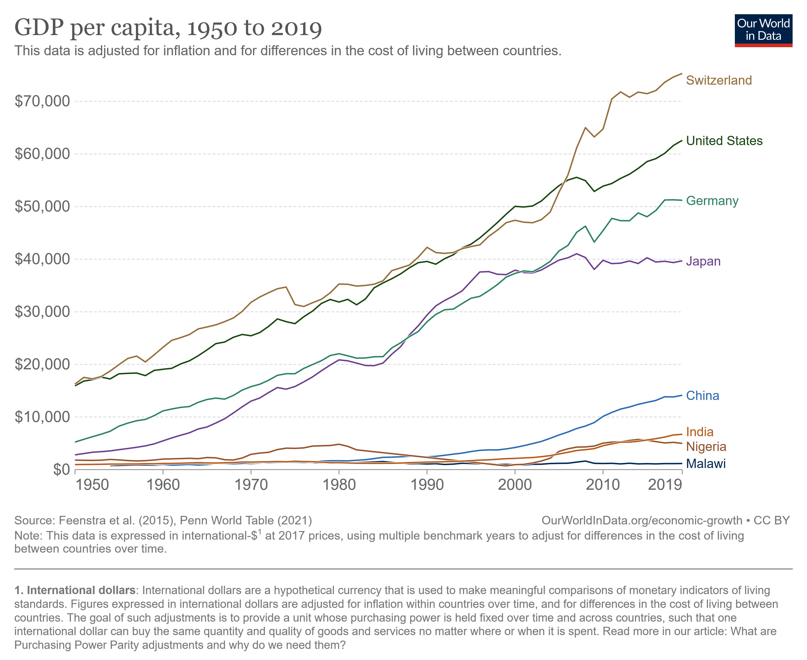

*Abbildung 7: Quelle: Our World in Data.*

### Alternative Indikatoren für Wohlstand

Wenn das BIP so viele Facetten von Wohlstand ausblendet – wie liesse sich Wohlstand stattdessen erfassen? Angesichts der genannten Einschränkungen wurden mehrere alternative Indikatoren entwickelt, die ein umfassenderes Bild zeichnen wollen:

Der **Human Development Index (HDI)** ergänzt das BIP um Lebenserwartung und Bildungsstand. Der HDI orientiert sich damit an einem Konzept von Wohlstand und menschlichem Wohlbefinden, nach welchem Menschen befähigt werden sollen, ein nach ihrer eigenen Vorstellung lebenswertes Leben zu führen. Im Kapitel 3.4.2 gehen wir noch genauer auf diesen Ansatz ein.

Der **Genuine Progress Indicator (GPI)** geht weiter: Er bezieht neben positiven auch negativen Faktoren wie Umweltverschmutzung und soziale Ungleichheit mit ein – insgesamt rund 26 Indikatoren aus ökonomischer, sozialer und ökologischer Dimension, darunter auch der Wert unbezahlter Arbeit.

Da es grundsätzlich schwierig oder gar unmöglich ist, Wohlstand zu messen, werden auch diese Indikatoren für ihre Limitationen kritisiert und entsprechend existieren noch viele weitere Indikatoren zur Messung des Wohlstandes eines Landes. Durchsetzen konnte sich neben dem BIP aber bislang noch keiner.

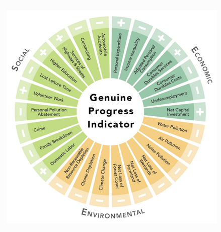

*Abbildung 8: Die Darstellung zeigt die verschieden Aspekte, die der GPI zu integrieren versucht. Quelle: [GNHUSA](https://gnhusa.org/genuine-progress-indicator/).*

Zur Veranschaulichung, wie weit unterschiedliche Indikatoren auseinanderklaffen können, seien hier die Berechnungen von Kubiszewski et al. [@kubiszewskiGDPMeasuringAchieving2013] für die Entwicklung des BIP und des GPI pro Kopf seit den 50er Jahren für eine Gruppe von 17 Ländern dargestellt.

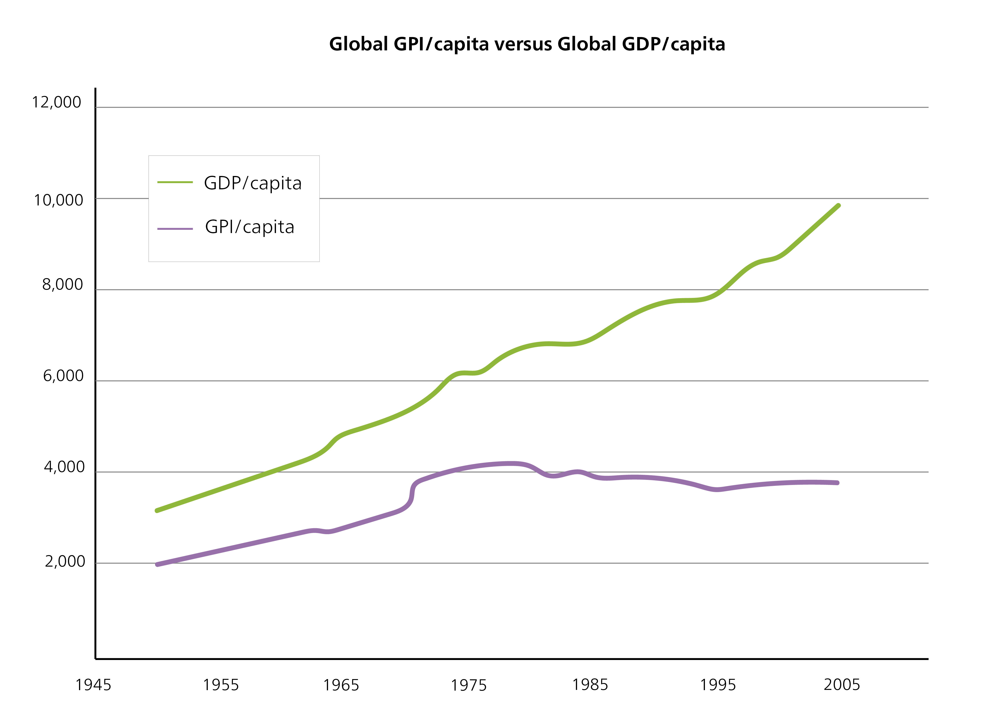

*Abbildung 9: GPI vs. GDP per capita. Quelle: [@kubiszewskiGDPMeasuringAchieving2013, p. 63].*

### Wirtschaftswachstum

*↗ Lehrbuchkapitel 4*

Wenn Wohlstand meist am BIP gemessen wird, dann wird die *Zunahme* dieses Wohlstands über die Zeit - das Wirtschaftswachstum - fast automatisch zum zentralen politischen Ziel. Wirtschaftswachstum bezeichnet die Zunahme der wirtschaftlichen Leistung eines Landes im Zeitverlauf, in der Regel gemessen an der BIP-Entwicklung. Es ist die zentrale Zielgrösse für Politik, Gesellschaft und Wirtschaft - so zentral, dass Schmelzer und Vetter [@schmelzerDegrowthPostwachstum2019, p. 62–68] vom **Wachstumsparadigma** sprechen.

In Anbetracht dieser Allgegenwärtigkeit des Wirtschaftswachstums ist es erstaunlich, dass wirtschaftliches Wachstum ein sehr junges Phänomen ist. Erst mit der industriellen Revolution in England im 19. Jahrhundert konnte auf der Welt erstmals anhaltendes wirtschaftliches Wachstum (gemessen am BIP) beobachtet werden. Die längste Zeit der Menschheitsgeschichte lebten die Menschen ohne langanhaltendes Wirtschaftswachstum. Mittlerweile ist wirtschaftliches Wachstum nicht nur ein zentraler Grundstein unseres gegenwärtigen Wirtschafts- und Gesellschaftssystems, sondern hat sich zu einer Zwangshandlung entwickelt [@binswangerWachstumszwangWarumVolkswirtschaft2019]. Auf diesen systemischen Wachstumszwang und das Wachstumsparadigma werden wir später in der Veranstaltung näher eingehen. Denn die Bedeutung des wirtschaftlichen Wachstums wird innerhalb der nachhaltigen Ökonomie intensiv diskutiert, wobei die Positionen weit auseinanderklaffen. Während einige am Wirtschaftswachstum (in angepasster Form) festhalten wollen, befürworten andere die Überwindung des Wirtschaftswachstums als Zwangshandlung (Green Growth vs. Postgrowth). Zu einem späteren Zeitpunkt werden wir uns mit diesen Diskussionen vertieft auseinandersetzen.

Die folgende Grafik zeigt die Entwicklung des BIP pro Kopf für verschiedene Länder, bzw. Regionen über die letzten 1000 Jahre. Die industrielle Revolution im 19. Jahrhundert ist dabei klar ersichtlich.

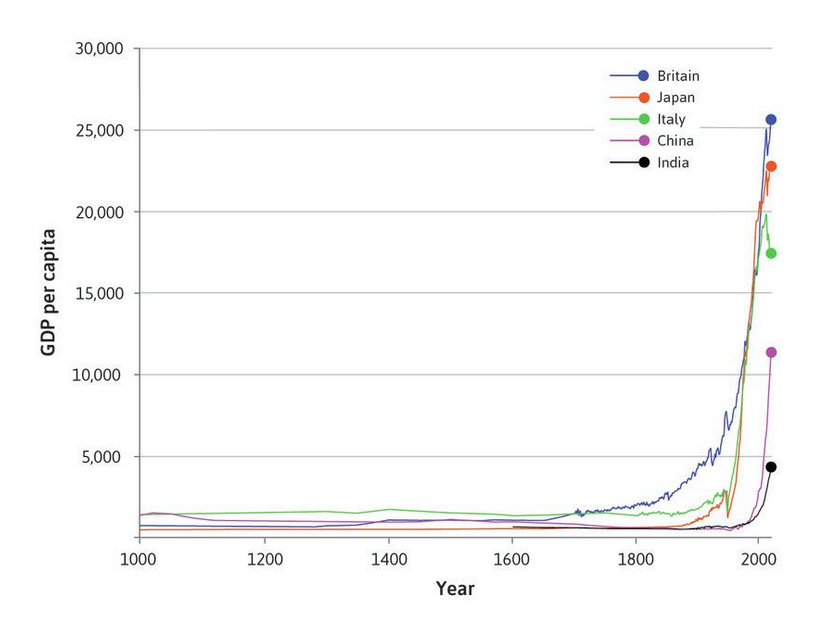

*Abbildung 10: Wachstum des BIP pro Kopf. Quelle:* [@boltFirstUpdateMaddison2013]*.*

::: {.callout-note collapse="false"}
#### Vertiefungsfragen

- Scheint Ihnen das BIP als sinnvolles Mass für den Wohlstand einer Nation zu messen? Was spricht dafür, was dagegen?
- Überlegen Sie sich Beispiele aus dem Alltag, in denen das Wachstumsparadigma zu erkennen ist.
- Was könnten Gründe sein, dass das BIP und der GPI so stark auseinanderklaffen? Und was könnte der Grund sein, dass die Trends in der Abbildung erst ab den 1970er Jahren so auseinanderklaffen?
:::

::: {.callout-caution collapse="true"}
### Weiterführende Literatur

Binswanger, Mathias. 2019. Der Wachstumszwang: warum die Volkswirtschaft immer weiterwachsen muss, selbst wenn wir genug haben. Weinheim: Wiley-VCH Verlag GmbH & Co. KGaA.

Lepenies, Philipp. 2013. Die Macht der einen Zahl: eine politische Geschichte des Bruttoinlandsprodukts. Erste Auflage, Originalausgabe. Berlin: Suhrkamp.

Schmelzer, Matthias. 2016. The hegemony of growth: the OECD and the making of the economic growth paradigm. Cambridge: Cambridge University Press.

Sen, Amartya. 2011. Development As Freedom. New York: Knopf Doubleday Publishing Group.
:::

## Bereitstellungsformen der Wirtschaft

::: {.callout-note .leitfrage}
### Leitfrage

Was braucht es, damit Wohlstand – wie wir ihn im letzten Kapitel diskutiert haben – überhaupt entstehen kann?
:::

Damit eine Gesellschaft Wohlstand erreichen kann, muss sie zuerst dafür sorgen, dass Güter und Dienstleistungen überhaupt bereitgestellt werden. Durch die Arbeitsteilung (siehe Box unten) stellen sich für ein Wirtschaftssystem stets auch immer grundlegende Organisationsfragen: Wie wird gesellschaftliche Produktion verteilt? Wer (re-)produziert, unterhält und repariert was? Wer konsumiert was? Mit anderen Worten: Wie wird das, was für Wohlstand nötig ist, überhaupt hergestellt und unter den Mitgliedern einer Gesellschaft verteilt?

Wie aus den vorangehenden Kapiteln klar wurde, hängen die Antworten auf diese Fragen stark davon ab, welches Verständnis von Wirtschaft man zugrunde legt. Wir folgen hier Karl Polanyis [@polanyiEconomyInstitutedProcess1957a] substantivistischen Verständnis, welches den Gegenstandsbereich über den Markt hinaus definiert und ein breites Verständnis von Wirtschaft vorschlägt.

Für unsere Ausgangsfrage – was es braucht, damit Wohlstand entstehen kann – ist das breite substantivistische Verständnis von Polanyi besonders aufschlussreich. Es zeigt, dass reale Wirtschaften aus ganz unterschiedlichen Institutionen und Logiken bestehen. Eine Wohnbaugenossenschaft arbeitet mit anderen Geschäftsmodellen als Installateure und Stahlunternehmen, das öffentliche Krankenhaus unterscheidet sich vom Industrieunternehmen, unbezahlte Sorgearbeit ist anders organisiert als Fliessbandarbeit. Karl Polanyi unterscheidet deshalb vier sozioökonomische Organisationsprinzipien bzw. Bereitstellungsformen, die in real existierenden Ökonomien zu finden sind und unterschiedlich zusammenwirken: Haushaltung, Gegenseitigkeit, Umverteilung und Markthandel [@polanyiGreatTransformation2017]:

(1) **Haushaltung** bezeichnet Formen der Selbstversorgung und gründet in Familien und Haushalten. In der griechischen Antike war der Oikos, d.h. das ganze Haus, eine autarke, d. h. selbstversorgende, Wirtschaftseinheit. Doch auch heute findet weiterhin ein grosser Teil der Wirtschaft im Haushalt statt, insbesondere als unbezahlte Sorge-, Pflege- und Betreuungsarbeit sowie Hausarbeit (z. B. Kochen, Putzen, Gärtnern).

(2) **Gegenseitigkeit** (auch Reziprozität genannt) basiert auf dem Prinzip des Geben-und-Nehmens und definiert einen Austausch von Waren und Diensten zwischen Personen jenseits von Markt und Staat. Dieser findet einerseits in lokalen Gemeinschaften und zwischen einander bekannten Personen statt, z. B. im Freundeskreis, in der Nachbarschaft oder in Vereinen, und umfasst u. a. Nachbarschaftshilfe und Gemeinwesenarbeit. Andererseits gibt es auch viele historische Beispiele von reziprokem Austausch über lange Distanzen, bei welchem Volksgruppen Güter austauschen, wobei hierbei häufig neben wirtschaftlichen auch zeremonielle Motive und solche der Beziehungspflege spielen. Um zu überdauern, erfordert diese Form der Bereitstellung jedoch, dass das Geben und Nehmen nicht zu stark aus dem Gleichgewicht geraten bzw. durch ein entsprechendes Gerechtigkeitsideal untermauert sind (siehe hierzu das Kapitel Soziale Grenzen/Gerechtigkeit).

(3) **Umverteilung** (auch Redistribution genannt) definiert einen systematischen Fluss von Ressourcen hin zu einem administrativen Zentrum und deren anschliessende Umverteilung. Beispiele sind durch Steuern oder Abgaben finanzierte öffentliche Bildungs-, Gesundheits- und Pensionssysteme. Umverteilung teilt (einander oftmals unbekannten) Mitgliedern einer Gesellschaft Ressourcen zu. Sie findet innerhalb politischer Territorien, insbesondere dem Nationalstaat, statt und geht daher über lokale Gemeinschaften hinaus.

(4) Schliesslich definiert der **Markthandel** den Tausch von Waren und Dienstleitungen zu Marktpreisen. Dies ist der kommodifizierte[^4] Bereich des Wirtschaftens. Je nach Art der gehandelten Waren und Dienstleistungen, der Reichweite und Struktur können sich diese Märkte unterscheiden. Die Logik des individuellen Gewinns und der Zahlungsfähigkeit ist in Marktbeziehungen vorherrschend.

[^4]: Die Kommodifizierung bedeutet, dass etwas zu einer Ware wird und auf Märkten gehandelt wird. Also etwas wird nach einer Marktlogik produziert und verteilt, was vorher nicht nach dieser Logik funktioniert hat (bspw. Nahrung, welche zur Selbstversorgung produziert wird). Grundsätzlich kann fast alles von Kommodifizierung betroffen sein, bspw. Arbeit, Güter, natürliche Ressourcen, CO~2~, etc. Mit der Entwicklung des Kapitalismus wurden immer mehr Bereiche der Wirtschaft kommodifiziert, weshalb dies für uns für viele Bereiche als selbstverständlich erscheint.

::: {.callout-note collapse="false"}
#### Vertiefungsfragen

- Suchen Sie für alle Bereitstellungsformen weitere Beispiele aus Ihrem Alltag.
- Suchen Sie ein Beispiel für eine Ware oder Dienstleistung, die über alle vier Bereitstellungsformen bereitgestellt wird. Wie verändern die vier Bereitstellungsformen die Situation und den Charakter der Transaktion/Bereitstellung?
:::

Zurück zur Leitfrage: Wohlstand entsteht also nicht allein durch Markttausch. Reale Ökonomien sind immer **gemischte Wirtschaften**. Sie kombinieren alle vier Bereitstellungsformen, auch wenn im Alltag oft nur der Markthandel als "die Wirtschaft" wahrgenommen wird. Nicht jeder Aspekt des Lebens und Wirtschaftens lässt sich – oder sollte sich – in eine marktfähige, kommodifizierte Ware verwandeln. Welche dieser Bereitstellungsformen wie stark zum Wohlstand einer Gesellschaft beitragen (und welche davon in der klassischen Wohlstandsmessung wie dem BIP sichtbar werden), ist damit selbst eine zentrale ökonomische Frage.

Aus: Novy, Andreas, Richard Bärnthaler, und Magdalena Prieler. 2023. *Zukunftsfähiges Wirtschaften: Herausforderungen der sozialökologischen Transformation*. 2. Auflage. Weinheim: Juventa Verlag.

## (Re-)Produktionsfaktoren

::: {.callout-note .leitfrage}
### Leitfrage

Leitfrage: Was braucht es, damit Güter und Dienstleistungen entstehen?
:::

*↗ Lehrbuchkapitel 16*

Um diese Frage zu beantworten, braucht die Ökonomik ein Konzept für die "Zutaten" wirtschaftlicher Tätigkeit: die **Produktionsfaktoren**. Als Produktionsfaktoren werden alle Inputs bezeichnet, die zur Herstellung eines Outputs – eines Guts oder einer Dienstleistung – nötig sind. Die aggregierten Produktionsfaktoren einer Volkswirtschaft werden als **Faktorausstattung** bezeichnet. Die Ursprünge der Produktionsfaktoren finden sich im physiokratischen Denken des 18. Jahrhunderts; als Konzept etablierten sie sich in der klassischen Ökonomik. Die Produktionsfaktoren des Wirtschaftens können gemäss der klassischen Ökonomik in drei Kategorien unterteilt werden: **Boden, Kapital und Arbeit.** Im Laufe der Zeit wurde diese Trinität immer wieder kritisiert, erweitert und angepasst. So wurden als weitere Faktoren bspw. Entrepreneurship, Wissen & Technologie und die Natur selbst ins Spiel gebraucht. Häufig werden diese Aspekte aber auch unter einer der drei bestehenden Faktoren subsumiert.

Doch die Frage "Was braucht es, damit etwas entsteht?" ist damit erst zur Hälfte beantwortet. Viele Denkschulen (etwa die Neoklassik, die post-Keynesianische Ökonomik und teilweise auch die Marxistische Ökonomik) fokussieren vor allem auf die **Produktion** von Gütern und Dienstleistungen zum Verkauf auf dem Markt. Ausgeblendet wird dabei oft die **Reproduktion -** also alles, was nötig ist, damit etwas weiterhin genutzt werden kann. So muss das Fahrrad regelmässig gepumpt und die Kette geölt werden, damit es zuverlässig fährt. Eine Tasse muss tausende Male abgewaschen werden, damit sie wieder benutzt werden kann. Aber auch Menschen, und somit Arbeitskräfte, müssen „reproduziert“ werden (dies wird oft als soziale Reproduktion beschrieben). So benötigen wir alle Nahrung, Fürsorge etc. damit wir leben und zur Arbeit erscheinen können.

Wer nur auf Produktion fokussiert, blendet damit einen zentralen Teil dessen aus, was Güter und Dienstleistungen überhaupt erst ermöglicht: Unbezahlte Reproduktionsarbeit wie Kochen, Putzen oder Kinderbetreuung wird oft nicht mitanalysiert, sondern einfach als gegeben vorausgesetzt. Die feministische Ökonomik zeigt jedoch, dass diese Arbeit integraler Bestandteil des wirtschaftlichen Lebens ist. Sie bildet die Grundlage, auf der marktvermittelte Tätigkeiten überhaupt erst stattfinden können. Die Trennung in „produktive“ marktvermittelte Arbeit und „unproduktive“ Hausarbeit und deren geschlechterspezifischen Konnotationen hat sich erst mit der Entstehung des Kapitalismus herausgebildet und ist keineswegs natürlich. Fragen von Produktion und Reproduktion sind somit auch stark mit dem kapitalistischen Produktionssystem verbunden (siehe 2.5).

Im Folgenden wenden wir uns den drei klassischen Produktionsfaktoren zu - Boden, Kapital und Arbeit -, die je nach Perspektive nicht nur für die Produktion, sondern auch für die Reproduktion eine zentrale Rolle spielen.

### Boden - Können wir Natur beliebig durch Technologie ersetzen?

*↗ Lehrbuchkapitel 13*

Unter dem Produktionsfaktor Boden wird oft nicht nur die Fläche/der Grund selbst, sondern auch die natürliche Umwelt zusammengefasst. Dabei geht es oft um die Frage, wie mit Boden und natürlichen Ressourcen umgegangen wird und wie sie genutzt werden. Diese Fragen betreffen uns im Alltag sehr direkt. So ist beispielsweise die Gestaltung des Wohnraumes von zentraler Bedeutung für uns alle. Aber auch der Umgang mit landwirtschaftlichen Flächen, Wäldern, Seen sowie den darin lebenden Lebewesen spielen für unseren Alltag eine zentrale Rolle. Zudem sind der Boden und natürliche Ressourcen ein elementarer Faktor für die Produktion von Gütern und Dienstleistungen. Boden ist für die Produktion unerlässlich, sei es für Fabriken oder Landwirtschaft. Aber auch natürliche Ressourcen wie bspw. Wasser und seltene Erden sind als Input für die Produktion zentral.

Das Besondere am Boden ist, dass er einerseits unveränderliche, natürliche Merkmale hat (bspw. ist Boden immobil und nicht vermehrbar), andererseits ist der Umgang damit sehr stark gesellschaftlich bestimmt (bspw. Eigentums-, Zugangs- und Nutzungsrechte). Diese Ausgangslage sorgt dafür, dass der Umgang mit Boden sehr viel Konfliktpotential aufweist und zwingend mit Verteilungsfragen verknüpft ist und auch ein wichtiger Aspekt von Ungleichheit darstellen kann. Entsprechend sind Fragen nach dem Umgang mit Boden zutiefst politisch.

**Perspektive 1: Natur ist im Prinzip ersetzbar**

Trotz ihrer lebenswichtigen Bedeutung werden Boden und natürliche Ressourcen in der Ökonomie wenig beachtet. In vielen Denkschulen wie der Neoklassik oder teilweise auch der post-Keynesianischen Theorie wird der Boden entweder ausgeblendet, vorausgesetzt oder als reiner Vermögenswert behandelt (bspw. Wohnraum) und so unter Kapital subsumiert. So findet der Boden in diesen Theorien sehr selten Eingang in die Produktionsfunktionen. Und wenn Boden und natürliche Ressourcen explizit beachtet werden, dann werden sie oft als „ökologische Dienstleistungen“ (engl. *ecosystem services*) verstanden. Über eine Bepreisung werden sie dann als Inputfaktor und Ware konzeptualisiert und in eine Marktlogik eingebettet. In solchen Verständnissen werden Boden und natürliche Ressourcen also implizit oder explizit als „reine Inputfaktoren“ verstanden und/oder als selbstverständlich vorausgesetzt. So wird bspw. ein Wald auf seine rein ökonomisch verwertbare Dimension wie bspw. das Verkaufen von Holz und Wild reduziert. Dabei wird oft vernachlässigt, dass Natur nie in Form von Gütern bereitsteht, sondern stets von Menschen durch Arbeit nutzbar und verwertbar gemacht werden muss [@schauppStoffwechselpolitikArbeitNatur2024]. In diesen Verständnissen wird zudem implizit angenommen, dass bspw. der Wegfall von Biodiversität bspw. durch technologische Lösungen kompensiert werden kann. In einer Kosten-Nutzen werden dann alle Kosten Nutzen aufsummiert und so alle unterschiedlichen Aspekte durch die monetäre Bewertung gleichgesetzt. Für die Nachhaltige Ökonomie sind solche grundlegenden Fragen von zentraler Bedeutung. Zudem werden durch den Bezug zur Marktlogik Bodenfragen entpolitisiert und Macht- und Verteilungsfragen implizit ausgeklammert.

**Perspektive 2: Natur hat Grenzen, die Technologie nicht aufheben kann**

Dem gegenüber gib es ein grundlegend anderes Verständnis von Boden und natürlichen Ressourcen als nicht ersetzbare Güter, welche die Grundlage für gesellschaftliches Leben darstellen. In diesem Verständnis lässt sich der Wegfall von Biodiversität oder die Zerstörung von fruchtbarem Boden nicht kompensieren. Diese Verluste sind endgültig. Solche Verständnisse kommen oft aus der ökologischen Ökonomik, aber auch einige Strömungen der feministischen und marxistische Ökonomik bauen auf diesem Verständnis auf. Die natürliche Begrenztheit und die Notwendigkeit nach gesellschaftlicher Organisation im Umgang mit Boden wird als Ausgangslage angenommen und Macht- und Verteilungsfragen oft explizit gemacht.

Ob sich Natur beliebig durch Technologie ersetzen lässt, ist damit keine rein technische, sondern eine theoretisch und politisch aufgeladene Frage. In Kapitel 3.1 vertiefen wir verschiedene Naturverständnisse und ihre Konsequenzen. Hier gilt es vor allem mitzunehmen, dass Boden und dessen Bedeutung für das wirtschaftliche Leben unterschiedlich verstanden und konzipiert werden kann. Zudem weisen Boden und natürliche Ressourcen einige unveränderliche, natürliche Merkmale auf. Wer aber Zugang dazu hat, ist keiner natürlichen, ökonomischen Gesetzmässigkeit unterworfen, sondern das Ergebnis von ökonomischen, politischen und gesellschaftlichen Strukturen.

### Kapital - Warum besitzen einige Menschen Kapital und andere nicht?

*↗ Lehrbuchkapitel 11*

Kapital begegnet uns tagtäglich in verschiedenen Formen im Alltag, doch der Begriff versteckt sich meist in eher technischem Vokabular. So können wir bspw. mit einem gewissen Startkapital ein Unternehmen gründen, Geld in eine Kapitalanlage (bspw. Wertpapiere kaufen) investieren oder in die eigene Bildung investieren, was als Humankapital bezeichnet wird. Nicht zuletzt ist auch unser Wirtschaftssystem – der Kapitalismus – nach dem (Unternehmens-)Kapital benannt, welches dessen Eigentümer\*innen ermächtigt, die für das Unternehmen massgeblichen Entscheidungen zu treffen. Entsprechend muss es auch eine wichtige Rolle spielen. Aber was ist es genau? In den angeführten Beispielen zeigt sich bereits, dass ein wichtiger Aspekt damit verbunden ist, dass dabei (in) etwas investiert wird, das später eine Rendite (eben eine *Kapital*rendite) abwerfen soll: durch das Investieren des Startkapitals möchte ich ein Unternehmen aufbauen, das später Gewinne schreibt, der Kauf von Wertpapieren soll regelmässige Zinsen abwerfen und die Investition in die Bildung soll sich durch einen höheren Lohn im Berufsleben auszahlen. Aber bezeichnen diese Beispiele nun im gleichen Masse Kapital, oder gibt es hier Unterschiede? Wiederum je nach Perspektive wird diese Frage unterschiedlich beantwortet.

#### Kapital als Ding - Ungleichheit als Ergebnis unterschiedlicher Investitionen

Die neoklassische Ökonomik sieht in Kapital in erster Linie einen Produktionsfaktor, also vorwiegend Maschinen, Werkzeuge, Fabrikgebäude, etc. Mit diesem (physischen) Kapital werden dann mit Hilfe von Arbeit als zweiter Produktionsfaktor Waren hergestellt. Auf dem Kapitalmarkt (bzw. dem Markt für finanzielles Kapital) wird dann die Rendite bestimmt, die im Gleichgewicht der Produktivität des physischen Kapitals entspricht. Kapital wird hier in erster Linie als Ware verstanden, die über einen Markt gehandelt wird und entsprechend den Marktmechanismen bewertet und verteilt wird. Dabei wird in erster Linie an die Produktion von Gütern gedacht, aber in diesem Verständnis kann sehr wohl auch Humankapital als solches verstanden werden. Ich investiere Zeit und verzichte auf Lohn während meiner Ausbildung und erwarte dann eine Rendite in Form eines höheren Lohnes, welcher über den Marktmechanismus geregelt wird.

Zu unserer Leitfrage passt dieses Verständnis so: Wer mehr Kapital besitzt, hat in der Vergangenheit mehr investiert (oder geerbt). Ungleichheit erscheint deshalb hier primär als Ergebnis unterschiedlicher Investitionsentscheidungen und -möglichkeiten, nicht als strukturelles Problem. Zur Abgrenzung von Geld: Auch **Geld** kann in diesem Verständnis Kapital sein, sofern es investiert wird, um eine Rendite zu erzielen - Geld, das nur in der Schublade liegt, wäre streng genommen kein Kapital.

#### Kapital als gesellschaftliches Verhältnis

Auch die post-Keynesianische Theorie versteht unter dem Kapitalbegriff in erster Linie einen Produktionsfaktor, verbindet aber ganz andere Dynamiken damit (siehe Kapitel 2.5). Insbesondere ist dabei auch ein Kapitalismusbegriff verbunden und die Unterscheidung von Klassen. Arbeiter\*innen die kein Kapital haben und deshalb für ihren Lohn arbeiten müssen und Kapitalist\*innen, die Kapital haben und einsetzen können, um Gewinne zu erzielen. So kommen auch vermehrt Macht- und Verteilungsfragen in den Blick.

Dieser Blick auf die Beziehung zwischen Klassen hat die post-Keynesianische Ökonomik von der Marxistischen Ökonomik genommen. Die Marxistische Ökonomik macht diesen relationalen Aspekt von Kapital zum zentralen Punkt: Kapital ist hier kein Ding, sondern ein **gesellschaftliches Verhältnis**. Der Einsatz von Kapital basiert auf der Trennung der Produktionsmittel von den Arbeiter\*innen, die für einen Lohn arbeiten müssen – also ihre Arbeitskraft verkaufen, da sie selbst über kein Kapital verfügen. In diesem Verständnis sprechen wir bspw. bei Maschinen die zur landwirtschaftlichen Selbstversorgung eingesetzt werden nicht von Kapital. Wenn aber ein\*e Unternehmer\*in Maschinen kauft und Lohnarbeitende zahlt, damit sie für sie/ihn das Land bestellen und die Ernten zur Erzielung eines Profits auf dem Markt verkauft wird, sprechen wir in diesem Verständnis von Kapital. Kapital ist also an den Einsatz von Lohnarbeit zur Erzielung eines Gewinns geknüpft und dieses Klassenverhältnis ist der zentrale Aspekt von Kapital. Der marxistische Kapitalbegriff ist entsprechend an den spezifischen Kontext des Kapitalismus geknüpft und kann nicht beliebig auf andere Zeiten oder Kontexte ausgeweitet werden. Und auch der Begriff des Humankapitals ist in diesem Verständnis wenig sinnvoll. Auch ist die kapitalistische Dynamik, dass sich Kapital ständig vermehren muss (Akkumulation) ebenfalls bereits in diesem Begriff als gesellschaftliches Verhältnis angelegt. In unserem Beispiel würde die/der Unternehmer\*in den erzielten Gewinn dann bspw. in weitere Maschinen zum Ausbau der Produktion investieren. Diese Dynamik würde dann stetig weiter gehen.

Zur Abgrenzung von Geld: Blosses Geld ist in diesem Verständnis noch kein Kapital. Erst wenn es eingesetzt wird, um Lohnarbeit zu mobilisieren und daraus Profit zu erzielen, wird daraus Kapital. Hodgson [@hodgsonEvolutionMoralityEnd2014] findet deshalb auch dieses Verständnis unzureichend und versteht Kapital alles, was potentiell zur Erzielung eines Profites eingesetzt werden kann. Das heisst konkret, dass alles Vermögen darunter verstanden wird, sofern es auch als Gegenwert dienen kann, um Kredite aufzunehmen (Collateral). Dieses Kapitalverständnis liegt bspw. auch der Analyse Pikettys in seinem grossen Werk „Das Kapital des 21. Jahrhunderts“ zugrunde und lässt sich mit verschiedenen Denkschulen verbinden [@pikettyCapitalTwentyFirstCentury2014].

Obwohl in öffentlichen Debatten oft so getan wird, als sei völlig klar, was mit "Kapital" gemeint ist, zeigen sich hier ganz unterschiedliche Verständnisse - und mit ihnen unterschiedliche Antworten auf unsere Leitfrage. Ob Ungleichheit im Kapitalbesitz als Ergebnis individueller Entscheidungen, als strukturelles Machtverhältnis oder als sich selbst verstärkender Vermögensvorteil verstanden wird, hängt davon ab, welchen Kapitalbegriff wir zugrunde legen. Es ist daher zentral, sich bewusst zu machen, welchen Kapitalbegriff wir verwenden und zu welchem Zweck.

### Arbeit - Warum verdiene ich so viel, wie ich verdiene – und warum wird manche Arbeit, wie Care-Arbeit, oft gar nicht bezahlt?

*↗ Lehrbuchkapitel 12*

Die Arbeit stellt den dritten Produktionsfaktor dar und ist nötig, damit aus Rohstoffen Güter und Dienstleitungen gewonnen werden können. Koordinierende, geistige und ausführende Tätigkeiten sind für den zielführenden Einsatz von Kapital nötig, um produzieren zu können. Arbeit ist also ein zentraler Faktor für Wertschöpfung. Arbeit bestimmt in vielen Fällen auch den Alltag der Menschen und nimmt auch in der wirtschaftspolitischen Berichterstattung eine zentrale Rolle ein, etwa durch Diskussionen über Arbeitslosigkeit, Beschäftigungszahlen und Mindestlöhne. Dabei geht es oft um eine spezifische Form von Arbeit: **Erwerbsarbeit.**[^5]

[^5]: Erwerbsarbeit meint Tätigkeiten, für die Menschen eine direkte Gegenleistung in Form von Geld erhalten.

Genau hier setzt unsere Leitfrage an: Wieso verdienen manche Menschen für ihre Arbeit viel, andere wenig – und wieso zählt manche Arbeit überhaupt als bezahlungswürdig, während andere, etwa Sorge- und Betreuungsarbeit, oft unbezahlt bleibt? Wie wir sehen werden, hängt die Antwort stark davon ab, welchem ökonomischen Verständnis von Arbeit man folgt.

#### Zentralität der Erwerbsarbeit – was zählt überhaupt als Arbeit.

Auch in unserem Alltag dreht sich viel um die Erwerbsarbeit. Aber diese Zentralität der Erwerbsarbeit entwickelte sich erst im Zuge des industriellen Kapitalismus des 19. Jahrhunderts und wurde zur zentralen gesellschaftlichen Integrations- und Orientierungsinstanz. Während in vormodernen Haushaltsökonomien bezahlte und unbezahlte Tätigkeiten eng miteinander verbunden waren und der Haushalt die zentrale wirtschaftliche Einheit war, wurde nun vermehrt ausschliesslich marktvermittelte, entlohnte Arbeit als produktiv anerkannt, während Sorge- und Hausarbeit abgewertet wurden. Mit der Entwicklung des Kapitalismus wurden immer mehr Menschen abhängig von Erwerbsarbeit, um ihren Lebensunterhalt bestreiten zu können. Und auch das kapitalistische System ist auf Erwerbsarbeit angewiesen, da zu hohe Arbeitslosigkeit zu einer Krise die wirtschaftliche Entwicklung abschwächen kann und auch zu einer gesellschaftlichen Krise führen kann (post-Keynesianer\*innen betonen, dass mit tiefer Beschäftigung auch die gesamtwirtschaftliche Nachfrage wegfällt). Zudem wurde die soziale Sicherung und die Steuereinnahmen stark auf Erwerbsarbeit aufgebaut, und auch gesellschaftlich Teilhabe und soziale Anerkennung orientieren sich an der Erwerbsarbeit. In der zweiten Hälfte des 20. Jahrhundert verfestigte sich diese Entwicklung durch die Idee des *Normalarbeitsverhältnisses* und des männlichen Ernährers als gesellschaftliches Leitbild.[^6]

[^6]: Der Begriff «Normalarbeitsverhältnis» wird nach [@bernetArbeitAndersDenken2021, p. 128] als «unbefristete, sozial abgesicherte und kollektivvertraglich geschützte Vollzeitstelle mit einem gesicherten Monatseinkommen, klar geregelten Arbeitszeiten, Kündigungsschutz und gewissen Instrumenten der Mitbestimmung» verstanden. Trotz des Namens war dieses Arbeitsverhältnis nie wirklich normal. Es gab immer viele Menschen, die nicht in solchen Verhältnissen arbeiteten, sehr oft Migrant\*innen und Frauen.

Seit den 1970er Jahren gerät dieses Modell, auch in der Schweiz, durch Flexibilisierung und Prekarisierung der Beschäftigung zunehmend unter Druck (bspw. Gig Economy). Seit den 1970er Jahren sind in der Schweiz Arbeitslosigkeit und Unterbeschäftigung gestiegen, ebenso wie Temporärarbeit, Teilzeitbeschäftigung, prekäre und informelle Beschäftigung [@benelliWenigerWertTemporar2014; @degenArbeitUndKapital2012; @sheldonMigrationIntegrationUnd2007; @streckeisenSteigendeErwerbslosigkeitUnd2012; @streckeisenUnsichtbarenPrekaritaetZur2019]. In den letzten 50 Jahre sind Frauen auch immer häufiger in den Arbeitsmarkt eingetreten, arbeiten aber vorwiegend Teilzeit.

Entsprechend der Zentralität der Erwerbsarbeit liegt der Fokus in vielen Denkschulen – etwa der neoklassischen und der post-Keynesianischen Ökonomik – stark auf der Erwerbsarbeit, während unbezahlte Reproduktionsarbeit meist stillschweigend vorausgesetzt wird. Feministische Ökonomik arbeitet demgegenüber mit einem deutlich breiteren Arbeitsbegriff, der auch unbezahlte Arbeit einschliesst. Sie greift dabei oft auf das sogenannte **Drittpersonenprinzip** zurück: Als Arbeit gilt jede Tätigkeit, die grundsätzlich auch von einer dritten, bezahlten Person übernommen werden könnte. Wie beispielsweise Kochen, Putzen oder Kinderbetreuung fallen damit ebenso unter "Arbeit" wie eine Fabriktätigkeit, unabhängig davon, ob sie entlohnt wird oder nicht.

Die feministische Ökonomik weist zudem darauf hin, dass personenbezogene Dienstleistungen (z. B. Pflege, Betreuung) einer anderen Logik folgen als etwa Fabrikarbeit. Im Gegensatz zu Fabrikarbeiten lassen sich personenbezogene Dienstleistungen in ihrer Produktivität oder Effizienz kaum steigern, weil die Qualität der Arbeit direkt von Zeit und menschlicher Interaktion abhängt und sich deshalb kaum standardisieren oder planen lässt. Dies führt dazu, dass dadurch die Lohnkosten in diesen Bereichen relativ zu anderen Sektoren steigen, da sie nicht (z.B. durch neue Technologien) eine immer höhere Arbeitsproduktivität aufweisen können, die Löhne aber mit der gesellschaftlichen Entwicklung steigen. Der Ökonom William Baumol hat dies unter dem Begriff der Kostenkrankheit (engl. *cost disease*) beschrieben und zeigt, wie bspw. die Kosten in technologischen Branchen massiv gesunken sind, während sie in personenbezogenen Dienstleistungen weiter steigen (siehe Abbildung x). In der Schweiz ist dies bspw. im Gesundheitswesen stark sichtbar, wo die Kosten steigen, die Rufe nach Effizienzsteigerungen aufkommen, aber nicht umgesetzt werden können, was das Personal stark unter Druck setzt.

#### Aber wie werden Arbeitszeit und Lohn bestimmt?

Damit kommen wir zum Kern der Leitfrage: Warum verdiene *ich* so viel, wie ich verdiene? Auch hier gehen die Denkschulen auseinander. Die Neoklassik sieht die zentrale Erklärung im Marktmechanismus des Arbeitsmarkts: Im Gleichgewicht entspricht der Lohn der Arbeitsproduktivität. Menschen maximieren ihren persönlichen Nutzen, indem sie sich gemäss ihren Präferenzen für ein optimales Verhältnis zwischen Freizeit und Konsum entscheiden, welcher durch den Verkauf von Arbeit(szeit) ermöglicht wird. Wer arbeiten will, findet in diesem Modell auch Arbeit: Im Marktgleichgewicht gibt es keine (unfreiwillige) Arbeitslosigkeit. Aus dieser Perspektive verdient man also, was der eigenen Produktivität entspricht.

Feministische, post-keynesianische und marxistische Ökonom\*innen widersprechen dem: Aufgrund der gesellschaftlichen Zentralität der Erwerbsarbeit sind Menschen letztlich gezwungen zu arbeiten und können ihre Arbeitszeit nicht frei bestimmen. Hier spielen Machtungleichgewichte auf dem Arbeitsmarkt und Institutionen wie Gewerkschaften eine zentrale Rolle in diesem Prozess. Zudem betont die feministische Ökonomik, dass diese Fragen oft auch von gesellschaftlichen Normen geprägt sind, die die Verteilung von Arbeit, die Arbeitszeit und die Löhne auch von Geschlechterfragen mitbestimmt werden.

#### Arbeitslosigkeit

Entsprechend der Zentralität der Erwerbsarbeit werden auch oft auch nur Zahlen zu bezahlter Arbeit erfasst und in Analysen einbezogen. Als wichtigster Indikator wird in der Regel die **Arbeitslosenquote** herangezogen. Diese wird meist folgendermassen berechnet:

$$\text{Arbeitslosenquote} = \frac{\text{Zahl registrierter Arbeitslosen}}{\text{Erwerbspersonen}}$$\$\$\\text{Arbeitslosenquote} = \\frac{\\text{Zahl registrierter Arbeitslosen}}{\\text{Erwerbspersonen}}\$\$

Dieser Indikator ist aber nur einer von verschiedenen Indikatoren, die herangezogen werden.  So greift die Internationale Arbeitsorganisation (ILO) auf die Erwerbslosigkeit und entsprechend die Erwerbslosenquote als Indikator zurück. Als [**erwerbslos**](http://www.bfs.admin.ch/bfs/de/home/statistiken/arbeit-erwerb/erhebungen/els-ilo.html) gelten alle Personen der ständigen Wohnbevölkerung in der Schweiz, die ohne Arbeit sind, eine Stelle suchen und innerhalb kurzer Zeit mit einer Tätigkeit beginnen könnten. [2025 lag die Arbeitslosenquote in der Schweiz durchschnittlich bei 2.8%](https://www.admin.ch/de/newnsb/yFqP7XwYSs3ODBR8ZdR9g) und die [saisonbereinigte Erwerbslosenquote nach der ILO im vierten Quartal 2025 bei 5.0%](https://www.bfs.admin.ch/bfs/rm/home/statisticas/catalogs-bancas-datas.assetdetail.36326600.html). Die Erwerbslosenquote schliesst im Unterschied zur Arbeitslosenquote bspw. auch selbständig Erwerbende, Personen, die von langfristiger Arbeitslosigkeit betroffen sind wie Ausgesteuerte und Jugendliche, die direkt nach der Ausbildung noch keinem Erwerb nachgehen, mit ein. Entsprechend ist die Erwerbslosenquote höher als die Arbeitslosenquote. Solche Indikatoren sagen aber nichts über die Art der Anstellungen und der Arbeitsverhältnisse aus, womit sie für solche Beurteilung nicht dienlich sind. Auch grundsätzlichere Fragestellung zu Sinn und Zweck von Arbeit und einem hohen Beschäftigungsziel lassen sich nicht mit solchen Indikatoren diskutieren.

Wie zu Fragen nach Arbeitszeit und Lohn sehen die Denkschulen auch unterschiedliche Gründe für Arbeitslosigkeit. In der Neoklassik wird Arbeitslosigkeit vor allem als Ergebnis von Marktstörungen oder Marktversagen gedeutet, wenn also gewisse Faktoren das reibungsfreie Funktionieren des Marktmechanismus stören. Ein klassisches Beispiel für solche „Marktstörungen“ sind Mindestlöhne über dem Marktgleichgewicht, die die Kosten für Unternehmen erhöhen und so zu Arbeitslosigkeit führen. Gibt es keine Störungen im Marktmechanismus, gibt es grundsätzlich keine (unfreiwillige) Arbeitslosigkeit. Post-Keynesianische Ökonomik betont vor allem, dass sich Arbeitslosigkeit nicht durch den Arbeitsmarkt ergibt, sondern von der wirtschaftlichen Entwicklung und der gesamtwirtschaftlichen Nachfrage abhängt. Wenn diese sinkt, werden keine Leute mehr eingestellt oder Angestellte entlassen und die Arbeitslosigkeit steigt. Sie betont aber auch, dass Vollbeschäftigung von Arbeitgeber\*innen nicht unbedingt gewünscht ist, da eine gewisse Arbeitslosigkeit auch ihre Verhandlungsmacht von Unternehmen stärkt [@kaleckiPOLITICALASPECTSFULL1943a]. Auch die Marxistische Ökonomik betont, dass Arbeitslosigkeit ein struktureller Teil des Kapitalismus ist und die Verhandlungsmacht des Kapitals gegenüber den Arbeitnehmenden stärkt [@magdoffDisposableWorkersTodays2004]. Feministische Ökonomik betont, dass Arbeitslosigkeit nicht geschlechtsneutral ist und öfters Frauen Teil der stillen Reserve sind, die gerne mehr bezahlt arbeiten oder überhaupt einer Erwerbsarbeit nachgehen würden, aber bspw. aufgrund von unbezahlter Sorgearbeit gar nicht können.

Die folgende Abbildung zeigt die Entwicklung der Arbeitslosenquote in der Schweiz seit 1920. Die Arbeitslosigkeit war und ist in der Schweiz im internationalen Vergleich sehr tief. Besonders während des Wirtschaftsboom in der Nachkriegszeit gab es in der Schweiz fast keine Arbeitslosigkeit, weshalb die Schweiz viele Arbeitskräfte aus dem Ausland holte – welche oft unter prekären Bedingungen arbeiteten [@degenArbeitUndKapital2012]. Erst mit der Krise in den 70er Jahre kehrte die Arbeitslosigkeit in der Schweiz zurück, wobei die Schweiz einen starken Anstieg damit verhinderte, dass sie die Arbeitslosigkeit ins Ausland exportierte – bis 1977 mussten fast 250'000 ausländische Arbeitskräfte das Land verlassen [@degenArbeitUndKapital2012, p. 910].

*Abbildung 11: Quelle: 1920-1996 Statistisches Jahrbuch der Schweiz; 1997-2019 Seco*

#### Unbezahlte Arbeit

Seit 1997 erfasst das Bundesamt für Statistik (BFS) mit dem Satellitenkonto Haushaltsproduktion ([SHHP](https://www.bfs.admin.ch/bfs/de/home/statistiken/arbeit-erwerb/erwerbstaetigkeit-arbeitszeit/vereinbarkeit-unbezahlte-arbeit/satellitenkonto-haushaltsproduktion.html)) alle vier Jahre den monetären Wert und die Menge an unbezahlter Arbeit in der Schweiz. In der Schweiz wurde 2020 9.8 Milliarden Stunden unbezahlt gearbeitet (mehrheitlich von Frauen), mehr als für bezahlte Arbeit aufgewendet wurde (7.6 Milliarden Stunden). Die ganze unbezahlte Arbeit 2020 wird mit einem Wert von 434 Milliarden Franken geschätzt. Wird das BIP um die totale Haushaltsproduktion erweitert, entspricht diese 41.4% der Wertschöpfung der erweiterten Gesamtwirtschaft. In Abbildung 12 lässt sich sehen, wie sich die bezahlte und unbezahlte Arbeit zwischen den Geschlechtern verteilt. Insgesamt leisten Frauen etwas mehr Arbeitsstunden pro Woche als Männer, der grosse Unterschied ist, dass der Grossteil davon nicht bezahlt wird.

.](images/abb5.png)

::: {.callout-note collapse="false"}
#### Vertiefungsfragen

- Sammeln Sie für jeden der drei Produktionsfaktoren je zwei Beispiele.
- Sammeln Sie Beispiele für (Re-)Produktionsfaktoren, die in den drei klassischen Produktionsfaktoren ungenügend abgebildet sind.
- Überlegen Sie sich anhand von Beispielen, wie es sich auf die Produktion auswirkt, wenn mehr Arbeit als Kapital vorhanden ist, wenn mehr Kapital als Arbeit vorhanden ist, wenn der Faktor Boden nicht vorhanden ist, oder wenn alle Produktionsfaktoren in ausgeglichenem Verhältnis gegeben sind.
:::

Die Frage „Warum verdiene ich so viel, wie ich verdiene?“ lässt sich also nicht allein mit individueller Produktivität beantworten. Sie hängt davon ab, welche Tätigkeiten überhaupt als "Arbeit" gelten, wie Verhandlungsmacht und Institutionen den Arbeitsmarkt prägen, und welche historisch gewachsenen Normen bestimmen, wessen Arbeit sichtbar und entlohnt wird. Care-Arbeit bleibt dabei oft unbezahlt – nicht, weil sie weniger notwendig wäre, sondern weil unsere heutige Vorstellung von "produktiver" Arbeit historisch mit dem Aufstieg der Erwerbsarbeit im Kapitalismus verknüpft ist.

Weiterführendes Material: Die kurze Dokumentation [„Haben wir früher mehr geschuftet?“](https://www.youtube.com/watch?v=krP2vuV90FU) gibt einen groben Überblick über die Geschichte der Arbeit.

## Güterarten

::: {.callout-note .leitfrage}
### Leitfrage

Ist die Sonne ein öffentliches Gut – und welche Eigenschaften bestimmen, wie ein Gut wirtschaftlich behandelt wird?
:::

Die Produktion stellt Dinge und Dienstleistungen her, die wir Menschen benutzen und in Anspruch nehmen können. In der Produktion machen wir aus der Natur nutzbare Dinge und Dienstleistungen, die den Menschen zur Bedürfnisbefriedigung dienen. Aber wie können wir diese Dinge und Dienstleistungen als Kategorie beschreiben? Oft werden die produzierten Dinge und Dienstleistungen als Güter bezeichnet und versucht nach ihren Eigenschaften zu beschreiben. Dabei wird ersichtlich, dass diese Eigenschaften oft nicht einfach den Gütern inhärent sind, sondern stark von gesellschaftlichen Strukturen geprägt sind. Entsprechend lassen sich zentrale Fragen zum Umgang mit Gütern, wie bspw. der Zugang dazu, nicht auf die Eigenschaften von Gütern reduzieren, sondern sind auch immer von gesellschaftlichen Aushandlungen geprägt.

### Gütereigenschaften

Viele ökonomische Denkschulen unterscheiden die Güter nach zwei zentralen Eigenschaften. *Die Nutzenrivalität* beschreibt, ob ein Gut von verschiedenen Menschen ohne Nutzenverlust gleichzeitig konsumiert werden kann. Das *Ausschlussprinzip* beschreibt, ob es möglich ist, Personen von der Nutzung eines Guts auszuschliessen. Alle Güter können anhand der beiden Eigenschaften Rivalität und Ausschliessbarkeit in eine von vier Güterarten unterteilt werden. @tbl-gueterarten gibt eine Übersicht über diese Unterscheidung:

```{r}
#| label: tbl-gueterarten
#| tbl-cap: "Güterarten nach Ausschliessbarkeit und Rivalität im Konsum."

library(kableExtra)
is_pdf <- knitr::is_latex_output()

df <- data.frame(
  Ausschliessbarkeit = c("Ja", "Nein"),
  Ja = c(
    "Private Güter: Brot, Wohnung, Kleider",
    "Allmendegüter: Hochseefischgründe, Gotthardtunnel am Osterwochenende"),
  Nein = c(
    "Mautgüter: Kabelfernsehen, Streamingdienste, Nationalparks",
    "Öffentliche Güter: Rechtsordnung, Gewässerkorrekturen, Feuerwerke"),
  check.names = FALSE
)

df |>
  kbl(booktabs = TRUE, align = "l") |>
  kable_styling(
    bootstrap_options = c("striped", "hover", "condensed"),
    latex_options = if (is_pdf) c("hold_position") else NULL,
    full_width = !is_pdf
  ) |>
  add_header_above(c(" " = 1, "Rivalität im Konsum" = 2)) |>
  column_spec(1, bold = TRUE, width = if (is_pdf) "2.5cm" else NA) |>
  column_spec(2:3, width = if (is_pdf) "5.5cm" else NA) |>
  row_spec(0, bold = TRUE)
```

**Private Güter** sind sowohl ausschliessbar, als auch rivalisierend im Konsum. Dies bedeutet, dass es möglich ist, durch Massnahmen Personen vom Konsum abzuhalten und, dass der Konsum eines Gutes nicht von beliebig vielen Personen wiederholt werden kann. Aufgrund dieser Eigenschaften werden private Güter als gut für den Handel auf Märkten charakterisiert.

**Mautgüter** (oder Klubgüter) sind ausschliessbar, doch nicht rivalisierend im Konsum. Beispielsweise können Kabelfernsehen oder Streamingplattformen durch eine Abogebühr Personen vom Konsum ausschliessen, der Konsum der Abonnent\*innen leidet allerdings nicht darunter, wenn die Anzahl Nutzende ansteigt. Abseits der digitalen Güter ist die Trennung zwischen privaten und Mautgütern schwieriger. Etwa die Mitgliedschaft in einem Fitnessklub und der Benützung der zugehörigen Räumlichkeiten ist nur so lange nicht-rivalisierend, bis im Januar alle Nutzenden ihre Neujahrsvorsätze verfolgen wollen und alle Geräte ausgelastet sind.

**Allmendegüter** (auch Commons genannt) sind nicht ausschliessbar und doch rivalisierend im Konsum. Darunter fallen oftmals natürliche Ressourcen wie etwa Fischbestände oder die Verfügbarkeit von Wasser zur Bewässerung von Feldern. Um die Übernutzung dieser Güter zu verhindern ist Koordination zwischen den verschiedenen Nutzungsansprüche unabdingbar.

**Öffentliche Güter** sind weder ausschliessbar noch rivalisierend im Konsum. Solche Güter sind durch ihre Nicht-Ausschliessbarkeit kaum auf Märkten handelbar. Die Nutzung von öffentlichen Gütern ohne dafür bezahlen wird als Trittbrettfahrer-Problematik beschrieben. Durch staatliche Finanzierung können solche notwendigen Güter dennoch bereitgestellt werden.

Damit stellt sich die Frage aus unserer Leitfrage neu: Ist die Sonne – deren Licht wir alle gleichzeitig und ohne Ausschluss geniessen – tatsächlich zwangsläufig ein öffentliches Gut? Einige ökonomische Denkschulen wie die ökologische Ökonomik und Arbeiten aus der Sozialanthropologie betonen, dass es sich bei der Einteilung dieser Güter aber nicht um eine natürliche Einteilung handelt. Speziell die Ausschliessbarkeit ist keine dem Gut inhärente Eigenschaft, sondern hängt vor allem von den technischen Möglichkeiten, der gesellschaftlichen Aushandlung und gesellschaftlichen Machtverhältnissen ab. Speziell beim Umgang mit natürlichen Ressourcen ist die Frage der Ausschliessbarkeit in erster Linie eine soziale und/oder technische. So können Wasserressourcen technisch problemlos zugänglich, aber auch ausschliessbar gemacht werden. Sogar Sonnenlicht liesse sich theoretisch ausschliessbar machen – wie es Mr. Burns in der Serie „Die Simpsons“ plant, für den [die Sonne buchstäblich der Feind ist](https://www.youtube.com/watch?v=L3LbxDZRgA4). Insofern ist die Frage nicht so sehr ob die Sonne ein öffentliches Gut ist, sondern ob die Sonne als öffentliches gut behandelt wird. Konkret heisst das also: Ob die Sonne ein öffentliches Gut *bleibt*, ist letztlich eine Frage der Technik, der Macht und der gesellschaftlichen Aushandlung.

Bei der Kategorisierung der Güter gilt es zudem zu beachten, dass damit eine Verdinglichung einhergeht. Die Güter werden dabei auf ihren rein ökonomischen Wert reduziert. Gerade für Ressourcen, welche als Allmendegüter verwaltet werden, kann dies sehr problematisch sein. So wird oft ausgeblendet, wie durch Allmendegüter soziale Beziehungen und Gemeinschaften strukturiert werden, Partizipation stattfindet und eine Beziehung zur Natur und Umwelt erhalten wird. Ugo Mattei argumentiert deshalb, dass es verkürzt sei zu sagen, wir “haben” ein Gemeingut. Vielmehr gehe es darum zu ergründen, in welchem Masse wir Commons “sind”, insofern wir auch Teil der Umwelt sind (Mattei 2014, S. 76). Aus diesem Grund wird bspw. in der Sozialanthropologie oft vom Verb “commoning” anstelle des Substantivs “Commons” gesprochen.

**Box: Die Tragik der Allmende und ihre Überwindung**

*↗ Lehrbuchkapitel 19*

Akteur\*innen können nicht vom Konsum von öffentlichen und Allmendegüter ausgeschlossen werden. Dies kann eine Übernutzung dieser Güter zur Folge haben, was von Garret Hardin 1968 als Tragik der Allmende beschrieben wurde [@hardinTragedyCommons1968]. Oftmals wird als Lösungsansatz die Privatisierung dieser Güter hervorgebracht (sog. *Enclosure*), durch die Zuweisung von klaren Eigentumsrechten können Akteur\*innen von der Nutzung ausgeschlossen werden.

Elinor Ostrom forschte zum selben Thema und beobachtete, wie durch selbstorganisierte Kooperation innerhalb von klaren Grenzen auch ohne Zuteilung von Eigentumsrechten der Übernutzung entgegengewirkt werden kann. Funktionierende Lösungen gegen die Übernutzung von nicht-ausschliessbaren Gütern sind jedoch stark kontextabhängig und somit schwer verallgemeinerbar. Für ihre Forschung zu Allmenden wurde Ostrom 2009 mit dem Alfred-Nobel-Gedächtnispreis für Wirtschaftswissenschaften ausgezeichnet [@ostromMarketsStatesPolycentric2010]. Die mittlerweile reichhaltige Commonsforschung kennt viele untersuchte Beispiele von Allmenden, welche nicht übernutzt wurden und nicht der Tragik unterlagen. Es gibt Beispiele von Allmenden, die über Jahrhunderte gemeinschaftlich und nachhaltig bewirtschaftet wurden [siehe bspw. @dekeyzerInclusiveCommonsSustainability2018; @demoorDilemmaCommonersUnderstanding2015]. Die Commonsforschung von Ostrom und anderen zeigt entsprechend, dass es zur Verhinderung der Tragik der Allmende Lösungen jenseits von Privatisierung und Verstaatlichung gibt. Damit wird auch die Dichotomie vom Markt und Staat grundsätzlich aufgebrochen und Anknüpfungspunkte jenseits dieser zwei Sphären ermöglicht. In Kapitel 5 widmen wir uns eingehender der Beziehung zwischen Markt und Staat.

### Externe Effekte – warum kostet ein Flug oft weniger als eine Zugfahrt?

Nicht immer entspricht der Preis für die Nutzung von Gütern den wahren gesellschaftlichen Kosten. Wird das Gut trotzdem zu diesem Preis genutzt, werden die Kosten an Dritte, also weder auf Produzierende noch Konsumierende, sondern beispielsweise auf Steuerzahlende, nachfolgende Generationen oder die Natur übergewälzt. Ist dies der Fall, spricht man von **externen Effekten**.

Genau das beantwortet unsere Leitfrage: Ein Flugticket ist oft günstiger als eine Zugfahrt, weil im Flugpreis viele der tatsächlichen Kosten wie etwa Klimaschäden durch CO~2~-Emissionen, gar nicht eingerechnet sind. Diese Kosten tragen stattdessen Dritte. Der Marktpreis spiegelt damit nicht die vollen gesellschaftlichen Kosten wider. Externe Effekte können aber nicht nur negativ sein, wie in diesem Beispiel, sondern auch positiv. @tbl-externe-effekte gibt einige Bespiele für negative und positive externe Effekte.

Wie problematisch solche externen Effekte eingeschätzt werden, unterscheidet sich je nach Denkschule. In der Neoklassik werden externe Kosten in der Regel als Ausnahme eines normalerweise gut funktionierenden Marktes verstanden. William Kapp wies demgegenüber, in der Tradition der ökologischen Ökonomik, schon 1950 darauf hin, dass je mehr ein System auf der Maximierung von privatem Gewinn beruht, desto stärkere Anreize gibt es, Kosten auf Menschen, die Gesellschaft und die Natur abzuwälzen [@kappSocialCostsPrivate1950]. Entsprechen beinhaltet das gegenwärtige kapitalistische System inhärente Tendenzen zur Externalisierung von Kosten. Stephan Lessenich beschreibt die Wohlstandgesellschaften im Globalen Norden entsprechend als Externalisierungsgesellschaften, welche die Kosten in den Globalen Süden auslagern [@lessenichNebenUnsSintflut2020].

```{r}
#| label: tbl-externe-effekte
#| tbl-cap: "Beispiele positiver und negativer externer Effekte."

library(kableExtra)
is_pdf <- knitr::is_latex_output()

df <- data.frame(
  `Art des Effekts` = c("positiv", "negativ"),
  `Produktionsmöglichkeiten Dritter` = c(
    "Apfelbauer und Imker profitieren gegenseitig von der Bestäubung, bzw. den Apfelblüten.",
    "Industrie emittiert Schadstoffe in Gewässer; Dritte können keine Fischerei mehr betreiben."),
  `Konsummöglichkeiten Dritter` = c(
    "Eltern lassen ihre Kinder impfen; Gesellschaft profitiert von tieferer Infektionsrate und Gesundheitskosten.",
    "Industrie emittiert Schadstoffe in Gewässer; Dritte können nicht mehr im Fluss baden."),
  check.names = FALSE
)

df |>
  kbl(booktabs = TRUE, align = "l") |>
  kable_styling(
    bootstrap_options = c("striped", "hover", "condensed"),
    latex_options = if (is_pdf) c("hold_position") else NULL,
    full_width = !is_pdf
  ) |>
  add_header_above(c(" " = 1, "Effekt auf" = 2)) |>
  column_spec(1, bold = TRUE, width = if (is_pdf) "2.2cm" else NA) |>
  column_spec(2:3, width = if (is_pdf) "6cm" else NA) |>
  row_spec(0, bold = TRUE)
```

::: {.callout-note collapse="false"}
#### Vertiefungsfragen

- Sammeln Sie für die vier Güterarten jeweils zwei Beispiele, denen Sie im Alltag begegnen.
- Was sind Vor- und Nachteile einer Privatisierung von Allmendegütern? Überlegen Sie es sich anhand eines konkreten Beispiels.
- Recherchieren Sie zwei Beispiele von externen Effekten und wie diesen politisch begegnet wurde/wird.
:::

## Abstrakte Märkte oder kapitalistisches Produktionssystem

::: {.callout-note .leitfrage}
### Leitfrage

Wie wird koordiniert, wer die Ressourcen wie einsetzt und wer das Ergebnis erhält?
:::

*↗ Lehrbuchkapitel 18*

Märkte sind in unserem Alltag allgegenwärtig. Wir begegnen ihnen bspw. beim Wocheneinkauf im Einkaufszentrum, beim Online-Shopping oder beim Restaurantbesuch. In unserer Vorstellung bilden Märkte oft auch der zentrale Bereich von dem, was wir unter Wirtschaft verstehen. Doch wie wir unter Kapitel 2.2 gesehen haben, bilden Märkte nur eine Bereitstellungsform von vier verschiedenen dar. Trotzdem nehmen Märkte in der Ökonomik eine zentrale Rolle ein. So bilden einige Denkschulen ihr Wirtschaftsverständnis fast ausschliesslich auf Märkten (bspw. Neoklassik und post-Keynesianische Ökonomik). Entsprechend wird der Wirtschaftskreislauf in der Regel auf Haushalte und Unternehmen als Marktakteure reduziert. Erstere stellen letzteren ihre Arbeitskraft gegen ein Einkommen zur Verfügung. Mittels der Arbeitskraft sowie anderer Produktionsfaktoren stellen die Unternehmen Güter und Dienstleistungen her, welche die Haushalte konsumieren.

In einem simplifizierten Wirtschaftskreislauf stehen auf aggregierter Ebene den Ausgaben immer gleich hohe Einnahmen gegenüber. Die Haushalte nehmen dabei Löhne (*Lges*) ein und können diese als Ausgaben wieder konsumieren (*Cges*). Unternehmen nehmen Profite (*Pges*) ein und geben diese in Form von Investitionen (*Iges*) wieder aus.

Einnahmen = Ausgaben

$$P_{ges} + L_{ges} = I_{ges} + C_{ges}$$

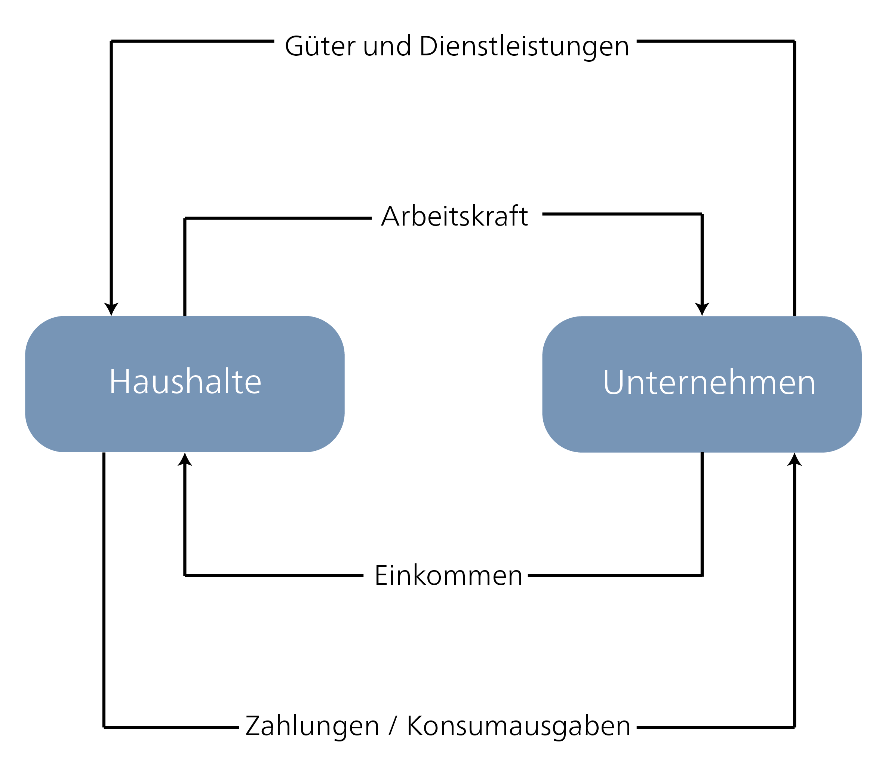

*Abbildung 13: Einfacher Wirtschaftskreislauf nach Rogall 2013, S. 32*

Erweitert man diesen Kreislauf um weitere Akteur\*innen (Staat, Banken, Ausland), lassen sich auch komplexere Zusammenhänge abbilden.

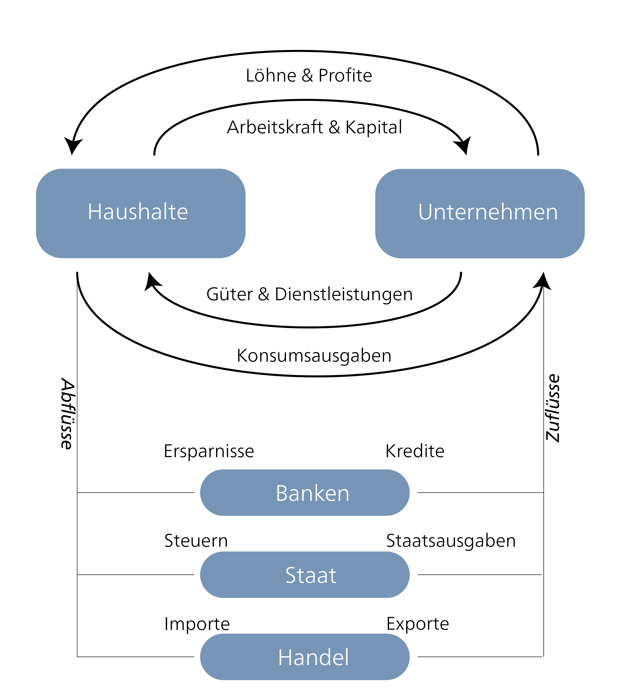

*Abbildung 14: Komplexeres Kreislaufmodell der Wirtschaft nach Mankiw/Taylor* [@bauerleGrundfragenOkonomie2026, p. 29]\* \*

Andere Denkschulen ziehen auch andere Bereitstellungsformen expliziter in Betracht. Die feministische Ökonomik betont bspw. die Bedeutung der unbezahlten Arbeit als Grundlage für die bezahlte Wirtschaft. Entsprechend nimmt sie in der Darstellung von wirtschaftlichen Aktivitäten eine wichtige Rolle ein. *Abbildung 15* zeigt zur Anschauung das Kreislaufmodell von Diane Elson, welche die unbezahlte Arbeit sichtbar macht. Die ökologische Ökonomik nimmt in solchen Darstellungen auch die Natur mit hinein, da auch die Natur die Grundlage für alles wirtschaftlich Handeln bietet. In Kapitel 3.1 werden wir uns eingehender damit befassen.

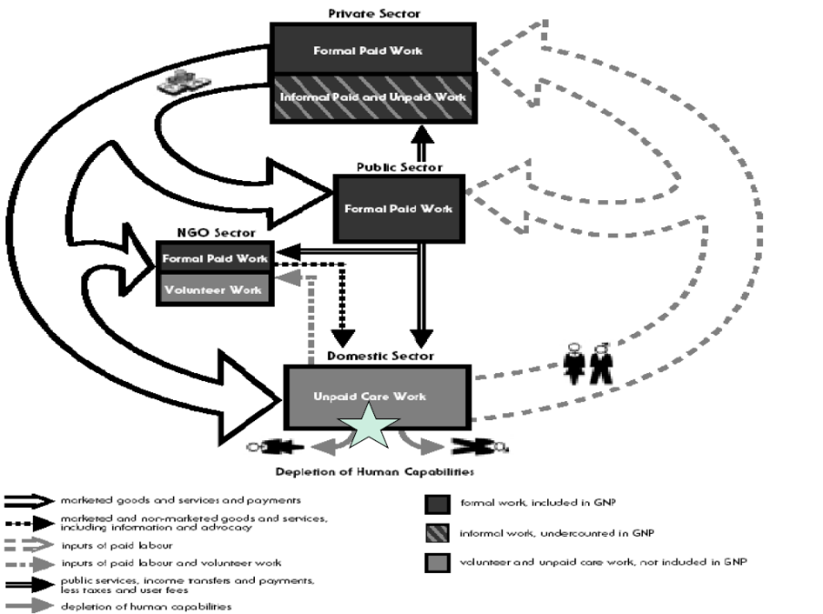

*Abbildung 15: Kreislaufmodell nach Diane Elson 2000*

Über die zentrale Bedeutung von Märkten sind sich die Denkschulen einig – nicht aber darüber, *was* Märkte eigentlich sind und wie sie funktionieren. Im Folgenden vergleichen wir zwei grundsätzlich verschiedene Antworten auf unsere Leitfrage: das abstrakte Marktverständnis der Neoklassik und das politökonomische Verständnis kapitalistischer Märkte. (Eine dritte Perspektive, die Institutionsökonomik, die die aktive Gestaltung von Märkten betont, greifen wir später beim Verhältnis von Markt und Staat wieder auf, Kapitel 5.)

### Funktionsweise des Marktes in der Neoklassik

Die Neoklassik betrachtet den **Markt als zentrale, selbstregulierende Institution** zur Bereitstellung von Gütern und Dienstleistungen betrachtet. Zentral ist hierbei, dass Märkte abstrakt konzeptualisiert werden, also dass sie als unabhängig von historischen und gesellschaftlichen Umständen verstanden werden. Dieses Verständnis impliziert, dass wir es hier mit (quasi-)natürlichen Mechanismen oder Gesetzen zu tun haben, die universell gelten. Dies ist der zentrale Unterschied zur politökonomischen Perspektive, die wir im Anschluss betrachten.

### Der Markt als zentrale Koordinationsinstanz

Im neoklassischen Verständnis koordinieren Märkte wirtschaftliche Aktivität über das Zusammenspiel von Angebot (Bereitschaft, etwas anzubieten) und Nachfrage (Bereitschaft, etwas zu erwerben). Dabei bilden die Gewinn- und Nutzenfunktionen der Akteur\*innen, die sich auf der Grundlage des Marginalprinzip (siehe Exkurs weiter unten) berechnen lassen, die Basis für Angebot und Nachfrage. Die Gesamtnachfrage ergibt sich aus der Aggregation der einzelnen Funktionen. Unternehmen versuchen, ihren Gewinn zu maximieren und Individuen versuchen, durch den Konsum ihren Nutzen (gemäss ihren Präferenzen) zu maximieren. In dieser Ausgangslage wird in der Folge durch den Wettbewerb und über den Preismechanismus bestimmt, wie die knappen Ressourcen verteilt werden (wie in Kapitel x dargestellt, ist das in der Neoklassik das zentrale ökonomische Problem). Wenn also Individuen frei entscheiden können, was sie kaufen und verkaufen möchten, sorgt der Marktmechanismus dafür, dass Güter dahin gehen, wo sie den höchsten Nutzen stiften, also zu einem effizienten oder optimalen Marktergebnis. Marktakteur\*innen und -strukturen sind lediglich von diesen Maximierungen geprägt, andere Einflüsse gibt es nicht, bspw. Bevorzugung oder Diskriminierung von Personen oder Gruppen. Es werden keine politischen oder moralischen Ziele verfolgt.

In den Wirtschaftswissenschaften werden Märkte meist mittels Preis-Mengen-Diagramm dargestellt. Die Achsen bilden Menge und Preis (resp. Lohn in Arbeits- und Zins in Kapitalmärkten) ab, Angebot und Nachfrage werden als Kurven dargestellt. Die Steigung der Kurven verändert sich mit der Elastizität von Angebot und Nachfrage und bildet ab, wie stark sich diese bei Änderungen von Menge oder Preis verändern. Die Neoklassik geht einerseits davon aus, dass der Markt zu einem Gelichgewicht tendiert und andererseits, dass dieses Gleichgewicht, das effizienteste Ergebnis darstellt. Als zentrale Referenz für die Beurteilung der Effizienz dient dabei die sogenannte Pareto-Effizienz (benannt nach dem Ökonomen Vilfredo Pareto. Eine Situation wird als Pareto-effizient oder auch Pareto-optimal verstanden, wenn keine Person bessergestellt werden kann (in Bezug auf den subjektiven Nutzen) ohne dass dabei einer anderen Person etwas weggenommen werden muss. Solange eine Person bessergestellt werden kann, ohne dass wir einer anderen Person was wegnehmen müssen, gilt die Situation als ineffizient. Wie in Kapitel 3.2 diskutiert wird, beinhaltet dies auch spezifische Gerechtigkeitsvorstellungen.

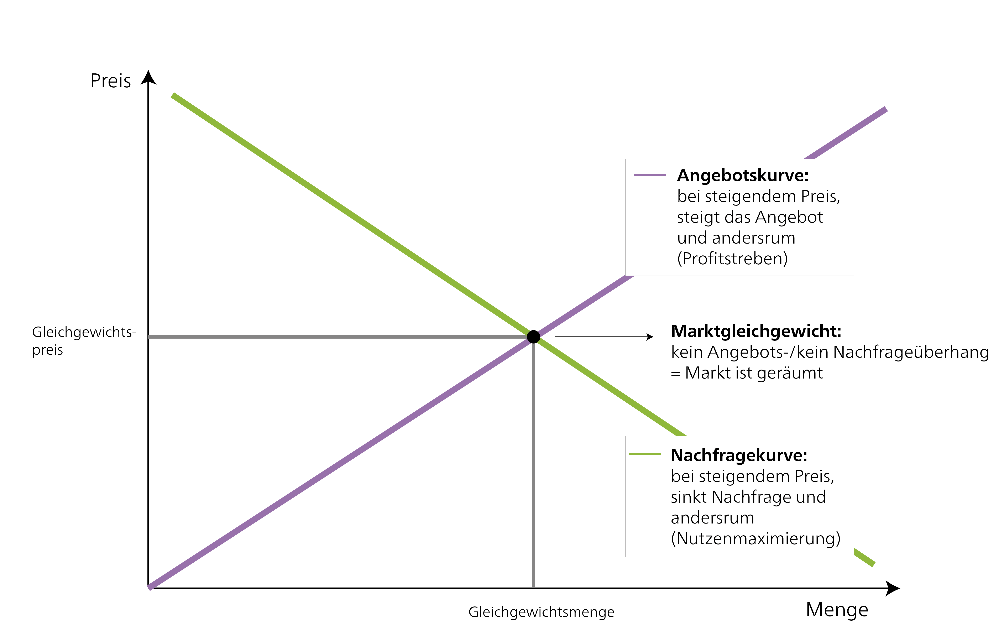

*Abbildung 16: Graphische Darstellung und Ermittlung eines Marktgleichgewichts*

Ist das Angebot eines Guts zu hoch, so sinkt der Preis – bei zu hoher Nachfrage steigt er an. Im Marktgleichgewicht entspricht die Nachfrage dem Angebot und der Preis stabilisiert sich. So wird durch den Preismechanismus entschieden, wer produziert, was und wie viel davon produziert wird und für wen produziert wird. Der Preis wird deshalb als zentrales Allokationsinstrument auf den Märkten betrachtet. Beispielsweise kann eine Fabrik, die mit veralteten Maschinen produziert, nicht zum selben Preis produzieren, wie eine andere Fabrik auf neuerem Stand. Aufgrund der zu hohen Produktionskosten scheidet sie vom Markt aus und muss andere Güter produzieren oder Konkurs anmelden. Der Wettbewerb sorgt dafür, dass dieser Mechanismus funktioniert und ineffiziente Unternehmen aus dem Markt ausscheiden. Eine zentrale Annahme dafür, damit sich die Angebotskurve nach oben neigt, liegt in der Annahme, dass ab einer gewissen Grösse die Grenzkosten von Unternehmen (auch in der langen Sicht) wieder steigen (bspw. durch erhöhten Koordinationsaufwand), dass es also gewissermassen eine Grenze des Wachstums für Unternehmen gibt. Diese Annahme ist aber umstritten [siehe bspw. @keenDebunkingEconomicsNaked2010; @pirgmaierNeoclassicalTrojanHorse2017]. Ist diese Annahme nicht erfüllt, könnte die Angebotskurve auch eine andere Neigung haben und es gäbe kein garantiertes Marktgleichgewicht mit vielen kompetitiven Unternehmen, sondern könnte auch eine Tendenz zum Monopol geben. Schon Alfred Marshall, dem Begründer dieses Preis-Mengen-Diagramms, haderte immer wieder mit der Frage, ob es nicht auch eine Tendenz zum Monopol geben könnte [@marshallIndustryTradeStudy1919, p. 316; @marshallPrinciplesEconomics2013, p. 324].

Die zentrale Grundannahme für diese Funktionsweise von Märkten ist diejenige der vollkommenen Konkurrenz. Bei **vollkommener Konkurrenz** haben einzelne Anbieter\*innen keinen Einfluss auf den Preis, da bei einer Preiserhöhung die Nachfrager\*innen bei anderen Anbieter\*innen kaufen. Unternehmen müssen den Marktpreis als gegebene Grösse annehmen und können nur über die von ihnen angebotene Menge entscheiden. Sie sind demnach in der Rolle der Preisnehmer und Mengenanpasser.

Damit vollkommene Konkurrenz möglich ist, sind mehrere Voraussetzungen nötig:

Auf dem Markt befinden sich eine grosse Anzahl von Anbieter\*innen und Nachfrager\*innen. Dieser Zustand wird als **Polypol** bezeichnet. Sind nur wenige Anbieter\*innen resp. Nachfrager\*innen vorhanden spricht man von einem Oligopol resp. Oligopson. Gibt es gar nur eine\*n Anbieter\*in resp. Nachfrager\*in spricht man von einem Monopol resp. Monopson (für eine Übersicht siehe @tbl-marktformen).

Alle Akteur\*innen verfügen über **vollständige Information**, d.h. es gibt keine versteckten Absprachen unter gewissen Marktteilnehmenden oder Unternehmen, die ohne Offenlegung minderwertige Güter anbieten.

Konsument\*innen haben **keinerlei Präferenzen für einzelne Anbieter\*innen**. Märkte funktionieren nur vollständig, wenn Konsument\*innen hindernisfrei zwischen den verschiedenen Anbieter\*innen wählen können. Ansonsten könnte ein\*e Anbieter\*in den Preis über den Marktpreis anheben und hätte trotzdem Kundschaft.

Sind die obenstehenden Voraussetzungen nicht gegeben, kann es zu Marktversagen kommen, der Markt funktioniert nicht mehr optimal. In einem neoklassischen Verständnis soll beim Aufkommen eines Marktversagen der Staat mit Regulierungen eingreifen. Solange aber kein Marktversagen eintritt, soll sich der Staat möglichst heraushalten und nur die Rahmenbedingungen garantieren. In Kapitel 5 schauen wir uns dann genauer an, wie die Beziehung zwischen dem Markt und dem Staat verstanden werden kann.

```{r}
#| label: tbl-marktformen
#| tbl-cap: "Marktformenschema: Marktformen nach Anzahl Anbieter und Nachfrager. Das Polypol ist eine Bedingung für die Annahme von vollkommener Konkurrenz. Quelle: eigene Darstellung nach [studyflix](https://studyflix.de/wirtschaft/marktformen-1492)."

library(kableExtra)
is_pdf <- knitr::is_latex_output()

df <- data.frame(
  Anbieter = c("ein Anbieter", "wenige Anbieter", "viele Anbieter"),
  `ein Nachfrager` = c(
    "Zweiseitiges Monopol",
    "Beschränktes Nachfragemonopol",
    "Nachfragemonopol (Monopson)"),
  `wenige Nachfrager` = c(
    "Beschränktes Angebotsmonopol",
    "Zweiseitiges Oligopol",
    "Nachfrageoligopol"),
  `viele Nachfrager` = c(
    "Monopol",
    "Oligopol",
    "Polypol"),
  check.names = FALSE
)

df |>
  kbl(booktabs = TRUE, align = "l") |>
  kable_styling(
    bootstrap_options = c("striped", "hover", "condensed"),
    latex_options = if (is_pdf) c("hold_position") else NULL,
    full_width = !is_pdf
  ) |>
  add_header_above(c(" " = 1, "Nachfrager" = 3)) |>
  column_spec(1, bold = TRUE, width = if (is_pdf) "3cm" else NA) |>
  column_spec(2:4, width = if (is_pdf) "3.8cm" else NA) |>
  row_spec(0, bold = TRUE)
```

::: {.callout-note collapse="false"}
#### Vertiefungsfragen

- Überlegen Sie sich für alle drei Voraussetzungen der vollkommenen Konkurrenz Beispiele aus der heutigen Wirtschaft, wo diese gegeben und wo nicht gegeben sind.
- Gibt es Unterschiede in der Nachfrage nach verschiedenen Gütern? Welchen Einfluss hat dies auf Märkte für Lebensmittel, Autos und Freizeitangebote?
- Überlegen Sie sich die Vor- und Nachteile, den Markt als abstraktes Konzept zu konzeptualisieren, also unabhängig vom historisch spezifischen Kontext.
:::

#### Arten von Märkten

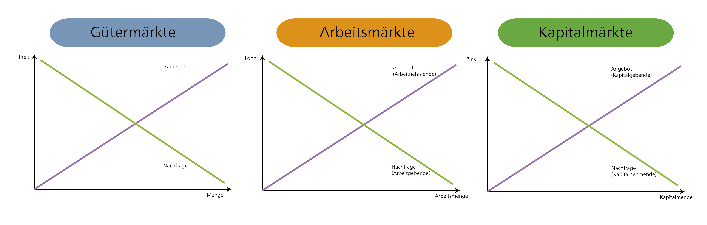

*Abbildung 18: verschiedene Arten von Märkten*

Dieser Marktmechanismus der Koordination von Angebot und Nachfrage wird auf verschiedene Märkte angewandt. Wesentlich unterschieden werden die Gütermärkte und die Faktormärkte. Auf **Gütermärkten** werden Güter und Dienstleistungen gehandelt. Auf **Faktormärkten** werden die Produktionsfaktoren (Boden, Kapital, Arbeit) angeboten und nachgefragt. So bieten die Haushalte auf dem Arbeitsmarkt ihre Arbeitskraft an und anstelle eines Preises entsteht durch die Nachfrage der Unternehmen durch den Preismechanismus die Höhe des bezahlten Lohns. Im neoklassischen Verständnis funktionieren all diese Märkte grundsätzlich nach der gleichen Logik. Der Arbeitsmarkt funktioniert nach dem gleichen Prinzip wie der Markt für Kartoffeln. Andere Denkschulen, bspw. die post-Keynesianische Ökonomik, betonten, dass Arbeitsmärkte sich stark von Gütermärkten unterscheiden.

::: {.callout-tip collapse="true"}
### Exkurs Preisniveau (nur bei Interesse)

Entsprechend der hohen Bedeutung des Preismechanismus für das Funktionieren von Märkten, ist das Preisniveau in einer Volkswirtschaft eine der wichtigsten Grössen die beobachtet und analysiert werden. Die Preisniveaustabilität wird anhand der Inflationsrate (Teuerungsrate) von Gütern und Dienstleistungen gemessen. Bei einer geringen Inflation von bis zu 2 % spricht man von einem stabilen Preisniveau. Statistische Ämter erfassen anhand eines standardisierten „Warenkorbs“, wie sich der Preisindex der Lebenshaltung über Zeit verändert. Sinkt das Preisniveau spricht man von Deflation. Die Zusammensetzung des Warenkorbs unterscheidet sich zwischen den Ländern und deckt meist nur Güter-, jedoch nicht Kapitalmärkte ab.

In der Schweiz erhebt das Bundesamt für Statistik den [Landesindex der Konsumentenpreise (LIK)](https://www.bfs.admin.ch/bfs/de/home/statistiken/preise/erhebungen/lik/warenkorb.html). In der untenstehenden Abbildung sehen Sie, aus welchen Konsumgütern und zu welchem Anteil sich dieser Index zusammenstellt. Der Warenkorb beinhaltet "die wichtigsten von den privaten Haushalten konsumierten Waren und Dienstleistungen". Die Gewichtung erfolgt aufgrund jährlicher Befragungen in den Haushalten und soll deren tatsächliches Konsumverhalten möglichst genau abbilden.

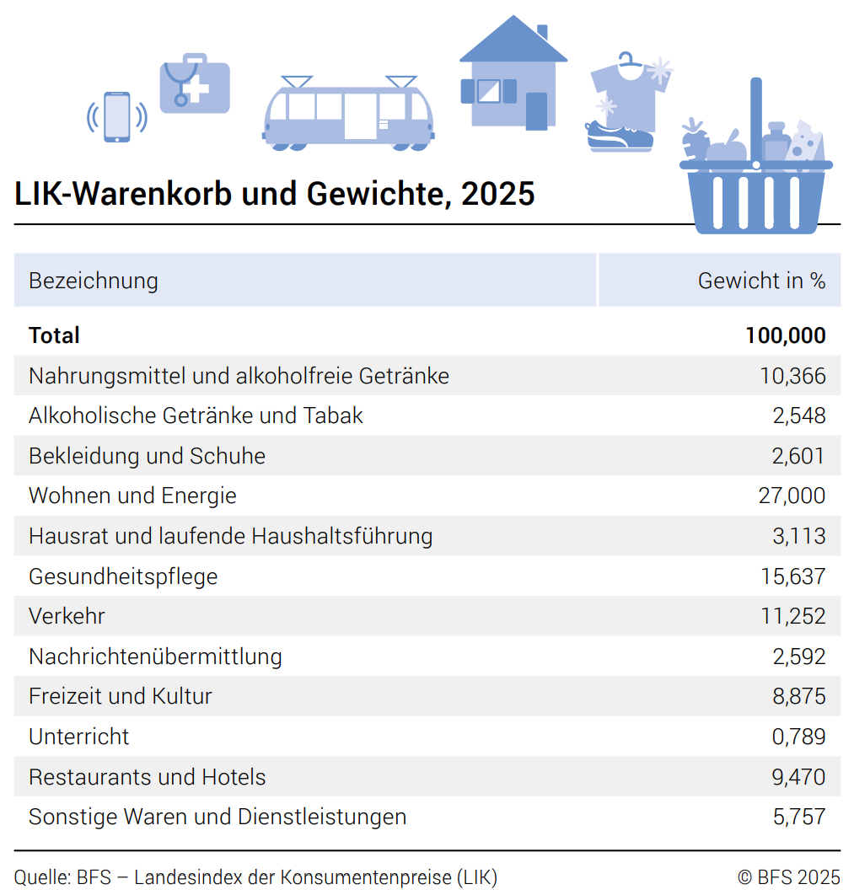

*Abbildung 19: Zusammensetzung des Warenkorbs für den Landesindex der Konsumentenpreise 2025 (Bundesamt für Statistik, 2025)*


:::

::: {.callout-tip collapse="true"}
### Exkurs: Die unsichtbare Hand des Marktes (nur bei Interesse)

Der Begriff der unsichtbaren Hand wird oft verwendet, um die **Selbstregulierung der Märkte** zu beschreiben. Der Begriff geht auf Adam Smith zurück. Adam Smith verwendete den Begriff zweimal in seinem früheren Werk „Theorie der ethischen Gefühle“ (1759) und einmal in seinem Werk „Der Wohlstand der Nationen“ (1776). In „Der Wohlstand der Nationen“ verwendet Smith den Begriff im Kapitel zu „Einfuhrbeschränkungen für ausländische Güter, die im Lande selbst hergestellt werden können“. In diesem Zusammenhang schreibt Smith, wenn jemand es vorziehe die nationale Wirtschaft anstelle der ausländischen zu unterstützen, würde diese Person von einer unsichtbaren Hand geleitet. Noam Chomsky interpretiert Smith deshalb dahingehend, dass er in dieser Stelle einen „Home Bias“ beschreibt. Verschiedene Ökonom\*innen haben die Stelle aber unterschiedlich interpretiert. Die populärste Interpretation sieht in dieser Stelle, die selbst regulierenden Kräfte des Marktes begründet. Das Marktgeschehen sei eine regulierende Kraft, die Einzelne dazu bringe, ihre individuellen Bedürfnisse bestmöglich zu befriedigen was gleichzeitig der Gesellschaft diene, indem Güter bestmöglich verteilt werden. Eine solche Interpretation ist in Anbetracht des einbettenden Kontexts umstritten und wird von Expert\*innen für Theoriengeschichte auch immer wieder kritisiert.

> „Tatsächlich fördert er in der Regel nicht bewusst das Allgemeinwohl, noch weiss er, wie hoch der eigene Beitrag ist. Wenn er es vorzieht, die nationale Wirtschaft anstatt die ausländische zu unterstützen, denkt er eigentlich nur an die eigene Sicherheit und wenn er dadurch die Erwerbstätigkeit so fördert, dass ihr Ertrag den höchsten Wert erzielen kann, strebt er lediglich nach eigenem Gewinn. Und er wird in diesem wie auch in vielen andern Fällen von einer unsichtbaren Hand geleitet, um einen Zweck zu fördern, den zu erfüllen er in keiner Weise beabsichtigt hat.“ [@smithWohlstandNationenUntersuchung2013, p. 371] Smith, Adam: Der Wohlstand der Nationen: Eine Untersuchung seiner Natur und seiner Ursachen, aus dem Englischen übersetzt von Horst Claus Recktenwald, 13. Auflage, Deutscher Taschenbuch Verlag GmbH & Co. KG, München 2013, S. 371.
:::

::: {.callout-tip collapse="true"}
### Exkurs: Das Marginalprinzip - Grenznutzen und Grenzkosten (nur bei Interesse)

Das Marginalprinzip ist zentral für die Konzipierung des Marktes aus einer neoklassischen Perspektive, da es sich der Erklärung der Entstehung von Wert und Nutzen und somit der Nachfrage annimmt. Das Marginalprinzip findet seine Ursprünge um 1870 in der marginalistischen Revolution und bildet bis heute die Grundlage der neoklassischen Volkswirtschaftslehre. Es behandelt die Frage nach dem Wert der Waren, wodurch es auch die Allokation von Gütern, Dienstleistungen und Produktionsfaktoren beeinflusst. Im Gegensatz zur Klassik löst sich das Marginalprinzip der Neoklassik von der objektiven Wertlehre und formuliert die subjektive Wertlehre.

Die objektive Wertelehre der Klassik postuliert, dass alle Waren einen objektiven Wert haben. Geläufig wurde die Arbeit, die in die Produktion der Ware gesteckt wurde, als Grundlage zur Bestimmung dieses Wertes herangezogen, was die Arbeitswerttheorie begründete. In der subjektiven Wertelehre werden hingegen keine absoluten Werte betrachtet, sondern die subjektiven Werte die Menschen Waren zuschreiben und deren marginalen Veränderungen in Bezug auf die Ausgangslage. Dieser Fokus auf marginale Veränderungen begründet das Marginalprinzip. Das Marginalprinzip ermöglichte die Übertragung der Differenzialrechnung auf die Kosten-/Nutzen- und Ertragsfunktion, wodurch die Anwendung mathematischer Modelle in den Wirtschaftswissenschaften anhaltenden Aufschwung erfuhr.

**Ertragsfunktion des Bodens und der Grenzertrag**

Ursprünglich wurde das Marginalprinzip bei der Ertragsfunktion des Bodens beobachtet. Untersuchungen der Landwirtschaft im 18. Jahrhundert offenbarten den Zusammenhang zwischen Faktoreinsatz und Ertrag. Der Grenzertrag ist der Zuwachs an Ertrag durch eine zusätzliche Einheit eines Produktionsfaktors.

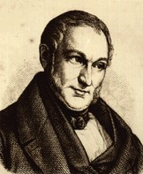

*„Es liegt in der Natur des Landbaues – und dies ist ein sehr beachtungswerter Umstand – dass das Mehrerzeugnis nicht in geradem Verhältnis mit der Zahl der mehr angestellten Arbeiter steigt, sondern jeder später angestellte Arbeiter liefert ein geringeres Erzeugnis als der vorhergehende.“* Johann Heinrich von Thünen 1850, Sekundarzitat nach Winfried Reiss in Mikroökonomische Theorie: Historisch fundierte Einführung 2007, S. 90f.

Was von Thünen mit dem Faktor Arbeit beobachtete, stellte auch A.R.J. Turgot beim Einsatz vom Faktor Kapital in Form von Dünger fest. Das Prinzip des Grenzertrags ist ebenso auf die industrielle Produktion und beispielsweise der Anzahl Arbeitender in einer Fabrik übertragbar.

**Die Gossenschen Gesetze**

Hermann Heinrich Gossen entwickelte 1854 seine Gesetze des menschlichen Verkehrs, und der daraus fliessenden Regeln für menschliches Handeln. Darin formulierte er die Gesetzmässigkeit von individuellen Präferenzen und deren Befriedigung, die sich am jeweiligen Nutzen orientiert.

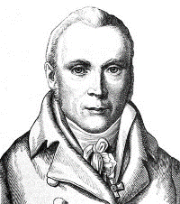

**Erstes Gossensches Gesetz: Gesetz vom abnehmenden Grenznutzen**

Das Gesetz vom abnehmenden Grenznutzen, auch Sättigungsgesetz genannt, lautet:

*„Die Größe eines und desselben Genusses nimmt, wenn wir mit Bereitung des Genusses ununterbrochen fortfahren, fortwährend ab, bis zuletzt Sättigung eintritt.“* Hermann Heinrich Gossen in Entwicklung der Gesetze des menschlichen Verkehrs, und der daraus fliessenden Regeln für menschliches Handeln 1854, S. 4.

So ist der Nutzen der ersten Tasse Kaffee an einem Morgen grösser als derjenige der dritten oder vierten. Ähnlich verhält es sich beim Wohnraum, wo bspw. das erste Badezimmereiner Wohnung den Bewohnenden von grösserem Nutzen ist als das zweite. Die Übertragung dieses Gesetzes ist gemäss der Theorie grundsätzlich auf alle Güter möglich.

**Zweites Gossensches Gesetz: Gesetz vom Ausgleich der Grenznutzen**

Das Gesetz vom Ausgleich der Grenznutzen, auch Genussausgleichsgesetz genannt, besagt:

*„Der Mensch, dem die Wahl zwischen mehren Genüssen frei steht, dessen Zeit aber nicht ausreicht, alle vollaus sich zu bereiten, muß, wie verschieden auch die absolute Größe der einzelnen Genüsse sein mag, um die Summe seines Genusses zum Größten zu bringen, bevor er auch nur den größten sich vollaus bereitet, sie alle teilweise bereiten, und zwar in einem solchen Verhältnis, daß die Größe eines jeden Genusses in dem Augenblick, in welchem seine Bereitung abgebrochen wird, bei allen noch die gleiche bleibt“*

Hermann Heinrich Gossen in Entwicklung der Gesetze des menschlichen Verkehrs, und der daraus fliessenden Regeln für menschliches Handeln 1854, S.12.

Dieses Gesetz zielt auf die optimale Verwendung von begrenzten Mitteln für verschiedene Güter. Der optimale Nutzen eines Individuums liegt dann vor, wenn der Grenznutzen (also der Nutzen der nächsten zusätzlichen Einheit) bei allen Gütern gleich ist. Mathematisch bedeutet dies, dass die Grenznutzenfunktionen der verschiedenen Güter gleichgesetzt werden. Der Grenznutzen entspricht dem maximalen Preis, welcher die entsprechende Person bereit ist zu zahlen. Aus der Aggregation der Grenznutzen(-funktionen) aller Individuum lässt sich die Gesamtnachfrage(-funktion) bestimmen. Das Marginalprinzip bildet entsprechend den Kern der neoklassischen Konsumtheorie. Für interessierte Studierende (die mit den Grundlagen der neoklassischen Ökonomik vertraut sind) empfiehlt sich die kritische Diskussion der neoklassischen Konsumtheorie von Ben Fine.

**Grenzkosten und Grenzertrag in Unternehmen**

Wie weiter oben hergeleitet beschreibt der Grenzertrag den Ertrag einer zusätzlichen Einheit. Analog beschreibt der Begriff **Grenzkosten** die Kosten einer zusätzlichen Einheit. Die Grenzkosten können mittels Ableitung der mathematischen Kostenfunktion ermittelt werden. Die Kosten \[K\] eines Unternehmens ergeben sich aus der Summe der fixen Kosten \[Kf\] (bspw. Miete, Maschinen) und der variablen Kosten \[Kv\] (Arbeitskraft, Rohstoffe, Vorprodukte).

$$K = K_f + K_v$$

Gemäss der neoklassischen Theorie orientieren sich Unternehmen neben der Kostenfunktion an der Erlösfunktion. Diese beschreibt, wie viel Erlös \[E\] beim Verkauf eines Guts abhängig von Menge \[X\] und Preis \[P\] entsteht.

$$E = P \cdot X$$

Durch die Ableitung der Erlösfunktion ergibt sich der Grenzerlös, den Erlös einer zusätzlich verkauften Einheit. Ein Unternehmen produziert solange bis die Grenzkosten die Grenzerträge übersteigen. Dies kann berechnet werden, indem die abgeleiteten Kosten- und Erlösfunktionen gleichgesetzt werden. Im Marktgleichgewicht (bei vollkommener Konkurrenz) entspricht der Preis theoretisch den Grenzkosten. Obwohl die neoklassische Theorie stark auf den Preis fokussiert, hat sie sich wenig damit beschäftigt, wie Unternehmen Preise setzen. Nubbemeyer [@nubbemeyerReconsiderationFullCostPricing2010] zeigt in seiner Dissertation auf, dass es bis Mitte des 20. Jahrhunderts kontrovers diskutiert wurde, ob Unternehmen sich für die Preissetzung tatsächlich am Marginalprinzip oder alternativen Konzepten (bspw. Mark-up Pricing wie in einigen Post-keynesianischen Modellen) orientieren. Obwohl die Debatte nicht abschliessend gelöst wurde, dominiert die Idee des Marginalprinzips die Ökonomik.
:::

### Märkte als Arenen von Macht und Verteilung – Kapitalistisches Produktionssystem

Während die neoklassische Ökonomik Märkte als universelle Institutionen anschaut, untersuchen andere Denkschulen kapitalistische Märkte in ihrer historischen und gesellschaftlichen Spezifität. Das heisst, diese Analysen beanspruchen keine universelle Gültigkeit, sondern wollen die Dynamiken auf kapitalistischen Märkten in einem spezifischen Kontext verstehen.

Aus dieser Sicht sind Märkte kein Naturzustand, sondern werden aktiv durch Akteur\*innen, Institutionen, Eigentumsrechte und Gesetze **gestaltet und reguliert.** Damit stellt sich unmittelbar unsere Leitfrage: Wer bestimmt die "Spielregeln" und wessen Interessen dienen sie? Diese Frage öffnet den Blick für **Macht und Verteilung**, die in politökonomischen Perspektiven eine zentrale Rolle spielen. Eine politökonomische Perspektive bedeutet, dass ökonomische, politische und gesellschaftliche Aspekte und Strukturen zusammenhängend verstanden werden und so bspw. eben Macht, Institutionen und Verteilung zentrale Beachtung finden. Die politische Ökonomie ist somit ein Sammelbegriff und verschiedene Denkschulen können eine politökonomische Perspektive einnehmen (auch in der Neoklasik gibt es einen Strang der politischen Ökonomie). Die Marxistische und post-keynesianische Ökonomik, sowie Teile der feministischen und ökologischen Ökonomik verstehen sich im Grundsatz als politökonomisch. Im Gegensatz zur Neoklassik gelten kapitalistische Märkte in dieser Perspektive zudem als inhärent **instabil**. So sind Klassenkonflikte und Machtdynamiken keine Ausnahme, sondern strukturell angelegt.

Um diese Perspektive konkreter zu fassen, fragen wir im nächsten Abschnitt: Was genau macht ein Wirtschaftssystem eigentlich zu einem *Kapitalistischen*?

### Was macht ein Wirtschaftssystem eigentlich zu einem Kapitalistischen?

Es gibt viele unterschiedliche Definitionen dessen, was die Essenz eines kapitalistischen Wirtschaftssystems ausmacht. Einige zentrale Aspekte lassen sich aber festhalten (Fraser 2022):

- Die Produktionsmittel befinden sich überwiegend in privatem Eigentum.

- Die Mehrheit der Arbeitnehmenden sind von den Produktionsmitteln getrennt. Sie haben also nicht das Eigentum an den Produktionsmitteln. Sie müssen deshalb ihre Arbeitskraft gegen Lohn verkaufen.

- Wirtschaftliche Entscheidungen und die Verteilung von Gütern werden überwiegend über Märkte koordiniert.

- Unternehmen produzieren überwiegend mit dem Ziel, Gewinne zu erzielen. Der Wettbewerbsdruck führt dazu, dass ein grosser Teil dieser Gewinne reinvestiert wird und so die ständige Kapitalakkumulation zu einem zentralen Merkmal kapitalistischer Wirtschaft wird. Dies führt zu einem Zwang zu ständigem Wachstum.

Für uns mögen diese Verhältnisse sehr alltäglich vorkommen. So gehen viele von uns einer Lohnarbeit nach, Märkte begegnen uns überall und Wettbewerb und Profitmotiv scheinen in den wirtschaftspolitischen Nachrichten so selbstverständlich, dass sie auch nicht weiter erklärt werden müssen. Tatsächlich wird diese Art von Wirtschaften aber erst im Laufe des 19. Jahrhunderts mit dem Aufkommen der Industrialisierung in England dominant. Davor waren in Westeuropa Bauern und Bäuerinnen über das Feudalsystem an das Land und der Grundherr gebunden und die Wirtschaft grösstenteils von Landwirtschaft geprägt. Die Produktion für den Eigenbedarf und die lokale Versorgung dominierten vielerorts. Zusätzlich spielte gemeinschaftliche Nutzung von Boden und Ressourcen, neben herrschaftlichem und privatem Besitz, eine wichtige Rolle für die Versorgung der Bevölkerung. Auch Märkte (bspw. Wochenmärkte, Jahrmärkte etc.) spielten schon eine Rolle, aber hatten im Alltag und für die Versorgung der Bevölkerung eine geringere Bedeutung als heute. Zudem waren Märkte stark in die Gesellschaft und in ein Moralsystem eingebettet – so spielten bspw. Vorstellungen von einem gerechten Preis eine zentrale Rolle.

Eine einflussreiche, vorwiegend Marxistische Interpretation sieht einen entscheidenden Schritt zur Entstehung des Kapitalismus darin, dass Menschen von ihrem Zugang zu Land und Produktionsmitteln getrennt wurden. So wurde über Jahrhunderte immer mehr Land im Gemeinbesitz, also Commons, privatisiert. Durch diese Einhegungen (engl. *enclosures*) und die Privatisierung gemeinschaftlich genutzter Flächen verloren viele bäuerliche Haushalte ihre Existenzgrundlage und wurden zunehmend auf Lohnarbeit angewiesen [@polanyiGreatTransformation2017]. Dies war teilweise ein sehr gewaltvoller Prozess und veranschaulicht, dass Märkte nicht unabhängig von gesellschaftlichen und politischen Prozessen entstehen. Sie werden durch verschiedene Akteur\*innen, staatliche Interventionen, Eigentumsrechte, Gesetze usw. aktiv geschaffen und gestaltet. Dabei wird klar, dass auch Macht ein zentraler Faktor ist.

Aber wie und wann sich der Kapitalismus genau herausbildet, ist bis heute in der Wissenschaft umstritten. Während einige Autor\*innen den Ursprung vor allem in veränderten Klassenverhältnissen und -konflikten in England sehen [bspw. @woodUrsprungKapitalismusSpurensuche2015], betonen andere die zentrale Rolle von Kolonialismus, Sklaverei und globalem Handel [bspw. @beckertKapitalismusGeschichteWeltrevolution2026]. Viele aktuelle Arbeiten versuchen diese beiden Perspektiven zu verbinden. Und während die einen den Ursprung des Kapitalismus schon im Mittelalter verorten, sehen andere die entscheidenden Schritte der Entstehung erst im Industriekapitalismus des 19. Jahrhunderts. Auch hier ist es eine Frage der Perspektive und vom Verständnis, was Kapitalismus genau ist (bspw., ob wir im Fernhandel ab dem 16. Jahrhundert bereits kapitalistische Elemente verorten können oder nicht).

#### Wie funktionieren kapitalistische Märkte?

**Warum müssen Unternehmen (und ganze Volkswirtschaften) eigentlich ständig wachsen?** Eine zentrale Dynamik kapitalistischer Wirtschaft ist die Akkumulation von Kapital. Unternehmen produzieren nicht nur, um Güter bereitzustellen, sondern um Gewinne zu erzielen und diese Gewinne erneut in den Produktionsprozess zu investieren. Marx beschreibt diese Dynamik als Bewegung von Geld (M) über Produktion von Ware (C) zurück zu mehr Geld (M’) – (wird oft unter dieser Schreibweise zusammengefasst: M–C–M’): Kapital wird eingesetzt, um Waren zu produzieren, deren Verkauf einen höheren Geldbetrag generiert. Kapital muss sich somit kontinuierlich vermehren. Diese Dynamik ist nicht allein durch individuelle Gewinninteressen einzelner Unternehmen bestimmt, sondern entsteht auch durch den Wettbewerbsdruck zwischen Unternehmen. Unternehmen, die nicht investieren, Innovationen hervorbringen oder ihre Produktivität steigern, riskieren, Marktanteile zu verlieren. Konkurrenz erzeugt dadurch einen systemischen Druck zu Wachstum, Expansion und ständiger Steigerung der Produktivität. Aus dieser Wachstumsdynamik entstehen mehrere Spannungen:

- **Kapital vs. Arbeit:** Da die Mehrheit der Menschen keine Produktionsmittel besitzt, ist sie darauf angewiesen, ihre Arbeitskraft gegen Lohn zu verkaufen. Gleichzeitig sind Unternehmen bestrebt, Gewinne zu erzielen, indem sie die Produktivität der Arbeit erhöhen und Kosten reduzieren. So stehen Profite und Löhne in einer inversen Beziehung, denn höhere Löhne bedeuten in der Regel tiefere Profite und umgekehrt. Marx beschreibt dieses Verhältnis als grundlegenden Klassenkonflikt zwischen Kapital und Arbeit. Dabei beschreibt Marx einen Prozess der Ausbeutung. Unternehmen zahlen Arbeitnehmenden nicht den vollständigen Wert, den sie durch ihre Arbeit erzeugen und schöpfen den Rest in Form von Profit ab (dieser Rest wird auch als Mehrwert bezeichnet). Da die Arbeitenden nicht den vollständigen Wert ihrer Arbeit erhalten, bezeichnet Marx diesen Prozess als Ausbeutung. Dabei beschreibt Ausbeutung in der marxistischen Theorie nicht primär eine moralische Bewertung einzelner Unternehmen, sondern eine gesellschaftliche Beziehung (siehe auch Kapitel 2.3.2 zu Kapital).

- **Verteilung von Einkommen und Nachfrage:** Während Unternehmen ein Interesse daran haben können, Lohnkosten zu reduzieren, stellen Löhne gleichzeitig die wichtigste Einkommensquelle für einen grossen Teil der Bevölkerung und damit eine zentrale Grundlage für Konsumnachfrage dar. Ein starker Druck auf Löhne kann daher zwar kurzfristig die Profitabilität einzelner Unternehmen erhöhen, langfristig aber zu einer schwächeren gesamtwirtschaftlichen Nachfrage beitragen. Marxistische Ansätze beschreiben dies als mögliche Tendenz zu Überproduktionskrisen: Unternehmen können mehr produzieren, als aufgrund der vorhandenen Kaufkraft abgesetzt werden kann. Post-Keynesianische Ansätze greifen diese Problematik ebenfalls auf, betonen aber insbesondere die Wichtigkeit von der Nachfrage für die wirtschaftliche Entwicklung. Sinkt (steigt) die Nachfrage investieren Unternehmen in der Tendenz weniger (mehr), was sich wiederum negativ (positiv) auf die wirtschaftliche Entwicklung auswirken kann.

- **Konkurrenz und Konzentration:** Einerseits gilt Wettbewerb als wichtiger Mechanismus für Innovation und Effizienzsteigerung. Andererseits kann Wettbewerb langfristig zu einer Konzentration von Kapital führen, da erfolgreiche Unternehmen Marktanteile gewinnen und kleinere Unternehmen verdrängen können. Dadurch können dominante Unternehmen und monopolähnliche Strukturen entstehen.

- **Gesellschaftliche und ökologische Grenzen:** Feministische Ökonom\*innen weisen darauf hin, dass kapitalistische Wirtschaft auf Arbeit angewiesen ist, die häufig ausserhalb von Märkten stattfindet, insbesondere unbezahlte Sorge- und Reproduktionsarbeit. Diese Tätigkeiten schaffen die Voraussetzungen dafür, dass die bezahlte Wirtschaft überhaupt möglich ist. Ökologische Ökonom\*innen betonen zudem, dass kapitalistische Akkumulation auf der Nutzung natürlicher Ressourcen basiert. Die kontinuierliche Ausweitung von Produktion und Konsum kann dadurch in Konflikt mit den begrenzten ökologischen Kapazitäten des Planeten geraten.

Die beschriebene Wachstumsdynamik und deren Spannungen führen dazu, dass kapitalistische Wirtschaftssysteme in besonderem Masse von Wachstum abhängig sind. Matthias Binswanger [@binswangerWachstumszwangWarumVolkswirtschaft2019] argumentiert, dass kapitalistische Wirtschaftssysteme gar einem **Wachstumszwang** ausgesetzt sind. Unternehmen müssen Gewinne erzielen, um Investitionen zu finanzieren und langfristig bestehen zu können. Wenn Unternehmen im Durchschnitt keine Gewinne erwirtschaften, kann dies zu einer Abwärtsspirale führen: Investitionen gehen zurück, Beschäftigung sinkt und die gesamtwirtschaftliche Nachfrage nimmt ab. Wachstum stabilisiert somit nicht nur einzelne Unternehmen, sondern das gesamte Wirtschaftssystem. Schmelzer & Vetter [@schmelzerDegrowthPostwachstum2019] argumentieren ihrerseits, dass **Wachstumsabhängigkeit** nicht zwangsläufig bedeutet, dass jede einzelne wirtschaftliche Aktivität wachsen muss. Vielmehr kann ein längerfristiges Ausbleiben von Wachstum erhebliche wirtschaftliche und gesellschaftliche Spannungen erzeugen. Eine Phase der Stagnation oder Schrumpfung kann zu steigender Arbeitslosigkeit, sinkenden Einkommen, Unternehmenskrisen und einer Belastung öffentlicher Haushalte führen [@schmelzerDegrowthPostwachstum2019]. Bleibt das Wachstum also aus, gerät das System in die Krise.

Verstärkt wird dieser Zwang/Abhängigkeit durch institutionelle Faktoren. Beispielsweise setzen moderne, kreditbasierte Finanzsysteme künftiges Wachstum voraus, damit Kredite zurückgezahlt werden können. Zudem sind in vielen Ländern Sozialversicherungssysteme - so auch in der Schweiz - eng an Erwerbsarbeit gekoppelt. Hohe Beschäftigung und steigende Einkommen werden dadurch zu wichtigen Voraussetzungen gesellschaftlicher Stabilität. Wachstum ist damit nicht nur ökonomisches Ziel, sondern tief in gesellschaftliche Institutionen eingebettet. Gemäss Hartmut Rosa [@rosaSocialAccelerationEthical2003a] ist Wachstum sogar kulturell zu einer zentralen Erwartung geworden.

Aus Sicht der ökologischen Ökonomik ist diese Wachstumsorientierung grundlegend problematisch, da Wirtschaftswachstum historisch eng an steigenden Energie- und Ressourcenverbrauch gekoppelt war und weiter ist. Ob sich Wachstum dauerhaft von Umweltbelastung entkoppeln lässt, ist der zentrale Streitpunkt zwischen Ansätzen des grünen Wachstums und Postwachstumsansätzen – dazu mehr in Kapitel X.

### Sind Finanzkrisen Unfälle – oder eingebaut ins System?

Geld und Kredit sind eine wichtige Voraussetzung für kapitalistische Dynamiken. Unternehmen können durch Kredite Investitionen tätigen, Produktionskapazitäten ausbauen und Innovationen finanzieren. Seit den 1980er-Jahren kam es in vielen Ländern zu einer zunehmenden Liberalisierung und Deregulierung der Finanzmärkte. In der Zeit nach der Grossen Depression von 1929 wurden Banken und die Finanzmärkte noch stark reguliert. Mit der Deregulierung der 1980er Jahren veränderte sich auch die Rolle des Finanzsektors innerhalb kapitalistischer Wirtschaftssysteme. Während Finanzmärkte ursprünglich vor allem die Aufgabe hatten, produktive Investitionen zu ermöglichen, gewannen zunehmend finanzielle Renditen und kurzfristige Wertsteigerungen an Bedeutung. Diese Entwicklung wird als *Finanzialisierung* bezeichnet. Gemeint ist damit eine zunehmende Bedeutung von Finanzmärkten, Finanzinstitutionen und finanziellen Motiven für Unternehmen, Haushalte und Staaten. Unternehmen orientieren sich beispielsweise stärker an kurzfristigen Renditezielen und der Steigerung des Aktienwertes, während Finanzinstitutionen zunehmend Gewinne durch Handel mit Finanzanlagen wie Aktien, Anleihen, Rohstoffen oder Derivaten erzielen. Mit der Bedeutung des Finanzmarktes für die gesamte Wirtschaft steigt auch die Macht der Finanzwirtschaft.

Die Deregulierung berief sich vor allem auf Theorien aus der neoklassischen Ökonomik, die argumentierten, dass deregulierte Finanzmärkte aufgrund ihrer Informationsverarbeitung und der Rationalität individueller Marktteilnehmer\*innen grundsätzlich effizient funktionieren würden (Fama 1970). Die grosse Finanzkrise von 2008 stellte diese Annahmen jedoch grundlegend infrage. Während die Finanzkrise aus einer neoklassischen Perspektive einen exogenen Schock darstellt, also ein äusserer Schock, der das Gleichgewicht störte, betonen andere Denkschulen, vor allem die post-Keynesianische Ökonomik, dass Finanzkrisen aus dem System selbst entstehen und das System somit inhärent instabil ist.. Die post-Keynesianische Ökonomik betont, dass Investitionen in erster Linie von Erwartungen über zukünftige Gewinne abhängen. Unternehmen investieren, wenn sie erwarten, dass zukünftige Einnahmen die Kosten der Investition übersteigen. Diese Erwartungen sind jedoch grundsätzlich unsicher. Dadurch können Investitionen und wirtschaftliche Aktivität starken Schwankungen unterliegen. Hyman Minsky [@minskyFinancialInstabilityHypothesis1992] zeigt mit seiner Hypothese finanzieller Instabilität, dass gerade Phasen wirtschaftlicher Stabilität neue Instabilitäten erzeugen können. In Zeiten steigenden Vertrauens nehmen Unternehmen und Haushalte zunehmend Kredite auf und Finanzinstitutionen sind bereit, höhere Risiken einzugehen. Dadurch kann sich eine Dynamik entwickeln, in der steigende Vermögenspreise und zunehmende Verschuldung die wirtschaftliche Expansion zunächst verstärken. Gleichzeitig wird das System jedoch anfälliger für Krisen. Wenn Erwartungen enttäuscht werden, können Kreditvergabe, Investitionen und Konsum abrupt zurückgehen. Die grosse Finanzkrise von 2008 war ein eindrückliches Beispiel dafür. Finanzkrisen sind aus dieser Perspektive deshalb nicht einfach externe Störungen eines grundsätzlich stabilen Marktsystems, sondern können aus den normalen Dynamiken kapitalistischer Finanzsysteme entstehen.

Die beschriebenen Spannungen sowie die Instabilität des Finanzsystems bedeuten nicht, dass kapitalistische Gesellschaften zwangsläufig zusammenbrechen. Sie zeigen aber auf, dass kapitalistische Märkte nicht von selbst in ein stabiles Gleichgewicht finden. Stattdessen sind sie instabil und krisenanfällig. Historisch haben kapitalistische Gesellschaften verschiedene Mechanismen entwickelt, um diese Konflikte zu begrenzen und Stabilität herzustellen. Dazu gehören beispielsweise staatliche Regulierung, Sozialversicherungen, Arbeitsrechte, öffentliche Investitionen oder die Erschliessung neuer Märkte. Die konkrete Ausgestaltung des Kapitalismus unterscheidet sich daher stark zwischen historischen Perioden und auch zwischen verschiedenen Regionen. Ein oft diskutiertes Beispiel von Stabilisierung ist das Fordistische Akkumulationsregime nach dem 2. Weltkrieg, als Arbeitnehmende zu grossen Teilen die kapitalistische Eigentums- und Wirtschaftsordnung anerkannten und Unternehmen steigende Löhne und den Ausbau des Sozialstaates akzeptierten. Produktivitätswachstum setzte sich dann stark in steigende Löhne um. Eine Entwicklung, die ab den 1970er Jahren jedoch ins Stocken geriet. Dies hatte dann starke Auswirkungen auf das Leben von vielen Menschen. In Kapitel x diskutieren wir die sozialen Grenzen und werden auch vertieft auf diese Entwicklungen eingehen.

::: {.callout-note collapse="false"}
#### Vertiefungsfragen

- Überlegen Sie sich, wo Sie in Ihrem Alltag Spannungen der kapitalistischen Produktionsweise begegnen und wie diese sich auf Ihren Alltag auswirken.
- Suchen Sie Beispiele für Wechselwirkungen zwischen Ökonomie, Politik und Gesellschaft.
- Kennen Sie gegenwärtige Prozesse der Einhegung? Wie hängen diese mit der kapitalistischen Produktionsweise zusammen?
:::

::: {.callout-tip collapse="true"}
### Exkurs - Oeconomia: Wirtschaftswachstum, Verschuldung, Ungleichheit und Gewinne

Carmon Losmann hat 2020 einen [Dokumentarfilm](https://www.3sat.de/film/dokumentarfilm/oeconomia-100.html) zum Zusammenhang von Wirtschaftswachstum, Verschuldung, Ungleichheit und Gewinnen gedreht. Der Film beschäftigt sich auf sehr zugängliche Weise mit diesen komplexen Zusammenhängen und regt zur Reflexion an. Auch wenn der Film teilweise eine gewisse Unschärfe aufweist, lohnt sich der Film als Einstieg sehr.
:::
