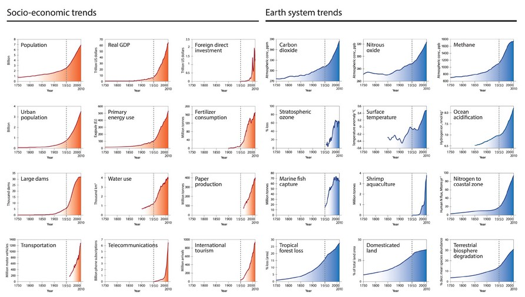
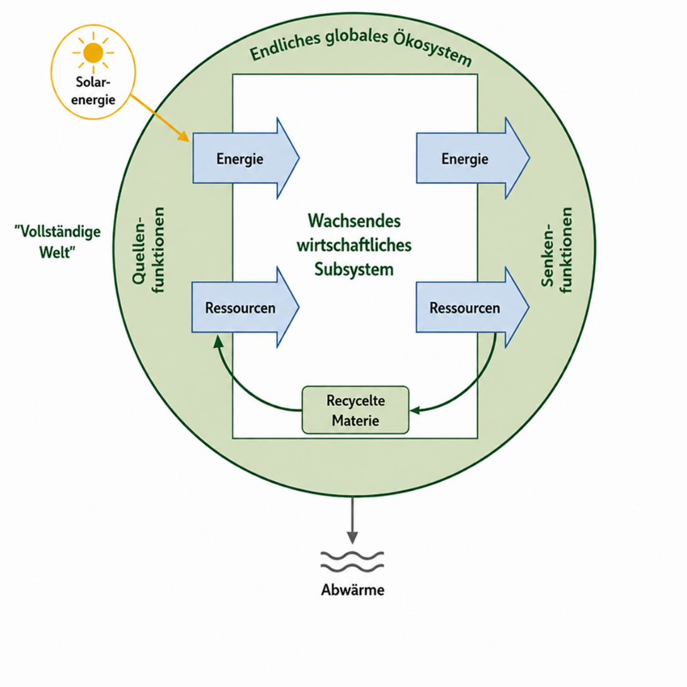
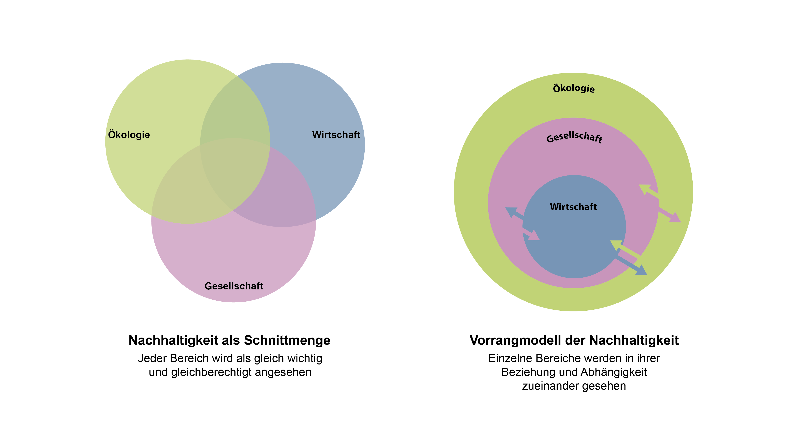
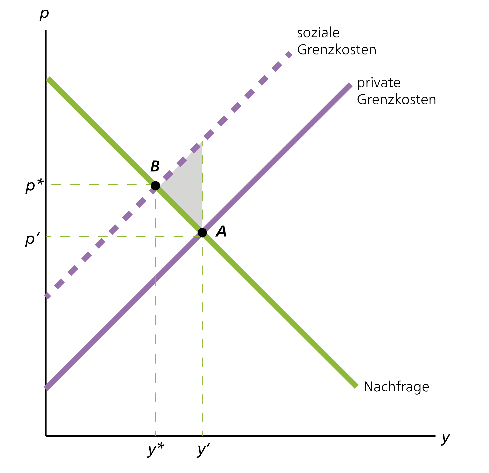
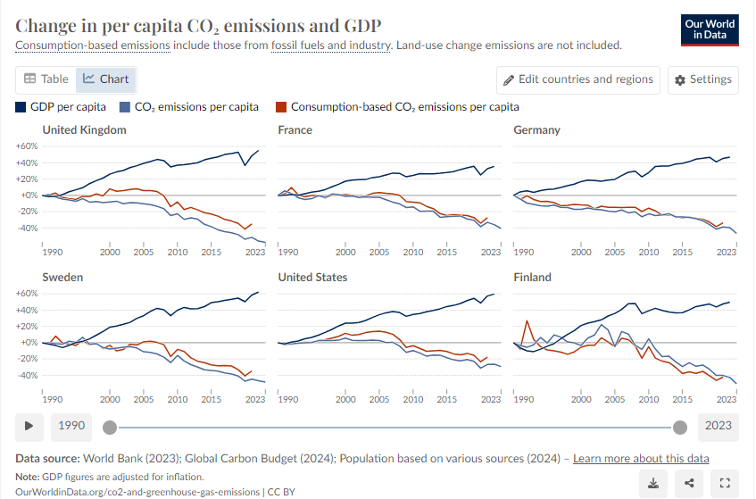
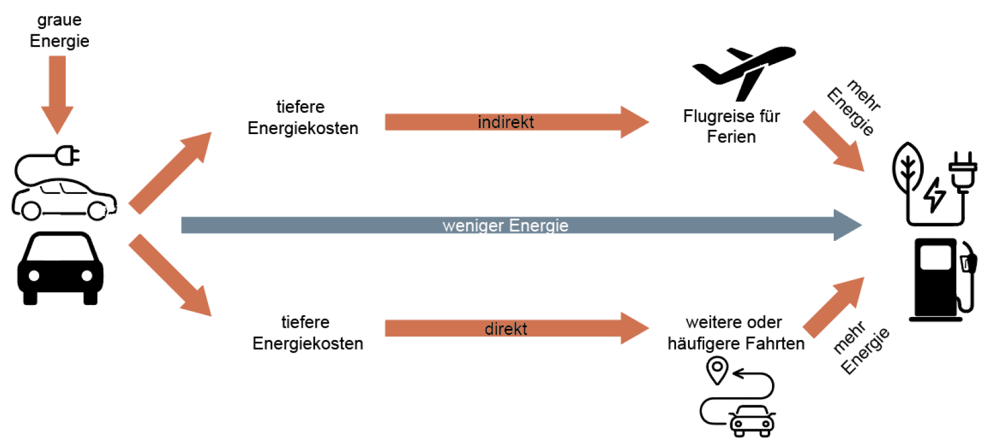
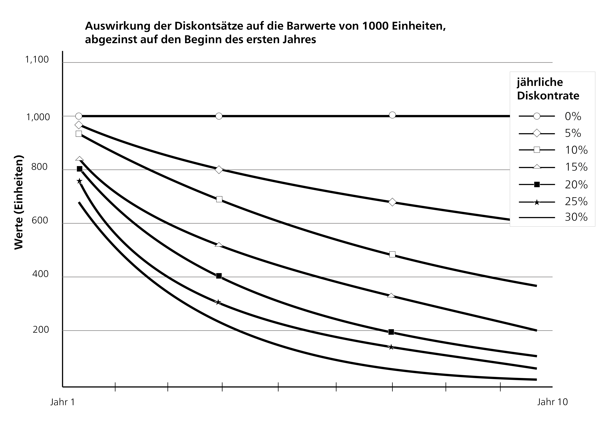
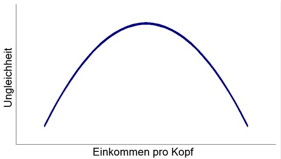
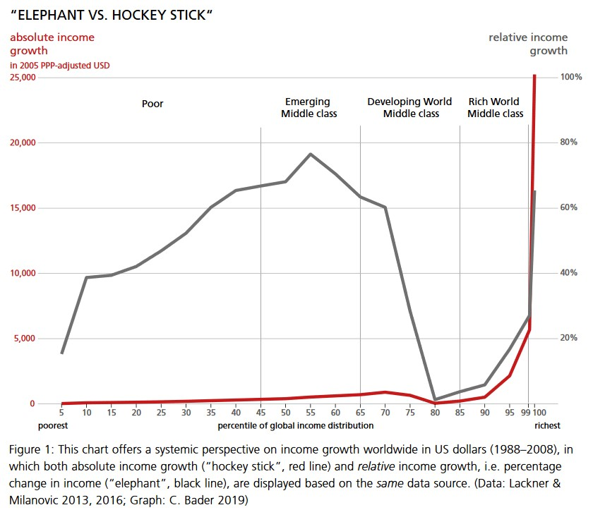

::: {.callout-note .leitfrage}
### Leitfrage

Leitfrage: Wenn Wohlstand für alle – innerhalb ökologischer Grenzen – das Ziel ist, das wir in Kapitel 2 als Ausgangspunkt genommen haben: Warum erreichen wir dieses Ziel nicht, und was genau steht ihm im Weg?
:::

Die derzeitige Wirtschaftsweise führt zu grossen Herausforderungen, die sich in verschiedenen Krisen manifestieren. Bei den aktuellen Krisen wird von einer Vielfachkrise gesprochen, seit kürzerem auch vermehrt von einer **Polykrise** (siehe bspw. [@lawrenceGlobalPolycrisisCausal2024a] oder dieses [Erklärvideo](https://www.weforum.org/videos/experts-explain-adam-tooze-what-is-the-polycrisis/) von Adam Tooze) weil sie die Arbeits- und Lebenswelt der Menschen in vielfältiger Weise berühren sowie miteinander verwoben sind. Die einzelnen Krisen sind teilweise stark miteinander verbunden und haben gemeinsame Ursachen. Andere erscheinen eher unabhängig voneinander und haben nicht unbedingt die gleichen Ursachen. In ihrer Ganzheit kulminieren sich all diese Krise aber zu dieser, oft überwältigend wirkenden, Polykrise. In diesem Kapitel wollen wir uns der **Analyse dieser Krisen** widmen, bevor wir uns mit den Lösungen für eine nachhaltige Wirtschaft auseinandersetzen. Im Folgenden widmen wir uns den ökologischen und sozialen Problemen separat. Es ist aber wichtig zu betonen, dass diese Dimensionen stark miteinander verknüpft sind und sich gegenseitig verstärken können. Die Trennung dieser Bereiche soll die Einführung aber erleichtern.

Wie in den vorangehenden Kapiteln ersichtlich wurde, ist auch die Analyse selbst von der Perspektive geprägt, die eine Person einnimmt. Die Problemanalyse würde je nach Denkschule anders ausfallen. So sieht bspw. die Neoklassik in der steigenden Einkommens- und Vermögensungleichheit nicht unbedingt ein Problem, solange diese durch marktwirtschaftliche Mechanismen zustande kommt. Eine Denkschule welche Machtaspekte in die Analyse einbezieht, wie bspw. die feministische oder die Marxistische, sieht in dieser Ungleichheit ein zentrales Problem für Wirtschaft und Gesellschaft. Entsprechend der Ausrichtung der Veranstaltung werden wir die Problemanalyse möglichst breit, über möglichst alle Denkschulen hinweg, fassen. Im späteren Verlauf der Veranstaltung werden wir auch genauer sehen, welche Analysen und Schlussfolgerungen aus welcher Denkschule einfliessen. In der Selbststudienphase befassen wir uns zuerst mit den ökologischen Grenzen des gegenwärtigen Wirtschaftens und mit dem Zusammenhang zwischen Natur und Ökonomie. Danach schauen wir uns in der vierten Selbststudienphase die sozialen Grenzen des gewärtigen Systems an und wie Ökonomie und Gesellschaft zusammenhängen.

## Ökologische Grenzen - Wie viel Erde haben wir eigentlich – und wie viel verbrauchen wir?

Die ökologischen Grenzen unseres wirtschaftlichen Handelns sind schon länger konkret spürbar und nicht nur abstrakte Diskussionen über Klimamodellen. Wir können sie in unserem alltäglichen Leben spüren. Während der Erarbeitung dieses Skripts im Sommer 2026 kam die vierte Hitzewelle auf die Schweiz, Waldbrände wütenden in Frankreich und Spanien und überall in Europa waren die Folgen der Hitze und Trockenheit spürbar. In Zusammenhang für eine nachhaltige Ökonomie stellt sich die Frage, wie wir diese Entwicklungen mit den wirtschaftlichen Aktivitäten in Verbindung bringen oder allgemeiner, wie wir den Zusammenhang zwischen Wirtschaft und Natur verstehen können. Wie wir diesen Zusammenhang verstehen, beeinflusst was wir als Problem wahrnehmen und bildet auch die Grundlage den Möglichkeitsrahmen, in welchem wir Lösungen denken und entwickeln können. Wir werden uns hier vor allem auf die neoklassische und ökologische Ökonomik fokussieren, da sie zwei grundlegend unterschiedliche Verständnisse von dieser Beziehung haben. Während die ökologische Ökonomik betont, dass die Wirtschaft in die natürliche Umwelt eingebettet und auf die Natur als Grundlage zwingend angewiesen ist, versteht die Neoklassik die Natur und Wirtschaft als zwei trennbare Sphären. Bevor wir aber eingehender auf die grundlegenden Verständnisse dieser Beziehung eingehen (3.1.2) und anschauen, was dies für die Problemanalyse bedeutet, werden wir kurz einige grundlegende Aspekte der ökologischen Krisen anschauen.

### Planetare Grenzen und Klimakrise



*Abbildung 23: Trends verschiedener sozio-ökonomischer und Erdsystemkenngrössen zwischen 1750 und 2010. Der rapide Anstieg wird "Grosse Beschleunigung" genannt und deren Auswirkungen als Indikator für das neue Zeitalter des Anthropozäns bewertet. Quelle: Steffen et al. 2015.* [@steffenTrajectoryAnthropoceneGreat2015b]

Im Gefolge der Industriellen Revolution entstand eine einzigartig produktive Produktionsweise, was eine massive Steigerung des materiellen Wohlstandes ermöglichte. Gleichzeitig, aber deutlich weniger betrachtet, kam es ebenso zu einer massiven Zunahme des Verbrauchs an natürlichen Ressourcen, Umweltverschmutzung und ausgestossenen Emissionen [@jarrigeContaminationEarthHistory2020]. Sozioökonomisches Wachstum ging mit der Beschleunigung biophysischer Trends einher. Die Beschreibung exponentieller Wachstumsdynamiken wird "die grosse Beschleunigung" genannt \* \*[@steffenTrajectoryAnthropoceneGreat2015b]. Die obenstehende Grafik zeigt beispielshaft einige wichtige biophysische sowie sozioökonomische Indikatoren, die alle mit der Industriellen Revolution zu steigen beginnen. Ab der Mitte des 20. Jahrhunderts wird die Tendenz zu exponentiellen Wachstum offensichtlich.

::: {.callout-tip collapse="true"}
### Exkurs exponentielles Wachstum

Die Exponentialfunktion wird verwendet, um die Grösse von Dingen zu beschreiben, die einem beschleunigten Wachstum unterworfen sind. Ein entscheidender Schritt ist die Erkenntnis, dass auch ein moderates Wachstum von beispielsweise fünf Prozent exponentielles Wachstum bedeutet, die Zunahme also ständig grösser wird (gilt bspw. für das Wirtschaftswachstum oder auch für die Fallzahlen während der Covid-Pandemie). Exponentielles Wachstum ist für uns Menschen nur schwer verständlich und wird gemeinhin unterschätzt, da die Steigung zu Beginn ja durchaus moderat ist. Nur nimmt die Wachstumsgeschwindigkeit dann eben ständig zu, da die moderate Steigerung sich im Folgejahr auf den im Vorjahr gestiegenen Wert bezieht – und wird irgendwann riesig gross. Ein aufschlussreicher Wert, der Wachstumsprozesse schnell entlarvt, ist die Verdoppelungszeit, die sich ganz einfach im Kopf berechnen lässt: 70 geteilt durch das prozentuale Wachstum pro Zeiteinheit. Wenn etwas um sieben Prozent pro Jahr wächst, beträgt die Verdoppelungszeit zehn Jahre, bei fünf Prozent vierzehn Jahre und bei einprozentigem Wachstum siebzig Jahre. Die Zahl 70 ist das Resultat der Multiplikation von 100 (dem prozentualen Wert der Verdoppelung) mit dem natürlichen Logarithmus von 2. Man muss die Herleitung dieser Zahl nicht verstehen. Wichtig ist bloss: 70 dividiert durch das prozentuale Wachstum.

Für Interessierte gibts einen Dokumentarfilm zum exponentiellen Wachstum: "[Exponentielles Wachstum verstehen: Das Prinzip der Seerose](https://www.3sat.de/wissen/wissenschaftsdoku/211216-sendung-wido-100.html)". Zum besseren Verständnis dient auch folgendes **Gedankenexperiment**: Ein\*e Auftraggeber\*in offeriert Ihnen zwei unterschiedliche Honorare für einen 64-tägigen Auftrag. Für welches Honorar entscheidet Sie sich? A: Sie bekommen jeden Tag 10'000 CHF. B: Sie bekommen am ersten Tag 1 Rappen und an jedem darauffolgenden Tag wird der Betrag verdoppelt.

@tbl-auszahlungsmatrix zeigt die Auszahlungsmatrix zu diesem Gedankenexperiment.

```{r}
#| label: tbl-auszahlungsmatrix
#| tbl-cap: "Gedankenexperiment: Auszahlungsmatrix bei linearem versus exponentiellem Wachstum."

library(kableExtra)
is_pdf <- knitr::is_latex_output()

df <- data.frame(
  `Anzahl Tage` = c("8 Tage", "21 Tage", "26 Tage", "30 Tage", "64 Tage"),
  `Auszahlung A` = c("CHF 80'000", "CHF 210'000", "CHF 260'000", "CHF 300'000", "CHF 640'000"),
  `Auszahlung B` = c("CHF 1.28", "CHF 10'485", "CHF 335'544", "CHF 5'368'709", "CHF 92'233'720'368'547'758"),
  check.names = FALSE
)

df |>
  kbl(booktabs = TRUE, align = "l", longtable = is_pdf) |>
  kable_styling(
    bootstrap_options = c("striped", "hover", "condensed"),
    latex_options = if (is_pdf) c("hold_position", "repeat_header") else NULL,
    full_width = !is_pdf,
    font_size = if (is_pdf) 8 else NULL
  ) |>
  row_spec(0, bold = TRUE)
```

Die Auszahlung von B nach 64 Tagen beträgt mehr als 92 Billiarden CHF, was etwa dem 95’000-Fachen des Vermögens von Elon Musk Ende Juni 2026 entspricht. (gemäss [Forbes](https://www.forbes.at/artikel/die-top-10-der-reichsten-menschen-der-welt-januar-2025) der reichste Mensch der Erde Stand Januar 2025).
:::

Seit dem späten 18. Jahrhundert, als der Brite Thomas Robert Malthus (1766-1834) in seinem Essay on „the Principle of Population“ erstmals eine Theorie zur Überbevölkerung aufgestellt hatte, hält sich in gewissen wissenschaftlichen Theorien der Diskurs einer planetaren Tragfähigkeit. Auch wenn sich Malthus’ Ideen mittlerweile als überholt herausgestellt haben – er berechnete die maximale Bevölkerungszahl abhängig von einer fix gegebenen Menge an produzierbaren Nahrungsmitteln – kommt die Grundüberlegung in Form des Neomalthusianismus zurück. In der 1972 vom Club of Rome veröffentlichen Studie „**Die Grenzen des Wachstums**“ wurde in einem neomalthusianischen Ansatz eine Bevölkerungsgrenze auch mittels der verfügbaren Nahrung, jedoch zusätzlich unter Einbezug von verfügbaren Ressourcen, Umweltverschmutzung und des Industrieoutputs berechnet. Obwohl die prognostizierten Entwicklungen nicht eingetroffen sind, hat die Studie bis heute in einer ökologischen Perspektive, die grenzenloses Wachstum problematisiert, Gewicht.

Die neuste theoretische Entwicklung diesbezüglich ist das naturwissenschaftliche Konzept der **planetaren Grenzen**. Anders als zuvor beziehen sich diese nicht auf eine maximale Bevölkerungszahl, sondern auf Kenngrössen der Erdsystemwissenschaften. Als Ausgangspunkt wählen die Forschenden den Zustand des Erdsystems im Holozän (das gegenwärtige und letzte Zeitalter der Erdgeschichte, das vor etwa 11’700 Jahren begann). In diesem Zeitalter habe der Planet über grosse Teile die idealen Bedingungen gehabt, um menschliche Zivilisationen hervorzubringen. Abweichungen davon bringe die Menschheit in einen unsicheren Bereich, in welchem Kipppunkte erreicht werden können. Deren Überschreitung kann bisherige Entwicklungen entweder abbrechen, deren Richtung ändern oder stark beschleunigen. Ein Beispiel dafür ist die Ausrottung vieler grosser Säugetiere am Ende der letzten Eiszeit infolge menschlicher Einwanderung auf dem amerikanischen Kontinent. Das Konzept der planetaren Grenzen rät hier zur Anwendung des Vorsorgeprinzips, um mögliche Schäden für Mensch und Umwelt zu reduzieren. Der aktuelle planetare Gesundheitsbericht nimmt die planetaren Grenzen als grundlegendes Framework um die Gesundheit unseres Planeten zu evaluieren [@ceasarPlanetaryHealthCheck2024; @sakschewskiPlanetaryHealthCheck2025a]. Die kürzlich gegründete Initiative „[Planetary Health Check](https://www.planetaryhealthcheck.org/)“ bietet neben dem Bericht auch auf der Webseite spannende Möglichkeiten sich mit den planetaren Grenzen und deren Entwicklung in den letzten 70 Jahren auseinanderzusetzen.

![Abbildung 23: Planetare Grenzen der verschiedenen Subsysteme und die jeweilige Risikoeinschätzung des aktuellen Stands. Grün bezeichnet den sicheren Handlungsspielraum, gelb eine erhöhte Unsicherheit. Über gelb hinaus zeigt, dass das Risiko fataler Folgen als gross eingeschätzt wird. Quelle: Sakschewski et al. 2025 S. 29.[@sakschewskiPlanetaryHealthCheck2025a, p. 29]](images/abb2.png)

Die planetaren Grenzen beziehen sich auf neun verschiedene Subsysteme wie Landnutzungswandel oder die Versauerung der Meere. Für diese sind jeweils ein innerer (sicherer Handlungsspielraum) und ein äusserer Kreis (erhöhte Unsicherheit) festgelegt. Sieben von neun planetaren Grenzen sind bereits überschritten [@sakschewskiPlanetaryHealthCheck2025a]. Bei der Versauerung der Ozeane ist die Grenze seit kurzem zum ersten Mal überschritten, während die Aerosolbelastung wieder etwas sinkt. Während der Trend bzgl. Ozonwerte in der Stratosphäre nicht eine eindeutige Richtung erkennen lässt, nimmt der Grad der Überschreitung bei allen zuvor als überschritten identifizierten Grenzen zu [@sakschewskiPlanetaryHealthCheck2025a].

Innerhalb dieser neun Subsysteme gibt es zwei sogenannte Kerngrenzen: die Intaktheit der Biosphäre und den Klimawandel. Diese beiden Systeme vereinen die Prozesse vieler anderer Subsysteme und wirken auf überregionaler Ebene. Das Erreichen von Kipppunkten in diesen beiden Systemen kann deshalb das gesamte Erdsystem in einen neuen Zustand versetzen. Besonders die rapiden Veränderungen im Klima stellen die Menschheit im 21. Jahrhundert vor eine grosse Herausforderung. Indem das Energiesystem, die Verkehrsinfrastruktur und die industrielle Landwirtschaft auf fossilen Energieträgern wie Öl und Gas basieren, werden fortlaufend übermässig Treibhausgase wie Kohlendioxid und Stickstoffoxide emittiert. Diese sammeln sich in der Atmosphäre und verhindern, dass die Sonnenwärme, die durch Sonnenstrahlung in die Atmosphäre gelangt, wieder aus ihr entweicht (Treibhauseffekt). Dadurch sind in den letzten 30 Jahren Gletscher und Eisschilde geschrumpft, die Ozeane wärmer geworden und der Meeresspiegel gestiegen. Auch extreme Temperaturanomalien und Niederschlagsereignisse nehmen fortlaufend zu. Heute ist die Konzentration der Treibhausgase in der Erdatmosphäre die höchste in den letzten 800'000 Jahren und die globale Durchschnittstemperatur seit der Industriellen Revolution um über ein Grad Celsius angestiegen.

Um die Kipppunkte im Klima nicht zu erreichen, wurde in der Klimapolitik mit dem Pariser Abkommen im Jahr 2015 das Zwei-Grad-Ziel festgesetzt. Der Anstieg der Durchschnittstemperatur seit der Industriellen Revolution soll damit „deutlich unter 2 Grad Celsius“ gehalten werden. Selbst bei zwei Grad Erwärmung sind massive biophysische Veränderungen wahrscheinlich. Und um dieses Ziel zu erreichen, muss die Energieversorgung ab 2050 gänzlich auf fossile Brennstoffe verzichten. Eine solche Umstellung stellt die Gesellschaft von grossen Herausforderungen, insbesondere weil die fossilen Energien ein zentraler Faktor in der Entwicklung des gegenwärtigen Wirtschaftssystems ausmachten und dieses stark strukturieren [siehe bspw. @huberFuelingCapitalismOil2013; @kallisOilEconomySystematic2017; @malmFossilCapitalRise2016].

### Verschiedene Verständnisse von der Natur-Wirtschaft-Beziehung

*↗ Lehrbuchkapitel 7*

Wie bereits im Kapitel 2 zum Gegenstandsbereich diskutiert, gibt es einige Denkschulen, die Wirtschaft vorwiegend als separaten Bereich verstehen, in dem Akteur\*innen auf Märkten interagieren. Andere betonen die Einbettung von wirtschaftlichen Aktivitäten in Gesellschaft und Natur. In Kapitel 2.3.1, in welchen wir uns mit dem Boden als Produktionsfaktor beschäftig haben, sind wir dieser Unterscheidung schon begegnet. Die Neoklassik fokussiert in ihrem Verständnis sehr stark auf eine separate ökonomische Sphäre. Diese Bemühungen eine separate ökonomische Sphäre isoliert zu untersuchen geht unteranderem auf die marginalistische Revolution zurück, als unter anderem versucht wurde ökonomische Motive von nicht ökonomischen Motiven beim Menschen zu trennen. Entsprechend steht die Wirtschaft in diesem Verständnis gewissermassen neben der Natur und sie sind sich gleichwertig (siehe Abbildung 24).

](images/abb3.png)

Ein grundsätzlich anderes Verständnis ergibt sich für die ökologische Ökonomik. Hier werden Wirtschaft und Natur nicht nebeneinander konzipiert, sondern die Wirtschaft wird als eingebettet in ein Ökosystem verstanden. Die Wirtschaft ist ein Subsystem des globalen Ökosystems und vollständig von dessen Funktionen abhängig. Alle wirtschaftlichen Aktivitäten beruhen auf der Entnahme von Energie und Rohstoffen aus der Natur und enden zwangsläufig in Form von Abfällen und Emissionen, die wieder an die Umwelt abgegeben werden. Die Wirtschaft kann daher nicht unabhängig von den biophysikalischen Grenzen des Planeten verstanden werden. Während Kapital, Arbeit oder Wissen vermehrt werden können, sind die Ressourcen der Erde sowie ihre Fähigkeit, Schadstoffe aufzunehmen, begrenzt. Abbildung 25 konzeptualisiert die Einbettung des wirtschaftlichen Subsystems in ein grösseres endliches globales Ökosystem. So ist die Wirtschaft in ein endliches globales Ökosystem eingebettet, entnimmt dem Energie und Ressourcen (Quellenfunktion) und gibt auch wieder Materie und Energie in dieses Ökosystem ab (Senkenfunktion). Von aussen kommt lediglich Solarenergie neu in das System, gleichzeitig verlässt Abwärme die Erde.



Diese grundlegend unterschiedlichen Verständnisse haben wichtige Konsequenzen wie wir auch Nachhaltigkeit verstehen können. Der Begriff der Nachhaltigkeit lässt sich in ein Kontinuum von schwacher bis starker Ausprägung einordnen (siehe Abbildung 26). Während das neoklassische Verständnis ein schwaches Nachhaltigkeitsverständnis nach sich zieht, hat die ökologische Ökonomik ein starkes Nachhaltigkeitsverständnis. Im Folgenden werden wir auf die beiden Verständnisse eingehen.



#### Schwache Nachhaltigkeit - Position der neoklassischen Ökonomie[^3_intro-1]

[^3_intro-1]: Auszug aus [@pufeNachhaltigkeit2017, p. 105] und <https://thesustainablepeople.com/starke-und-schwache-nachhaltigkeit/>.

Die schwache Nachhaltigkeit stellt eine eher "nachgiebige" Anforderung an Nachhaltigkeit dar. Für die Anhänger dieser Sichtweise ist eine Handlung nachhaltig, wenn sie dem Gesamtsystem insgesamt einen Vorteil bietet oder zumindest seine Qualität nicht mindert. Daher kann schwache Nachhaltigkeit als eine Art Grundanforderung für Nachhaltigkeit betrachtet werden, mit dem Ziel, ein bestimmtes Niveau an Wohlergehen oder Lebensqualität zu erhalten oder Gleichberechtigung zu gewährleisten. Das Konzept der schwachen Nachhaltigkeit „geht von der weitgehenden und zumindest im Prinzip unbegrenzten \[…\] Substituierbarkeit aller Sorten von Kapitalien aus“ [@ottTheorieUndPraxis2004, p. 41] und fusst damit auf der Prämisse der neoklassischen Ökonomik, welche die verschiedenen Sphären gleichberechtigt nebeneinander konzipiert. So kann bspw. das natürliche Kapital durch andere Kapitalien ersetzt werden, bspw. könnte der Verlust an Biodiversität durch technologisches Kapital ersetzt werden. Dabei wird davon ausgegangen, dass es letztlich unerheblich ist, in welcher physischen Zusammensetzung der ererbte Kapitalbestand an die nächste Generation übergeben wird – entscheidend ist nur, dass das Gesamtkapital und der Gesamtnutzen und damit insgesamt das Wohlfahrtsniveau erhalten bleibt. Das Konzept der schwachen Nachhaltigkeit knüpft an die neoklassische Nutzentheorie an, nach der es unerheblich ist, wie Nutzen erzeugt wird. Die aus der Neoklassik hervorgegangene Umweltökonomie greift grundsätzlich auf das Konzept der schwachen Nachhaltigkeit zurück.

Im Rahmen des Konzepts der schwachen Nachhaltigkeit kann eine Massnahme dennoch als nachhaltig angesehen werden, selbst wenn sie auf Kosten des Naturkapitals erfolgt. Dies ist zum Beispiel der Fall, wenn der Verlust durch eine Zunahme des Human- oder Sachkapitals kompensiert wird. Ein Abbau von Rohstoffen wie Kohle oder eine exzessive Rohölförderung könnte demnach durchaus vertretbar sein. Dieses Verständnis erkennt tendenziell eher die starke Rolle des technischen Fortschritts für eine nachhaltige Entwicklung an. Die Bewertung von Massnahmen basierend auf solch einem Konzept ist naturgemäss komplex, da sie stets mit vielen Annahmen verbunden ist. Abgesehen von grundlegenden Fragen zur Nachhaltigkeit wie "Was ist ein gutes Leben? Wie misst man das Wohlstandsniveau?" bedingt dieser Ansatz, dass der Wert der verschiedenen Arten von Kapital festgelegt werden. In der Praxis bedeutet dies, dass allem ein monetärer Wert zugeschrieben wird. Wie wir im Kapitel x zum Boden gesehen haben, ist dies eine wichtige Voraussetzung für die Substituierbarkeit. Es ermöglicht, dass die verschiedenen Kapitalarten vergleichbar und austauschbar werden. Auch dort wo es keinen Marktpreis gibt, muss also ein monetärer Wert festgesetzt werden. Ob eine solche monetäre Bewertung möglich oder sinnvoll ist, wird immer wieder diskutiert. Einerseits stellt sich die Frage, ob wir der Natur einen Preis geben können, anderseits impliziert die monetäre Bewertung zwingend die Substituierbarkeit von der natürlichen Umwelt. William Kapp zweifelte schon 1974 an, ob diese monetäre Bewertung es schafft, den substantiellen sozialen Wert abzubilden, um den es eigentlich geht [@kappEnvironmentalPoliciesDevelopment1974]. Zudem stellen sich bei der Operationalisierung grundsätzliche und normative Fragen. Welche Faktoren werden dann berücksichtigt? Was ist der Wert der Schönheit der Natur? Was der Wert eines seltenen Vogels oder eines Wals? Dieses kurze [Video](https://www.youtube.com/watch?v=MSxIBYOMQOU) gibt Einblicke in solche Fragen. Die monetäre Bewertung bildet dann die Grundlage für Kosten-Nutzen-Analysen, in welchen dann bspw. die Kosten einer Klimamassnahme dem Nutzen gegenübergestellt wird. Im Exkurs finden Sie bei Interesse weiter unten die Möglichkeit etwas weiter in diese Thematik einzutauchen.

#### Starke Nachhaltigkeit - Position der ökologischen Ökonomie

Im Unterschied zur schwachen Nachhaltigkeit betrachtet die Position der starken Nachhaltigkeit den Wert des Naturkapitals als unersetzbar. Charakteristisch für die Vertreter des starken Nachhaltigkeitsbegriffs ist, dass ihr Optimismus bzgl. den einzelnen Substitutionsmöglichkeiten wesentlich geringer ausfällt. Deshalb betonen sie die Bedeutung eines intakten „Naturkapitalstocks“. Dass sich der Naturkapitalstock zugunsten einer anderen Kapitalart drastisch reduzieren kann, ist für sie undenkbar. Menschlich produziertes Kapital und natürliches Kapital sind nur begrenzt austauschbar. Somit gehen Vertreter\*innen einer starken Nachhaltigkeit von einer ökozentrischen Sichtweise aus, im Gegensatz zu der anthropozentrischen Sichtweise einer schwachen Nachhaltigkeit.

Im Gegensatz zur Zuversicht der neoklassischen Ökonom\*innen bezüglich der Substituierbarkeit glauben Befürworter\*innen der starken Nachhaltigkeit nicht an Lösungen, die auf Nachsorge und Reaktion basieren, sondern setzen auf Prävention und Antizipation. Beispielsweise kann die Zunahme des Ozonlochs nur begrenzt durch Massnahmen wie Sonnencreme, Schutzkleidung und medizinische Nachsorge kompensiert werden. Selbst technologische Ansätze wie Geo-Engineering werden kritisch betrachtet, da sie das Problem oberflächlich behandeln, anstatt seine Ursachen anzugehen. Geo-Engineering bezieht sich auf technische Eingriffe in geochemische oder biogeochemische Kreisläufe, um beispielsweise den Klimawandel oder die Versauerung der Meere zu verlangsamen.

Bisher konzentrierte sich die Reduzierung von Umweltbelastungen hauptsächlich auf End-of-pipe-Technologien, wie beispielsweise Rauchgasreinigungsanlagen an Fabrikschornsteinen oder Katalysatoren in Autos. Gleichzeitig wurden langfristige Umweltprobleme durch solche Massnahmen in den Hintergrund gedrängt, solange ihre Auswirkungen nicht deutlich genug wahrgenommen wurden, wie im Fall des Klimawandels oder des Verlusts an Biodiversität. Diese scheinbare Umweltschonung wird durch das Konzept der **Externalisierung** erklärt, bei dem Umwelt- und Sozialkosten nach aussen verlagert werden, wie es beispielsweise von Lessenich [@lessenichNebenUnsSintflut2018] beschrieben wird. Dies bedeutet, dass bei der Preisgestaltung nur volkswirtschaftliche und betriebswirtschaftliche Kosten berücksichtigt werden, teilweise weil diese leichter zu quantifizieren sind, während die sozialen und ökologischen Kosten der Güter- und Dienstleistungsbereitstellung ausgelassen oder nach aussen verlagert werden. Dies führt zu Verzerrungen in den Marktpreisen.

### Klimakrise – Marktversagen oder systemisches Problem

Der Klimawandel betrifft, wie weiter oben ausgeführt, eine der zentralen planetaren Grenzen und ist wohl eine der grössten gesellschaftlichen Herausforderungen dieses Jahrhunderts. Obwohl alle ökonomischen Denkschulen die Klimakrise als zentrales Problem anerkennen, unterscheiden sie sich stark darin, wie sie die Klimakrise verstehen, erklären und welche politischen Massnahmen sich dann daraus ableiten lassen. Während die Neoklassik in der Klimakrise vor allem ein grosses Marktversagen sieht, welches dadurch gelöst werden kann, dass ein funktionierender Markt geschaffen wird, sieht bspw. die ökologische Ökonomik das Problem grundsätzlicher in der kapitalistischen Produktionsweise, also in der Art wie wir wirtschaften. Im Folgenden schauen wir uns die beiden Verständnisse anhand des Klimawandels an, eine solche Gegenüberstellung liesse sich in ähnlicher Weise aber auf viele ökologische Krise, bspw. Biodiversitätsverlust anwenden, da die zugrundeliegenden Unterschiede im Verständnis der grundsätzlichen Natur-Wirtschaft-Beziehung liegen.

#### Klimawandel als Marktversagen

Aus Sicht der neoklassischen Ökonomik stellt die Klimakrise in erster Linie ein Marktversagen dar. Wie in Kapitel 2.5.2 ausgeführt, gelten Märkte grundsätzlich als effiziente Institutionen zur Koordination wirtschaftlicher Aktivitäten. Unter bestimmten Bedingungen (vollkommene Konkurrenz) führen sie dazu, dass Ressourcen dort eingesetzt werden, wo sie den grössten gesellschaftlichen Nutzen stiften. Da der Preismechanismus für das Funktionieren von Märkten zentral ist, ist eine wichtige Voraussetzung hierfür, dass alle Kosten und Nutzen einer wirtschaftlichen Handlung in den Marktpreisen berücksichtigt werden. Ist dies nicht der Fall, kann der Preismechanismus nicht optimal funktionieren.

Und bei der Klimakrise ist genau dies der Fall. Unternehmen und Haushalte verursachen durch den Ausstoss von Treibhausgasen Kosten, die nicht von ihnen selbst, sondern von der Gesellschaft getragen werden. Diese Kosten sind aber nicht automatisch im Marktpreis von Gütern inbegriffen. Solche nicht im Marktpreis enthaltenen Folgen werden als negative Externalitäten bezeichnet (siehe Kapitel 2.4.2). Die Kosten des Klimawandels – etwa Extremwetterereignisse, Ernteausfälle oder Biodiversitätsverluste – spiegeln sich deshalb nicht vollständig in den Preisen fossiler Energieträger wider. Fossile Energie erscheint künstlich günstig, wodurch mehr Emissionen entstehen als gesellschaftlich wünschenswert wären. In Abbildung 27 ist dies dargestellt. Die gestrichelte rote Linie würde den sozialen Grenzkosten entsprechen, die durchgezogene rote Linien entspricht den privaten Grenzkosten. Da nur die privaten Kosten im Preis abgebildet sind, ist der Preis von Gütern, die auf fossilen Energieträgern basieren, zu tief und entsprechend ist die Menge im Marktgleichgewicht A zu hoch. Konkret bedeutet dies, dass die ausgestossenen Menge CO~2~ zu hoch ist. Wenn alle sozialen Kosten im Preis abgebildet würden, dann wäre das optimale Markgleichgewicht bei Punkt B mit einer Menge y\*. Das graue Dreieck bezeichnet den gesamtwirtschaftlichen Wohlstandsverlust, der durch diese negativen Externalitäten verursacht wird.

Wie in Kapitel 2.5.2 angetönt (und im Kapitel 5 noch genauer ausgeführt), bilden in der neoklassischen Ökonomik Marktversagen einen Grund für den Staat einzugreifen. Die zentrale wirtschaftspolitische Aufgabe besteht nun gemäss dieser Analyse darin, diese externen Kosten zu internalisieren. Das heisst, dass alle Kosten und Nutzen im Preis integriert werden. Das Verursacherprinzip (also dass die Kosten von den Verursacher\*innen getragen werden) soll wiederhergestellt werden, indem Emissionen einen Preis erhalten. Zu den wichtigsten Instrumenten zählen CO~2~-Steuern oder Emissionshandelssysteme, in welchem die CO~2~-Emissionen einen Preis erhalten und über einen Markt gehandelt werden. Beide Ansätze verfolgen das Ziel, den Preis fossiler Energieträger zu erhöhen und dadurch Anreize für emissionsärmere Technologien, Innovationen und Verhaltensänderungen zu schaffen. Unternehmen und Haushalte entscheiden anschliessend selbst, auf welche Weise sie ihre Emissionen am kostengünstigsten reduzieren. Aus neoklassischer Sicht ermöglichen marktwirtschaftliche Instrumente daher einen effizienten Klimaschutz bei möglichst geringen gesamtwirtschaftlichen Kosten, da wir uns so in den optimalen Gleichgewichtspunkt B bewegen. Dieser Ansatz bedingt die Substituierbarkeit aus der schwachen Nachhaltigkeit und dass es möglich ist, allen Kosten und Nutzen einen Preis geben zu können (bspw. Verlust von Biodiversität etc.), wie zuvor ausgeführt.



In diesem Ansatz werden grundlegende Strukturen als gebenden angenommen und entsprechend wird die grundlegende Wirtschaftsordnung dabei auch nicht infrage gestellt. Märkte gelten weiterhin als geeigneter Mechanismus zur Ressourcenallokation; sie müssen lediglich dort korrigiert werden, wo Marktversagen auftritt. Wirtschaftswachstum wird entsprechend nicht als Problem betrachtet. Vielmehr wird angenommen, dass bei funktionierenden Märkten durch Preissignale technologischer Fortschritt und Innovation langfristig zu einer Entkopplung von Wirtschaftswachstum und Umweltbelastung führen können.

#### Klimawandel als systemisches Problem

Die ökologische Ökonomik teilt zwar die Einschätzung, dass Umweltkosten häufig externalisiert werden, interpretiert die Klimakrise jedoch grundlegend anders. Sie betrachtet den Klimawandel nicht lediglich als ein Marktversagen, sondern als Symptom eines Wirtschaftssystems, das dauerhaft aufsteigenden Material- und Energieumsätzen basiert und dadurch die planetaren Grenzen der Erde überschreitet.

Dabei bildet der Ausgangspunkt das mehrmals diskutierte Verständnis, dass die Wirtschaft kein unabhängiges System ist. Vor diesem Hintergrund erscheint die Klimakrise nicht als einzelnes Umweltproblem, sondern als Ausdruck von grundsätzlichen Spannungen zwischen wirtschaftlicher Entwicklung und den ökologischen Tragfähigkeitsgrenzen des Erdsystems. Der Klimawandel ist damit eng mit anderen ökologischen Krisen – etwa dem Verlust der Biodiversität, der Übernutzung natürlicher Ressourcen oder der Störung biogeochemischer Stoffkreisläufe – verknüpft. Die verschiedenen Umweltprobleme werden als miteinander verbundene Symptome eines Wirtschaftssystems verstanden, dessen materieller und energetischer Durchsatz kontinuierlich wächst.

Im Unterschied zur neoklassischen Ökonomik versteht die ökologische Ökonomik Umweltprobleme deshalb nicht in erster Linie als Folge fehlender Marktpreise. Die Idee von negativen Externalitäten wird jedoch nicht abgelehnt. Diese werden aber nicht als Ausnahme eines ansonsten funktionierenden Marktes betrachtet, sondern als strukturelle Eigenschaft kapitalistischer Produktionsweisen. Unternehmen stehen im Wettbewerb und sind bestrebt, Produktionskosten möglichst gering zu halten. Solange ein System auf der Maximierung von privatem Gewinn beruht, besteht ein Anreiz Kosten auf Menschen, die Gesellschaft und die Natur abzuwälzen, also zu externalisieren [@kappSocialCostsPrivate1950; @saaveEinverleibenUndExternalisieren2022a]. Die Externalisierung ökologischer Kosten ist daher kein zufälliges Marktversagen, sondern wird als inhärente Folge der Wachstums- und Konkurrenzlogik kapitalistischer Wirtschaftssysteme verstanden.

Darüber hinaus betont die ökologische Ökonomik die besondere Bedeutung des Wirtschaftswachstums. Historisch ging das Wachstum des Bruttoinlandsprodukts nahezu überall mit einem steigenden Verbrauch von Energie und Materialien einher. Zwar ist die Ressourcen- und Energieintensität vieler Produktionsprozesse gesunken, doch wurden diese Effizienzgewinne häufig durch das Wachstum von Produktion und Konsum überkompensiert. Für die ökologische Ökonomik ist deshalb nicht allein entscheidend, wie effizient Ressourcen genutzt werden, sondern ob der absolute Ressourcen- und Energieverbrauch innerhalb der planetaren Grenzen bleibt.

In diesem Zusammenhang unterscheidet sie zwischen relativer und absoluter Entkopplung vom Wirtschaftswachstum. Von relativer Entkopplung spricht man, wenn der Ressourcenverbrauch oder die Emissionen langsamer wachsen als das Bruttoinlandsprodukt. Absolute Entkopplung liegt hingegen nur dann vor, wenn die Umweltbelastung trotz weiterem Wirtschaftswachstum tatsächlich sinkt (siehe Abbildung 28).

![Abbildung 28: relative und absolute Entkoppelung; Quelle: [@eeaEuropeanEnvironmentState2015].](images/abb7.png)

Während relative Entkopplungen in vielen Ländern beobachtet werden können, beurteilen Vertreterinnen und Vertreter der ökologischen Ökonomik die Möglichkeit einer dauerhaften absoluten Entkopplung im global erforderlichen Ausmass skeptisch. Ein Teil der beobachteten Emissionsreduktionen in Industrieländern beruht zudem auf der Verlagerung ressourcenintensiver Produktion in andere Weltregionen und nicht auf einer tatsächlichen Verringerung des globalen Material- und Energieverbrauchs. Wie in Abbildung 29 dargestellt kann in einigen Ländern des Globalen Nordens eine absolute Entkoppelung festgestellt werden (wobei nicht ganz alle Emissionen eingerechnet sind). Dabei handelt sich aber nicht um den Ressourcenverbrauch, sondern lediglich CO~2~-Emissionen und es bleibt weiterhin fraglich, ob dies auf globaler Ebene möglich ist. Auf globaler Ebene kann keine absolute Entkoppelung von CO~2~-Emissionen und Wirtschaftswachstum beobachtet werden.



Ein weiterer wichtiger Punkt ist die Diskussion um *Rebound-Effekte*. Technologische Innovationen erhöhen zwar häufig die Effizienz der Ressourcennutzung, machen Produkte und Dienstleistungen dadurch aber oftmals günstiger. Sinkende Kosten können wiederum zu einer stärkeren Nachfrage führen, sodass ein Teil der ursprünglich erwarteten Umweltentlastung wieder verloren geht. So verbrauchen moderne Fahrzeuge weniger Treibstoff pro Kilometer als frühere Modelle, gleichzeitig können die tieferen Kosten dazu führen, dass grössere Fahrzeuge gekauft oder mehr Strecken zurückgelegt werden, was direkte Rebound-Effekte darstellt. Indirekte Effekte würden hier bspw. auftreten, wenn die tieferen Kosten dazu führen, dass mehr Flugreisen in Ferien unternommen werden, was dann auch zu höherem Energieverbrauch führen kann (siehe Abbildung 30). Auch energieeffiziente Haushaltsgeräte oder Gebäude führen nicht automatisch zu einem entsprechend geringeren Energieverbrauch. Effizienzsteigerungen sind deshalb aus Sicht der ökologischen Ökonomik zwar unverzichtbar, reichen jedoch allein nicht aus, um den absoluten Ressourcenverbrauch ausreichend zu reduzieren.



Aus der Problemanalyse der ökologischen Ökonomik ergeben sich andere politische Schlussfolgerungen als in der neoklassischen Ökonomik. Wichtig ist aber auch zu betonen, dass die Internalisierung externer Kosten durch CO~2~-Preise oder Emissionshandel grundsätzlich nicht abgelehnt wird; sie gilt jedoch lediglich als ein Baustein einer umfassenderen Transformation. Entgegen der neoklassischen Perspektive wird hier das wirtschaftliche System grundsätzlich infrage gestellt und Lösungen beinhalten auch grundsätzliche Transformationen des bestehenden Systems. In der Selbststudienphase x werden wir dann auch verschieden mögliche Ansätze genauer anschauen, die sich aus einer Analyse einer starken Nachhaltigkeit ergeben, aber auch solche, die sich eher an einem Verständnis der Neoklassik orientieren. In vielen Debatten der Nachhaltigkeit liegen die Unterschiede im Kern stark auf diesen grundsätzlichen Unterschieden.

::: {.callout-tip collapse="true"}
### Exkurs – Kosten-Nutzen-Analyse

Mit der Kosten/Nutzen-Analyse wird die Abwägung zwischen Kosten und Nutzen ermöglicht. Dieses Instrument ermöglicht, von Entscheidungen die erwarteten Konsequenzen in Abwägung der damit verbundenen Kosten und Nutzen zu bewerten. Die wichtige Vorbedingung dieser Analyse ist die monetäre Bewertung aller Konsequenzen. Nur so kann eine Bewertung mit vergleichbaren Grössen gemacht werden. Die Etablierung der Kosten-Nutzen-Analyse geht auf die Diskussion von sozialen Kosten (externe Kosten) in den 50er und 60er Jahren zurück. Basierend auf der Arbeit von Ökonomen wie William Kapp [-@kappSocialCostsPrivate1950] wurde argumentiert, dass die entstehenden sozialen Kosten durch Regulierung verhindert werden sollten. Ronald Coase [-@coaseProblemSocialCost1960] hingegen argumentierte, dass auch Regulierungen Kosten für Unternehmen darstellen würden: Opportunitätskosten durch den entgangenen Gewinn. Bspw. der Gewinn einer Chemiefirma, die durch ihre Tätigkeit einen Fluss verschmutzt. Dieser Gewinn der Firma müsse mit den sozialen Kosten verrechnet werden. Eine solche Totalrechnung soll gemäss Coase eine Grundlage bieten, um gegen Regulierungen und für Ausweitung der Eigentumsrechte (also des Marktes) zu argumentieren.

Die Kosten -Nutzen-Analyse hat mehrere Probleme. Eine Schwierigkeit ist, dass der Wert von vielen Bereichen des gesellschaftlichen und natürlichen Lebens nicht klar mit einem Preis beziffert werden kann. So ist es nicht möglich, den Wert einer vom Aussterben bedrohten Tier- oder Pflanzenart, das Vorhandensein eines Waldes, von sauberer Luft oder eines Menschenlebens mit einem klaren und objektiven Preis zu beziffern. Um dieser Herausforderung zu begegnen, haben Forschende verschiedene Methoden entwickelt, die die Quantifizierung von monetären Werten ermöglichen sollen. Wichtig sind hier zwei wesentliche Verfahren: Mittels **stated preference-Verfahren** können Akteur\*innen zu verschiedenen zukünftigen Szenarien befragt werden. Bisher unbekannte Gegebenheiten können so gegeneinander abgewogen werden. In **revealed preference-Verfahren** wird von bereits getroffenen Entscheidungen eine Nutzenbewertung für die Zukunft abgeleitet. So wird verhindert, dass Akteur\*innen in der Bewertung von zu erwartenden zukünftigen Szenarien strategische Antworten geben. Allerdings können nicht zuvor aufgetretene Rahmenbedingungen nicht bewertet werden. Obwohl es etablierte Verfahren zur Bewertung von Präferenzen gibt, sind diese limitiert in ihren Möglichkeiten, Kosten und Nutzen abzuwägen. Wie der Begriff „Präferenz“ bereits vermuten lässt, handelt es sich dabei stets um subjektive Ansichten. So wird die daraus abgeleitete monetäre Bewertung auch immer subjektiv sein, also keine objektive Zahl.

**Beispiel** Anfang dieses Jahrtausends stellte sich hinaus, dass der Tabakkonzern Philip Morris in Tschechien eine Kosten:Nutzen-Analyse zu den Auswirkungen des Rauchens auf das Land in Auftrag gegeben hatte. Darin kamen die Autoren zum Schluss, dass das Rauchen für den tschechischen Staatshaushalt einen jährlichen Gewinn von rund 5.8 Milliarden Kronen (ca. 150 Mio. USD) ausmache. Durch die tiefere Lebenserwartung der Rauchenden müsse der Staat weniger lange für sie aufkommen und spare deswegen Geld. Dieser Bericht löste einen öffentlichen Aufschrei aus, worauf sich der Tabakkonzern entschuldigte. Doch dieses Beispiel zeigt auch die subjektive Natur der Kosten -Nutzen-Analyse auf. Der Konzern hatte durch das Reduzieren des Werts von menschlichen Lebensjahren auf eine Zahl nicht nur eine moralische Linie überschritten. Sondern wie eine Wissenschaftlerin später zeigte, hatte der Konzern auch falsche Annahmen getroffen und weiterreichende Kosten im Bericht ausgeblendet. Ihre Kosten-Nutzen-Analyse vom selben Szenario kam zum Schluss, dass das Rauchen in Tschechien zu einem jährlichen Defizit von rund 14 Milliarden Kronen beitrug.

Ein weiteres Problem ist, dass eine Kosten-Nutzen-Analyse impliziert, dass die verschiedenen Kapitalarten miteinander substituierbar sind, dass also bspw. der Verlust von Biodiversität technologisch substituiert werden kann. Diese Problematik haben wir in diesem Kapitel eingehend diskutiert

**Diskontierung – der Faktor Zeit**

Der Faktor Zeit wird in der Kosten-Nutzen-Analyse mittels *Diskontierung* einbezogen. Das heisst, dass in Zukunft anfallende Kosten werden als kleiner bewertet. Die Diskontierungsrate beeinflusst dabei, wie stark wahrgenommene Kosten mit vergangener Zeit abnehmen. Zur Bestimmung der Diskontierungsrate können verschiedene Entscheidungsgrundlagen beigezogen werden. Intergenerationelle Gerechtigkeit, der Entscheid zwischen starker und schwacher Nachhaltigkeit, Unsicherheit zukünftiger Ereignisse oder die Zeitpräferenz der Entscheidenden beeinflussen, wie stark zukünftige Kosten diskontiert werden.



*Abbildung 31: Darstellung von verschiedenen Diskontraten über Zeit*

In der obenstehenden Darstellung sind verschiedene Diskontierungsraten über denselben Zeitraum dargestellt. So werden die Kosten eines in 15 Jahren auftretenden Klimaschaden von 1000 CHF bei einer Diskontierungsrate von 1.5 % mit ca. 800 CHF bewertet. Bei einer Rate von 5 % werden lediglich rund 460 CHF als wahrgenommene Kosten in die Kosten-Nutzen-Rechnung einbezogen.

**Beispiel**

Der britische Ökonom Nicholas Stern publizierte 2006 zuhanden der britischen Regierung den sogenannten [Stern Report](https://webarchive.nationalarchives.gov.uk/ukgwa/20100407172811/https:/www.hm-treasury.gov.uk/stern_review_report.htm). In dem umfassenden Dokument beschreibt er den Klimawandel als das grösste Marktversagen der Geschichte und argumentiert mittels Kosten-Nutzen-Analyse, dass ein Prozent (später argumentierte er für zwei Prozent) des globalen BIP in die Emissionsreduktion investiert werden müsse. Unter Ökonom\*innen gab es gemischte Reaktionen auf Sterns Bericht. Während ihn manche unterstützten, argumentierten andere, dass er die Kosten der Klimaerwärmung falsch berechne. Hauptargument war seine tiefe Diskontierungsrate von 0.1 Prozent, die er zur Bewertung der zukünftigen Kosten verwendete. Der Ökonom William Nordhaus übernahm Sterns Berechnungen und änderte nur die Diskontrate von 0.1% auf 3%. Demnach seien Investitionen gegen die Klimaerwärmung nach wie vor nötig, doch wesentlich geringer als von Stern gefordert. In der Logik der Kosten-Nutzen-Analyse kommt Nordhaus zum Schluss, dass die Erderwärmung im optimalen Szenario bis 2100 auf über 3 Grad ansteigt [@nordhausClimateChangeUltimate2019]. Die Frage der Diskont ierungsrate stellt in diesem Beispiel eine klare ethische Positionierung dar. Stern wählte die Rate von 0.1%. Er argumentiert, dass zukünftige Generationen nicht aufgrund ihres späteren Lebenszeitpunkts geringer gewichtet werden sollen. Die Diskontierung von 0.1 repräsentiert das geringe Risko, dass die Menschheit aufgrund eines katastrophalen Ereignisses ausgelöscht wird. Nordhaus' Diskontrate hingegen gewichtet die Wohlfahrt der kommenden Generationen mit jedem Jahr um 3% weniger. Dies unter der Annahme, dass die Wirtschaft kontinuierlich um diese Rate wächst und zukünftige Generationen entsprechend wohlhabender sein werden und die Kosten in Zukunft weniger ins Gewicht fallen.

Die Berechnung von Kosten und Nutzen in der Zukunft hängt demnach von vielen Annahmen und ethischen Fragen ab. Diese sollen in der Diskontrate numerisch abgebildet werden.
:::

::: {.callout-caution collapse="true"}
### Weiterführende Literatur

Buller, Adrienne. 2022. *The Value of a Whale: On the Illusions of Green Capitalism*. Manchester: Manchester University Press.
:::

## Soziale Grenzen: Wächst der Kuchen für alle – oder nur für wenige?

*↗ Lehrbuchkapitel 8 und 9*

Als im frühen 19. Jahrhunderts die industrielle Produktion in den Städten Fahrt aufnahm, benötigten Industrielle massenweise Arbeitskräfte. Diese „fanden“ sie durch die zunehmende Binnenmigration aus dem ländlichen Raum. Durch die fortschreitende *Enclosure* (wörtlich: Einzäunung) und Privatisierung der Allmende verlor ein Grossteil der Landbevölkerung zunehmend ihre Lebensgrundlage und mussten in die Städte abwandern, um dort fortan als industrielle Arbeitskräfte ihren Lebensunterhalt zu verdienen. Nur so konnte sich die industrielle Produktion und kapitalistische Marktwirtschaft als neues Wirtschafts- und Gesellschaftssystem etablieren. Doch der wirtschaftliche Aufschwung nützte keineswegs allen Beteiligten zu gleichen Massen: während Fabrikbesitzer zu noch nie dagewesenem Reichtum kamen, herrschte in den neuen Arbeiter:innenvierteln zunehmende Verelendung. Unzählige Berichte zeugen von einem bis anhin ungekannten Ausmass an Leid und menschenunwürdigen Zuständen, sowohl in den Fabriken als auch den überfüllten Baracken der Arbeiterfamilien. 14 bis 16-Stundenschichten ohne Pausen, Kinderarbeit und haarsträubende Gesundheitsrisiken waren trister Normalzustand. Doch wer auf Rechte pochte, riskierte schnell seine Anstellung und damit, seine Familie vom Elend an den Rand des Überlebens zu bringen: Arbeitskräfte gab es genug und genauso war die Not genug gross, um jedwede Bedingungen in Kauf nehmen zu müssen.

Doch schon früh manifestierte sich auch Kritik an den neuen Verhältnissen und insbesondere der menschlichen Verelendung. Neben ersten Selbsthilfe-Vereinigungen wie Konsumgenossenschaften formierte sich auch zunehmend ideelle Antworten auf das Elend des Industriekapitalismus. Verschiedene Flügel des Frühsozialismus benannten das Problem der entmenschlichenden Zustände (bspw. in England Robert Owen). Die Einwände gegen das Marktsystem wurden meist aus der Perspektive der arbeitenden Klasse formuliert. Man wollte die elende Situation, in der sich Lohnarbeitende und deren Familien sich wiederfanden, nicht einfach weiter hinnehmen. So war ein zentrales Bestreben bspw. die Organisation der Arbeiterschaft in Genossenschaftsvereinen, die sowohl die Produktion als auch die Distribution von Gütern nach Prinzipien eines fairen Lohns und der konkreten Bedürftigkeit organisierten.

Mitte des 19. Jahrhunderts machte sich Karl Marx, ein im industriellen England lebender Deutscher, daran, die bis heute einflussreichste Kapitalismuskritik zu verfassen. Ein knappes Jahrhundert später beschrieb schliesslich Karl Polanyi (1886-1964) aus historischer Sicht das menschliche Elend als notwendige Konsequenz einer Marktgesellschaft. Polanyi beschrieb den damaligen *Markt* als ein von jeder sozialen Kontrolle entglittenen und in dem Sinn „entbetteten“ (engl. *disembedded)* kapitalistischen Markt. Er erklärte sich seine Beobachtung durch die Einbeziehung des Geldes, der Arbeitskraft und des Bodens in den marktvermittelnden Prozess der Preisbildung. Nach seiner Überzeugung entwickelte sich erst dadurch ein von allen normativen Einschränkungen losgelösten Systems des Marktverkehrs, welches die Tendenz hat, alle sozialen Verbindlichkeiten, Verlässlichkeiten und Ehrvorstellungen der Lebenswelt zu zerstören. Gleichzeitig, so Polanyi, konnte sich die vollständige *Kommodifizierung* und damit die Herstellung einer reinen Marktgesellschaft nirgendwo komplett durchsetzen, da Gesellschaften ab einem gewissen Punkt Gegenmassnahmen ergreifen, um sich etwa dem entstehenden Elend und der gesellschaftlichen Entbettung und Entfremdung entgegenzuwirken [in *Die Grosse Transformation*, 1944, @polanyiGreatTransformation2017]. Die sich gegen Ende des 19. und Anfang 20. Jahrhunderts etablierende Gewerkschafts- und Genossenschaftsbewegung, vor allem aber auch der sich etablierende Sozialstaat kann nach dieser Lesart als dem gleichzeitig fortschreitenden Kapitalismus inhärente Gegenreaktion verstanden werden. Gewissermassen mit doppelter Funktion zu seiner *Begrenzung*: um die Menschen vor seinen Konsequenzen zu schützen und gleichzeitig den Kapitalismus vor sich selbst zu schützen.

### Soziale Grenzen im 21. Jahrhundert

Wie die Grafiken von Steffen et al. [-@steffenTrajectoryAnthropoceneGreat2015b] unter den ökologischen Grenzen zeigen, haben sich im 20. Jahrhundert nicht nur Erdsystemtrends stark beschleunigt, sondern auch sozio-ökonomische. Zwar haben die sozialen Fortschritte (bzw. Gegenbewegungen) extreme Armut und Elend in vielen Industriestaaten merklich verringert, doch sind weltweit verschiedene soziale Grenzen in ähnlicher Gefahr überschritten zu werden, wie Ökologische. *Doughnut Economics*, ein bekanntes Buch und gleichnamiges Framework von der Ökonomin Kate Raworth ergänzt die neun „planetary boundaries“ entsprechend um zwölf „social foundations“ bzw. soziale Grundlagen [@raworthDoughnutAnthropoceneHumanitys2017]. Zu diesen zählt sie bspw. Ernährungssicherheit, Gesundheitsversorgung und Zugang zu Bildung. Auf ähnliche Weise reflektiert auch die von allen UNO-Staaten verabschiedete Agenda 2030 in ihren 17 *Sustainable Development Goals* (SDGs) die fortwährende Dringlichkeit sozialer Fragen als Teil der nachhaltigen Entwicklung.

Trotz dieser vermeintlich breiten Akzeptanz der Ziele sind soziale Grenzen oft weniger klar zu ziehen als planetare Grenzen und werden entsprechend kontroverser diskutiert. Wie wir etwa sehen werden, sind soziale Fragen eng mit Vorstellungen von Gerechtigkeit und eines guten Lebens verknüpft. Der Begriff der „Grenze“ (engl. *boundary*) ist auf den ersten Blick darum weniger offensichtlich, insbesondere im Vergleich mit den biophysischen Grenzen der planetarischen Ökologie. Bei näherer Betrachtung zeigt sich jedoch, dass der Begriff einer sozialen Grenze bzw. eines Fundaments (engl. *foundation*), das nicht unterschritten werden darf, durchaus Sinn ergibt, wenn wir Gesellschaft und die Menschheit als Ganzes als soziale Systeme begreifen, deren Funktionieren – ähnlich der Ökologie – aus der Balance geraten kann. Dies kann sowohl durch soziale wie auch primär ökonomische Veränderungen passieren, die sich zudem häufig ergänzen. So war das Elend der Arbeiter\*innen im Frühkapitalismus zwar auf den ersten Blick durch die materielle Armut geprägt, doch bedeutete die Migration in die Städte auch, aus dem gewohnten sozialen Umfeld mit all seinen Kontakten und Rhythmen herausgerissen zu werden.

Auch heute betonen Wissenschaftler\*innen soziale Grenzen, die mit der immer wieder notwendigen Anpassung an stets neue Gesetzmässigkeiten der kapitalistischen Wirtschaft und Gesellschaft einhergehen. Der deutsche Soziologe Hartmut Rosa beschreibt die Modernisierung als Prozess der „sozialen Beschleunigung“ [siehe bspw. @rosaBeschleunigungUndEntfremdung2024; @rosaSocialAccelerationEthical2003a]. Gemäss Rosa beschleunigen sich neben dem technologischen Fortschritt auch der **soziale Wandel**, zum Beispiel die Veränderung sozialer Beziehungsmuster, und das **Lebenstempo**. Diese Beschleunigungsprozesse werden von ökonomischen, kulturellen und strukturellen Faktoren getrieben und führen dazu, dass wir trotz stetigem technologischem Fortschritt und damit verbundenen Effizienzgewinnen verstärkt Zeitnot empfinden und uns gestresst fühlen. Beispielsweise ermöglichte die enormen Fortschritte in der Kommunikationstechnologie, dass wir viel effizienter über lange Strecken kommunizieren können (bspw. Emails statt Briefversand). Wo wir früher allenfalls einige wenige Briefe geschrieben haben, hat sich die Anzahl versendeten Emails massiv erhöht womit wir gewissenermassen die freigewordene Zeit mit dem Versand zusätzlicher Emails füllen, was dann auch wieder weitere Verpflichtungen mit sich bringt und Beziehungsmuster verändert. So haben sich damit bspw. die Möglichkeiten und Anforderung der Erreichbarkeit erhöht. Mit dem technologischen Fortschritt beschleunigen sich auch die Möglichkeiten Teile der Welt zu erleben, bspw. durch Fortschritte in Transport und Kommunikation, aber auch im Erledigen von immer mehr Aufgaben unter Einbezug von künstlicher Intelligenz. Die potenziell erlebbare Welt vergrössert sich schneller als der Anteil, den wir tatsächlich erleben können. Relativ verkleinert sich also der Anteil der Welt, den wir erleben können. Solche Beschleunigungsdynamiken haben Auswirkungen auf das soziale Wohlbefinden von Individuen und Gesellschaften und können deshalb nicht ausser Acht gelassen werden.

Eine weitere soziale Grenze, die immer mehr auch Ökonom\*innen beschäftigt (wenn auch längst nicht alle) ist die vielerorts und global zunehmende Ungleichheit von Einkommen und Vermögen. Doch weshalb kann bei Einkommens- und Vermögensungleichheit von einer sozialen Grenze gesprochen werden? Die Epidemiologen Kate Pickett und Richard Wilkinson haben etwa gezeigt, dass soziale, gesundheitliche und Umweltprobleme in den OECD-Staaten mit hoher Ungleichheit deutlich stärker ausgeprägt sind als in Staaten mit tiefer Einkommensungleichheit, wie Abbildung 32 zeigt [@wilkinsonSpiritLevelWhy2011; @wilkinsonWhyWorldCannot2024]. Mit zunehmender Ungleichheit nehmen etwa Kindersterblichkeit zu und Lebenserwartung ab. Dafür, so Pickett und Wilkinson, könnte beispielsweise der höhere Stress durch Statuskonkurrenz sein. Zudem betont die post-Keynesianische Ökonomik, dass die Verteilung auch wichtige Auswirkungen auf die wirtschaftliche haben kann und hohe Ungleichheit sich negativ auf die gesamtwirtschaftliche Nachfrage auswirken kann: Wenn die meisten Menschen gerne mehr ausgeben würden aber nicht können, während wenige Reiche den grössten Teil ihres Einkommens als Vermögen ansparen, wird insgesamt weniger konsumiert [siehe bspw. @kalaitzakisFunctionalPersonalIncome2026]. Weiter stehen starke Ungleichheiten auch in engem Zusammenhang mit den ökologischen Grenzen im vorherigen Kapitel: wie viele Studien belegen, haben Reiche einen unverhältnismässig grösseren ökologischen Fussabdruck als alle anderen Menschen [@wilkinsonWhyWorldCannot2024] (siehe auch Kapitel 17 im Lehrbuch).

Aufgrund dieser verschiedenen und miteinander verwobenen Entwicklungen sehen viele Beobachter\*innen in der räumlichen Einkommensungleichheit auch die Erklärung für das Aufkommen populistischer politischer Parteien und damit einhergehende gesellschaftspolitische Destabilisierung. Diese wiederum sind mit einer der fundamentalen Fragen des gesellschaftlichen Zusammenlebens verbunden: jener nach Gerechtigkeit. Um der Komplexität von Ungleichheit etwas auf den Grund zu gehen, widmen wir den Rest des Kapitels diesem Thema, indem wir der Reihe nach unterschiedliche Gerechtigkeitsbegriffe und verschiedenen ökonomischen Perspektiven auf Arten und Ursachen von Ungleichheit.

![Abbildung 32: Lebenserwartung und Einkommensungleichheit [@wilkinsonWhyWorldCannot2024]](images/abb11.png)

### Gerechtigkeit und Ungleichheit

*↗ Lehrbuchkapitel 6*

Fragen über Gerechtigkeit und gerechte Verteilung betreffen fast jede soziale Interaktion auf irgendeine Art. Während ein „Sinn“ für Gerechtigkeit ähnlich der Sprachfähigkeit zur geistigen Grundausstattung des Menschen gehört (jedoch auch bei nichtmenschlichem Leben beobachtbar ist), stehen Gerechtigkeitsfragen schon seit den Anfängen der westlichen Philosophie im Fokus. Von Platon im antiken Griechenland, bis Martha Nussbaum im 21. Jahrhundert entstanden dabei unterschiedlichste Konzeptionen dessen, was eine gerechte Gesellschaft ausmacht. Im Folgenden gehen wir auf einige Ansätze genauer ein.

Ein guter Einstieg in die komplexe Frage der Gerechtigkeit nimmt unseren intuitiven Sinn für Gerechtigkeit als Ausgangspunkt. Dieses basiert häufig auf einer Form von **Reziprozität** bzw. Gegenseitigkeit. Wenn ich dir einen grossen Gefallen mache, empfinden wir es häufig als fair oder gerecht, wenn du mir den Gefallen irgendwann erwiderst, wenn auch möglicherweise unter Vorbehalt unserer unterschiedlichen Veranlagung. Hier versteckt sich bereits eine erste Differenzierung: sind wir beide gleichgestellt oder ähnlich veranlagt spricht man von „ausgeglichener Reziprozität“, wenn unsere Position sich aber fundamental unterscheidet (bspw. reich/arm, König/Untertan), dann erfordert Gerechtigkeit „unausgeglichene Reziprozität“, bspw.: wer mehr hat, gibt mehr, hat aber je nachdem auch mehr Anspruch. [@johnstonBriefHistoryJustice2011].

Obwohl dieses reziprozitätsbasierte Gerechtigkeitsverständnis in der Sozialpsychologie auch heute noch von grosser Bedeutung ist, spielte es in der Gerechtigkeitsphilosophie für lange Zeit kaum eine Rolle – auch wenn es tatsächlich ganz an deren Anfang stand. Platons formuliert seine Definition von Gerechtigkeit nämlich als direkte Antwort auf ein solch intuitives Verständnis, das von Sokrates’ Gesprächspartnern vorgebracht wird (Platons Philosophie wurde uns grösstenteils durch sogenannte „sokratische Dialoge“ übermittelt, also Dialoge zwischen Platons Lehrer Sokrates und anderen Gelehrten). Platons Ansatz, später von dessen Schüler Aristoteles weiterentwickelt, definiert Gerechtigkeit nicht mehr durch Intuition, sondern durch ein gesellschaftliches Ziel: Gerecht ist, was dem guten Leben dient, weswegen man hier von einem **teleologischen Gerechtigkeitsverständnis** spricht (griech. *telos* = Ziel).

Obwohl Platon und Aristoteles viele heute bedeutsame Fragen nicht eindeutig behandeln, war der Schritt zu einem zielorientierten (oder konsequentialistischen) Gerechtigkeitsbegriff philosophisch folgenreich. Eine modernere Variante von teleologischer Gerechtigkeit, der **Utilitarismus**, stellt denn noch heute eine wichtige philosophische Strömung dar, die gerade unter vielen neoklassischen Ökonom\*innen verbreitet ist. Im Kern des Utilitarismus steht die Suche nach dem grösstmöglichen gesamtgesellschaftlichen Nutzen (engl. *utility* = Nutzen), welche erreicht wird, indem die Gesamtsumme der positiven und negativen Folgen berechnet und maximiert wird. In der utilitaristischen Logik ist es darum z.B. erlaubt, gleiche ungleich zu behandeln, solange die Besserstellung (bzw. der Nutzenzuwachs) der einen Person grösser ist als die Schlechterstellung (bzw. der negative Nutzen) der anderen. Was zählt ist der Gesamtnutzen und damit auch die reine Effizienz bzw. der maximale Output, der mit einer gegebenen Menge Ressourcen erreicht werden kann – unabhängig seiner Verteilung und selbst wenn dafür bereits Arme ärmer und bereits Reiche noch reicher werden. In dieser reinen Effizienzlogik verbirgt sich jedoch auch die Radikalität der utilitaristischen Position.

Eine eng verwandte, aber abgeschwächte Variante der utilitaristischen Logik ist eine Definition von **Gerechtigkeit als Pareto-Effizienz**. Diese Maxime macht eine wichtige Ausnahme: Zwar erhält sie das Ziel der gesamtgesellschaftlichen Nutzenmaximierung, jedoch werden Handlungen nur dann akzeptiert, wenn sie dabei niemanden schlechter stellen. Als pareto-superior gilt ein an sich effizienterer Zustand also nur dann, wenn dabei gleichzeitig niemand zu schaden kommt. Diese Einschränkung ist auch deshalb bedeutsam, weil sie – anders als der Utilitarismus – auch das Wohl des Einzelnen mit in den Fokus rückt: damit wir eine Handlung als gerecht definieren können, brauchen wir Informationen nicht mehr nur über die Gesamtsumme des positiven und negativen Nutzens, sondern auch deren Verteilung. Damit öffnen sie die Tür für Gerechtigkeitstheorien, die sich nicht mehr aus einem gesellschaftlichen Ziel ableiten, sondern das Wohlbefinden des Einzelnen und die Ethik einer Handlung als solche in den Fokus rücken (sogenannte deontologische Theorien). Wie wir in Kapitel 2.5 gesehen haben, bildet diese Maxime der zentrale Referenzpunkt in der neoklassischen Ökonomik zur Beurteilung, ob ein (Markt-)Ergebnis effizient ist. Da dieses Kriterium in der Realität sehr selten erfüllt werden kann, wird auch häufig auf das Kaldor-Hicks Kriterium angewendet, welches besagt, dass eine Veränderung gesamtwirtschaftlich effizient ist, wenn die Gewinner\*innen die Verliererinen hypothetisch für ihre Verluste kompensieren könnten und danach immer noch bessergestellt werden. Ob dann die Verlierer\*innen tatsächlich für ihre Verluste kompensiert werden, spielt dann oft keine zentrale Rolle. Mit diesem Kriterium sind wir wieder zurück bei der utilitaristischen Betrachtung.

Die wohl einflussreichste moderne Gerechtigkeitstheorie wurde 1971 vom amerikanischen Philosophen **John Rawls** formuliert, in Anlehnung an seine deontologischen Vorgänger wie Immanuel Kant. Rawls widmete sich darin der Frage, auf welche Regeln sich die Mitglieder einer Gesellschaft hinsichtlich der Verteilung von Ressourcen einigen würden, ohne ihre eigene Position, Fähigkeiten und Konzeption des Guten zu kennen [@rawlsTheoryJustice1999]. Hinter einem solchen „Schleier des Nichtwissens“, so Rawls, würden sich Menschen einerseits auf ein System gleicher Grundfreiheiten (wie die Achtung der Menschenwürde) einigen und andererseits Ungleichheiten nur unter zwei klaren Bedingungen in Kauf nehmen:

> „erstens müssen sie mit Ämtern und Positionen verbunden sein, die unter Bedingungen fairer Chancengleichheit allen offenstehen (a); und zweitens müssen sie den am wenigsten begünstigten Angehörigen der Gesellschaft den größten Vorteil erbringen (b).“ [@rawlsTheoryJustice1999]

Die erste Bedingung ist weit bekannt – alle sollen grundsätzlich die gleichen Chancen bekommen. Die zweite Bedingung, das Differenzprinzip, ist weniger intuitiv, macht jedoch gut begründete Einschränkungen auch hinsichtlich der Gleichheit der Resultate. Da wir hinter einem Schleier auch unsere Fähigkeiten (bspw. Intelligenz) nicht kennen würden – und somit, ob wir in einer Welt der reinen Chancengleichheiten wirklich gleiche Chancen hätten – würden wir Ungleichheiten nur dann in Kauf nehmen, wenn diese den am schlechtesten gestellten am meisten nützen würden. Wenn wir bspw. annehmen, dass Ungleichheit das Wirtschaftswachstum ankurbelt, dann sollte dieses Wachstum den Ärmsten mehr nützen als allen anderen. Ein geflügeltes Wort in der Präambel der Schweizer Bundesverfassung nimmt diesen Gedanken lose auf: „Dass die Stärke des Volkes sich misst am Wohl der Schwachen“. Rawls’ „A Theory of Justice“ wurde in der Folge zu einer Art Kernreferenz, auf die spätere Gerechtigkeitstheorien Bezug nehmen mussten, um sich davon abzugrenzen und sie weiterzuentwickeln [@rawlsTheoryJustice1999]. Wichtige Debattenbeiträge kritisierten zum einen die Einschränkung von Gerechtigkeit auf Verteilungsfragen. Nancy Fraser und andere betonten dabei insbesondere die Bedeutung von fairen Prozessen, Partizipation und Anerkennung als der Verteilung vorgelagerte und unabhängige Gerechtigkeitsdimension [e.g. @fraserRethinkingPublicSphere1990].

Zum anderen gewann die Frage an Bedeutung, was denn überhaupt gerecht verteilt werden soll – und, in subtiler Anlehnung an die antiken Griechen – was das mit dem guten Leben zu tun hat. Besonders seit den 1980er und 1990er Jahren beschäftigen sich Denker\*innen verschiedentlich mit der Beobachtung, dass menschliche Entwicklung und ein lebenswertes Leben nur bedingt durch materiellen Wohlstand gemessen werden kann. Zwei der wichtigsten Stimmen in dieser Debatte sind der Ökonom und Philosoph Amartya Sen und die Philosophin Martha Nussbaum, deren Arbeiten dem inzwischen weitverbreiteten Human Development Index (HDI) zugrunde liegen (siehe Kapitel 2.1.2). Dieser erfasst neben materiellem Wohlstand auch die Lebenserwartung und die Anzahl Jahr an Schulbildung, basiert jedoch auf Sen’s und Nussbaum’s Begriff der sogenannten „Capabilities“[@nussbaumCapabilitiesFundamentalEntitlements2003; @senCommoditiesCapabilities1999]. Anstelle einer universellen Messgrösse von Entwicklung (wie materiellen Wohlstand oder Ressourcen) setzt der Capabilities-Ansatz die eigenen Vorstellungen von Wohlbefinden ins Zentrum bzw. die Fähigkeiten (engl. capabilities) jedes Menschen, diese Vorstellungen zu verwirklichen. Da die dafür benötigten Ressourcen können sich je nach Person und Kontext stark unterscheiden, verkörpert der Blick auf Capabilities dadurch eine bedeutsame Abkehr von Begriffen von Gerechtigkeit und des guten Lebens, die ausschliesslich auf materiellem Wohlstand beruhen. Indem nichtmaterielle Dimensionen von Wohlbefinden ins Zentrum rücken, wie z.B. die Möglichkeit, persönliche Beziehungen zu pflegen oder ein langes und zufriedenes Leben zu führen, präsentiert der Capabilities-Ansatz eine leicht relativierende Sicht auf die Dominanz ökonomischer Realitäten und Ungleichheiten für das menschliche Wohlbefinden.

Wie der von den Vereinten Nationen publizierte [Human Development Report](https://hdr.undp.org/content/human-development-report-2025) jedoch regelmässig aufzeigt, wird auch der HDI von den materiell reichsten Ländern angeführt. Unabhängig dessen, welchen Wohlstands- und Gerechtigkeitsbegriff wir verwenden, lohnt sich also eine genauere Betrachtung des Ursprungs von ökonomischer Ungleichheit.

### Arten und Ursachen von Ungleichheit

*↗ Lehrbuchkapitel 17*

Ungleichheiten in materiellem Wohlstand, aber auch in Form von Capabilities sind einerseits historisch gewachsen, wobei insbesondere globale Ungleichheit nach wie vor fundamental von kolonialen und postkolonialen Herrschaftsverhältnissen geprägt ist. Gleichzeitig sind diese historisch gewachsenen Ungleichheiten auch „im Kleinen“ beobachtbar: wer mit reichen Eltern aufwächst, hat eine bedeutend höhere Chance, ebenfalls selber einmal Wohlstand zu haben: Zugang zu Bildung, Hobbies, Ressourcen, Netzwerken, etc. erklären einen Grossteil der generationenübergreifenden Einkommensungleichheit [@corakIncomeInequalityEquality2013]. In Bezug auf Vermögensungleichheit kommt zudem der Faktor Erbe mit ins Spiel: wer mit substantiellen Vermögenswerten ins Leben startet, behält diese in der Regel nicht nur, sondern kann häufig auf ebenso substantielles passives Einkommen (bspw. aus der Vermietung von Wohnhäusern) bzw. selbständigen Wertzuwachs zählen (bspw. wenn die Wohnhäuser vor langem an heute zentraler Lage gebaut wurden und einen um ein vielfach höheres verkauft werden könnten).

Gleichzeitig ist jede „historische“ Ungleichheit auch als das Resultat der aktuellen wirtschaftlichen und politischen Verhältnisse zu verstehen. Ob Löhne, Gewinne, Erben, Umverteilung oder gar Enteignung als gerecht wahrgenommen wird, liegt letztlich an den massgeblichen Vorstellungen von Gerechtigkeit und wie sich diese politisch manifestieren. Neben Steuern und sozialstaatlichen Fragen wird die hier insbesondere auch um verschiedene Bereiche der Wirtschaftspolitik und den darunterliegenden ökonomischen Paradigmen. Doch worauf bezieht sich die Fragen über Verteilung und Ungleichheit konkret? In der Ökonomie werden in erster Linie verschiedene wichtige Unterscheidungen getroffen: zwischen Einkommens- und Vermögen, zwischen primärer und sekundärer Verteilung sowie zwischen nationaler und globaler Ungleichheit:

**Einkommen und Vermögen**: Das Gesamtprodukt einer Wirtschaft (wie gemessen als BIP) kann auch als aufsummiertes Einkommen der Produktionsfaktoren verstanden werden, also Löhne für Arbeit, Bodenzinsen bzw. -miete für Land, und Profite und Kapitalzinsen für Kapital. Welche Anteile diese Produktionsfaktoren am Gesamteinkommen verdienen bzw. wie das Einkommen innerhalb dieser Gruppen verteilt wird, wird als Einkommensverteilung und deren ungleiche Verteilung als Einkommensungleichheit bezeichnet. Verteilung und Ungleichheit von Vermögen, wiederum, bezeichnen die als Resultat und nicht als Prozess verstandene, bereits „verteilte“ Eigentum an angehäuftem Eigentum in Form von Geld bzw. Besitz wiederum an Land (wie ein Einfamilienhaus oder landwirtschaftliche Fläche) und Kapital (wie Traktoren oder Aktien von Firmen). Vermögen steht dabei in zweifachem Verhältnis zu Einkommen: zum einen entspricht das Vermögen einer Person der Ansammlung ihres persönlichen Einkommens; wobei Erben gerade bei sehr vermögenden Menschen meist am Ursprung ihres Reichtums liegt. Zum anderen erschliesst Vermögen neue Einkommensquellen, wenn es in Kapital oder Land investiert wird. Der Satz „das Geld für sich arbeiten lassen“ bezeichnet genau diesen Zusammenhang.

**Primär- und Sekundärverteilung**: Hierbei geht es ausschliesslich um Einkommen: Primärverteilung bezeichnet die direkte Verteilung des Gesamteinkommens an die Produktionsfaktoren (bzw. an Arbeiter\*innen, Kapital- und Landbesitzer\*innen). Die Sekundärverteilung bezeichnet das Ergebnis der Verteilung nach staatlicher Intervention insbesondere durch steuerliche Umverteilung, welche gegenüber einer zu ungleichen Primärverteilung korrigierend wirken soll (indem bspw. Arbeitslose staatlich unterstützt werden und dafür alle anderen besteuert werden). Die Einteilung in Primär- und Sekundärverteilung ist intuitiv, aber umstritten, da sie die Rolle des Staats für die Primärverteilung ausblendet und diese als quasi naturgegebenes Marktresultat vermittelt. Anstelle von Primär- und Sekundärverteilung wird deshalb auch von funktioneller bzw. personeller Verteilung gesprochen (siehe Lehrbuch Kapitel 17).

**Nationale und globale Ungleichheit**: Wenn über Ungleichheit gesprochen wird, geht es häufig entweder um die ungleiche Verteilung von Einkommen/Vermögen innerhalb eines Landes, aber genauso häufig um Ungleichheit zwischen den Ländern. Diese Unterscheidung ist für eine sinnhafte Diskussion unabdinglich und kann zu viel Verwirrung führen. Beispielsweise haben wir generell ein ungefähres Verständnis von der Armut in Ländern des globalen Südens, aber Mühe, das Leben einer dort reichen Person mit demjenigen einer in der Schweiz lebenden, armen Person zu vergleichen.

Im Folgenden wenden wir uns zuerst der Einkommensungleichheit und insbesondere der Primärverteilung zu, um die Ursachen von Ungleichheit aus ökonomischer Sicht zu ergründen, tun dies jedoch bereits mit Blick sowohl auf die nationale und internationale Verteilung.

### Arbeitsteilung und komparativer Vorteil

Neben der unsichtbaren Hand ist Adam Smiths Nadelfabrik der wohl bekannteste Auszug aus seinem Werk. Das erste Kapitel beschäftigt sich mit der Arbeitsteilung in einer Nadelfabrik und wie diese die Produktivität in hohem Masse steigert. Davon ableitend hält Adam Smith allgemeiner fest, wie durch die Arbeitsteilung die Produktivität steigt. Individuen, Unternehmen oder Länder, die sich in einer Tätigkeit spezialisieren, können diese zunehmend besser ausführen. Dadurch entsteht gegenüber anderen ein absoluter Vorteil in der Produktion. Wirtschaftssubjekte spezialisieren sich zunehmend auf diese Bereiche, in denen sie besser sind als andere. Wenn ein Subjekt in keinem Bereich einem anderen überlegen ist, kann es nicht am Handel teilnehmen.

David Ricardo kritisiert später Smiths Theorie der absoluten Vorteile. Wäre nämlich ein Wirtschaftssubjekt einem anderen in allen Belangen überlegen, so würde es nach Smith auch alles selber produzieren. Ricardo hingegen etabliert die Theorie des komparativen Vorteils. Diese besagt, dass Subjekte diese Güter produzieren, bei denen sie anderen gegenüber den grössten *komparativen Vorteil* bzw. geringsten relativen Nachteil haben. Hier wird es für Subjekte, die keiner Tätigkeit anderen überlegen sind, dennoch sinnvoll, sich an einer gemeinsamen Wirtschaft zu beteiligen. Dabei übernehmen sie Aufgaben, für welche andere zwar besser qualifiziert sind, diese aufgrund fehlender Ressourcen aber nicht priorisieren.

Ricardo rechnete seine Theorie am Beispiel des Handels (Tuch und Wein) zwischen England und Portugal vor und wollte so aufzeigen, dass sich freier Handel für beide Seiten lohnen würde. Es war ein Plädoyer gegen die damalig allgegenwärtigen Importbeschränkungen und Zölle zwischen den Ländern, die auf der merkantilistischen Logik beruhten. Dieses kurze [Video](https://www.srf.ch/play/tv/eco/video/komparativer-kostenvorteil?urn=urn:srf:video:ff4bef24-b498-42cc-8d98-25353e7a1f71) illustriert die Grundidee hinter Ricardos Theorie der komparativen Kostenvorteile.

So wird Ricardo oft herangezogen, um zu illustrieren, dass freier Handel für alle beteiligten Länder vorteilhaft sei. Diese Perspektive, welche in der neoklassischen Ökonomik sehr weit verbreitet ist, ist durchaus kritisch zu betrachten, wie viele andere Denkschulen betonen. Zum einen relativiert sich der Begriff „freier“ Handel relativ schnell im Kontext vom europäischen Imperialismus, der zur Zeit als Ricardo seine Theorie entwickelte aufkam. Der globale Markt wurde in dieser Zeit unter den vorherrschenden Machtverhältnissen vor allem zum Vorteil des Globalen Nordens ausgestaltet, basierte auf der Ausbeutung des Globalen Südens und schuf ungleiche Strukturen, die teilweise bis heute anhalten [siehe bspw. @anievasHowWestCame2015a; @davisLateVictorianHolocausts2017a; @ghoshNutmegsCurseParables2021; @hickelDivideBriefGuide2017; @patnaikCapitalImperialismTheory2021]. Zudem bedingt eine vorteilhafte Teilnahme am globalen Handel, dass ein Land über konkurrenzfähige Industrien verfügt. Auch Westeuropa und die USA haben ihre Industrien unter dem Schutz vom globalen Markt und mit staatlicher Industriepolitik aufgebaut [@changKickingAwayLadder2002]. Die erzwungene weitere wirtschaftliche Öffnung vieler Ländern im Globalen Süden ab Ende der 1970er durch Institutionen wie der Internationale Währungsfonds erschwerte bspw. die Entwicklung von eigenen konkurrenzfähigen produzierenden Industrien und drängte diese Länder wieder in die Produktion bzw. Abbau von Rohstoffen [siehe z.B. @palmaLatinAmericanEconomies2003]. Dorninger et al. [@dorningerGlobalPatternsEcologically2021a] zeigen wie stark sich dieser ungleiche Austausch in verschieden Aspekten (bspw. Landnutzung, Ressourcenverbrauch etc.) manifestiert und materialisiert (siehe Abbildung 33).

### Machtverhältnisse, Lohnquote und Vermögensungleichheit

Die Länder, die so von ihrem industriellen Startvorsprung profitierten, bedienten sich so zwar bei allen anderen, mussten aber gleichzeitig auf nationaler Ebene dafür sorgen, dass sich die Ungleichheit in (sozialen) Grenzen hielt. Mitte des 20. Jahrhunderts stellte der US-amerikanische Ökonom Simon Kuznets gar die Hypothese auf, dass in Staaten mit zunehmendem Wirtschaftswachstum die Ungleichheit der Einkommen zunächst zunehmen, jedoch ab einem gewissen Stand wieder abnehmen würde. Die sogenannte „Kuznets-Kurve“ entstand in einer Zeit von florierenden sozialen Marktwirtschaften der 1950er- und 60er-Jahre, als in den wachsenden Wirtschaften des Globalen Nordens **Gewinne breit an die Arbeitenden verteilt wurden und die höchsten Einkommen stark progressiv besteuert** wurden.



*Abbildung 24: Kuznets-Kurve*

::: {.callout-tip collapse="true"}
### Exkurs: Die Idee der Kuznets-Kurve hält sich hartnäckig

Ungleichheit in Einkommen und Vermögen - Eine Glaubensfrage?

Im folgenden Podcast des Schweizer Radio und Fernsehens SRF diskutierten Graeme Maxton, Ökonom und ehemaliger Generalsekretär des „Club of Rome“ und Samuel Rutz, Ökonom und Abteilungsleiter bei Avenir Suisse, über die Ausmasse und Ursachen von Ungleichheit.

Mit dem Aufkommen von neoliberalen Reformen ab den 1980ern zeichnete sich in den USA stark, in schwächerem Masse allerdings auch in Europa, eine zunehmende Polarisierung der Einkommen ab. So stieg seither der Anteil der reichsten 10% am Gesamteinkommen, während der der untersten 50% zunehmend abnahm (siehe bspw. [World Inequality Database](https://wid.world/)). Vielmehr als eine Art Naturgesetz sind die Ursachen von Ungleichheit letztlich also ein Zusammenspiel von bestehenden wirtschaftlichen Verhältnissen und den politischen Rahmenbedingungen. Eine wichtige Ursache der steigenden Einkommensungleichheit sind **die sich ändernden Machtverhältnisse zwischen Arbeit und Kapital in einer sich öffnenden Weltwirtschaft**. Während ein Grossteil des Finanzkapitals mittlerweile innert Sekundenbruchteilen via Mausklick um die Welt gehen kann, ist die Mobilität der Beschäftigten verhältnismässig nur wenig gestiegen. Sowohl institutionelle Faktoren wie Grenzen, aber auch soziale Beweggründe wie Familien oder Freundschaften verlangsamen den Produktionsfaktor Arbeit. Der zuvor etablierte Kompromiss zwischen Unternehmen und den in Gewerkschaften organisierten Beschäftigten geriet vielerorts in Bedrängnis. Als Folge sinkt heute in vielen Staaten die Lohnquote, also der Anteil des Erwerbseinkommens an der Gesamtwirtschaftsleistung, während der Anteil des Kapitaleinkommens ansteigt. Während bis in die 1970er Jahre noch deutlich über die Hälfte des BIP durch Arbeit verdient wurde, sank dieser Anteil in den 2000er Jahren in den meisten Ländern unter die 50%-Marke. Neben der ökonomischen Globalisierung ist dieser Trend auch stark durch die technologische Entwicklung geprägt. Angesichts der rapiden Beschleunigung insbesondere durch die verbreitete Anwendung von künstlicher Intelligenz ist keine schnelle Umkehr des Trends ersichtlich [@daoWhyLaborReceiving2017]. Viel eher ist anzunehmen, dass Einkommensunterschiede aufgrund von Arbeitsteilung je länger je mehr durch Unterschiede zwischen Arbeit- und Kapitaleinkommen in den Schatten gestellt werden.

Dies wiederum befeuert die ebenso schnell anwachsende **Vermögensungleichheit**. Denn so gross die Ungleichheit der Einkommen ist, wird sie im Vergleich mit der Ungleichheit der Vermögen – also der Gesamtzahl aller einer Person zustehenden Güter – in den Schatten gestellt. Der französische Ökonom Thomas Piketty zeigte im Jahr 2013 mit seinem Werk „Das Kapital im 21. Jahrhundert“ auf, wie historisch die Vermögensungleichheit seit Mitte des 20. Jahrhunderts wieder angewachsen ist [@pikettyCapitalTwentyFirstCentury2014]. Als wesentlichen Treiber dahinter sieht er, dass die Kapitaleinkommen stärker zugenommen haben, als die reale Wirtschaft gewachsen ist. Konsequenz daraus ist, dass die reichen Menschen, die in Kapitalgüter investieren können, Zugang zu Vermögenswachstum erhalten, welches arbeitenden Menschen verwehrt bleibt. Liberalisierungswellen der Politik nach der neoliberalen Wende in den 1980er Jahre begünstigen ebenfalls die Zunahme der Vermögensungleichheit. Etwa durch tiefe Erbschaftssteuern oder der Privatisierung von Unternehmen in staatlicher Hand konzentrieren sich Vermögen bei wenigen reichen Personen. Der Trend hinzu verstärkter Vermögensungleichheit schlägt sich jedes Jahr in noch extremeren Zahlen nieder: Bereits 2016 hielt eine Oxfam-Studie (basierend auf Daten der Credit Suisse) fest, dass das reichste Prozent gleich viel Vermögen unter sich vereint wie der Rest der Menschheit – und dass nur 62 Personen gleich viel besitzen wie die ärmere Hälfte der Weltbevölkerung. Im Jahr 2025 brauchte es dafür noch 12 [@maitlandResistingRuleRich2026].
:::

### Nationale und globale Ungleichheit

*↗ Lehrbuchkapitel 20*



*Abbildung 25: Elefant oder Hockeystock?, Quelle:* [@lannenInequalityWhatsWord2019]

Auf der globalen Ebene zeigt sich zwischen den Jahren 1988-2008 ein ähnliches Bild wie in Ländern mit hohen Einkommen. Die Kurve des **relativen Einkommenszuwachses (in schwarz)** zeigt zwar, dass in den mittleren Perzentilen der globalen Einkommen diese relativ stark zugenommen haben. Dies repräsentiert das schnelle Heranbilden von mittleren Einkommensschichten in Ländern wie China oder Brasilien. Die untersten Quantile verdeutlichen, wie die Einkommen in Afrika und Südasien nur langsam zunehmen. Der Trog zwischen den reichsten 80 und 95 Prozent bildet weite Teile von Nordamerika und Europa ab, wo die mittleren Einkommen seit den obengenannten neoliberalen Reformen stagnieren. Diese als „Milanovics Elefant“ bekannte Darstellung beinhaltet also Informationen zu verschiedenen Phänomenen gleichzeitig. Bei Betrachtung des **absoluten Einkommenszuwachses (in rot)** – auch als „Hockey Stick“ bezeichnet – wird jedoch deutlich, wie stark die Einkommen der reichsten Menschen in dieser Zeit zugenommen haben [@greenWhatsHappeningGlobal2016]. Mehr als die Hälfte aller Einkommenszuwächse sind in dieser Zeit an die reichsten fünf Prozent der Weltbevölkerung gegangen. Die ärmere Hälfte der Weltbevölkerung erhielt nur ein Zehntel des Einkommens.

Während die Globalisierung der Wirtschaft der letzten Jahrzehnte (sowie der ersten Globalisierung vor 150 Jahren) also oft in einem positiven Licht dargestellt und aufgezeigt wird, wie freier internationaler Handel zu globalem Wohlstand führt, zeigt sie auch neue soziale Grenzen auf. Wie der Ökonom Branko Milanovic schon vor über 20 Jahren beschrieben hat, wird dieses **zweite Gesicht der Globalisierung**, ein Gesicht von Ausbeutung und Zerstörung (oder Kolonialismus), ausgeblendet [@milanovicTwoFacesGlobalization2003]. Die Globalisierung ist ein Phänomen von enormer Grösse und Komplexität und kann entsprechend gleichzeitig ihr schönes sowie grausames Gesicht zeigen (je nachdem, wem sich das Gesicht offenbart) [@milanovicTwoFacesGlobalization2003]. Neben dem, dass der globale Kapitalismus vielerorts für grosses Wachstum im materiellen Wohlstand geführt hat, konnte, wie oben ausgeführt, auch eine Zunahme der Ungleichheit festgestellt werden. Zudem fusste das Wirtschaftssystem vielerorts auf kolonialer und imperialer Gewalt. Die Strukturen führen bis heute vielerorts zu Ausbeutung, Abhängigkeiten und ungleichem Austausch [siehe bspw. @anievasHowWestCame2015a; @davisLateVictorianHolocausts2017a; @ghoshNutmegsCurseParables2021; @hickelDivideBriefGuide2017; @patnaikCapitalImperialismTheory2021].

![Abbildung 33: Die Diagramme zeigen die Produktion und den Verbrauch von Ressourcen in jeder einkommensbasierten Ländergruppe (hohes Einkommen HI, oberes mittleres Einkommen UMI, unteres mittleres Einkommen LMI, niedriges Einkommen LI), China (CHN) und Indien (IND) im Jahr 2015. Die Ströme stellen die Umverteilung von Ressourcen durch Handel dar. Quelle: [@dorningerGlobalPatternsEcologically2021a], Figure 1.](images/abb14.png)

Die Abbildung 33 zeigt, dass einkommensstarke Länder mehr Ressourcen, Land, Energie und Arbeitskraft beanspruchen als sie selbst produzieren. Es findet diesbezüglich also ein **ungleicher Austausch zwischen den verschiedenen Ländergruppen statt**. Zudem drängt die globalisierte Weltwirtschaft und die entsprechenden Institutionen viele Länder im Globalen Süden in die Produktion von Rohstoffen (siehe bspw. Palma 2003). Gleichzeitig betätigen sich viele Ländern in hochspezialisierterer Industrie und Dienstleistungen, wo sich mehr Wert abschöpfen lässt. Globale Wertschöpfungsketten werden oft von Unternehmen im Globalen Norden kontrolliert, was diesen ungleichen Austausch verstärkt und diesen Unternehmen ermöglicht den Grossteil des Profites abzuschöpfen und die Kosten in den Globalen Süden zu verlagern [siehe bspw. @althouseEcologicallyUnequalExchange2023; @durandIntellectualMonopolyGlobal2020a; @ponteHiddenCostsEnvironmental2022]. Solche Konstellationen erhöhen den Druck auf Arbeitsbedingungen und begünstigen Ausbeutungsverhältnisse im Globalen Süden.

Dies ist nur ein kleiner und vereinfacht dargestellter Ausschnitt aus der Komplexität der globalisierten Wirtschaft. Viele Aspekte sind noch ungenügend erforscht und teilweise umstritten. Hier geht es aber vor allem darum aufzuzeigen, dass wie Milanovic argumentiert die Globalisierung mindestens zwei Gesichter hat. Welches sie jeweils zeigt gilt es im Einzelfall zu untersuchen.
