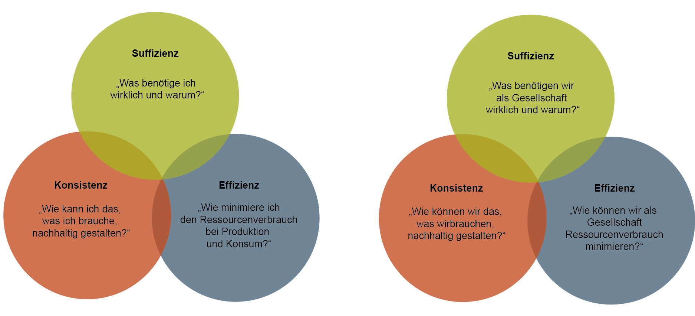

::: {.callout-note .leitfrage}
### Leitfrage

Leitfrage: Wenn wir in Kapitel 3 gesehen haben, woran unsere Wirtschaft beim Erreichen ihres Ziels – Wohlstand für alle, innerhalb ökologischer Grenzen – scheitert: Welche grundsätzlichen Stellschrauben gibt es, um das zu ändern?
:::

Mit Blick auf die ökologischen Grenzen unseres Planeten besteht in den meisten hochindustrialisierten Ländern auf wissenschaftlicher und politischer Ebene ein weitgehender Konsens darüber, dass ökologische Belastungsgrenzen (planetare Grenzen) auf Dauer eingehalten werden sollen. Mit dem 1,5-Grad- bzw. 2-Grad-Ziel wurde ein zentrales klimapolitisches Ziel im [Pariser Abkommen](https://www.fedlex.admin.ch/eli/fga/2017/81/de), welches die Schweiz mitunterzeichnet hat, auch international festgeschrieben. Auch in Bezug auf ökonomische und soziale Grenzen hat sich die Weltgemeinschaft mit der [Agenda 2030](https://sdgs.un.org/2030agenda) und die Schweiz spezifisch mit den Zielen der [Strategie Nachhaltige Entwicklung 2030](https://www.are.admin.ch/are/de/home/nachhaltige-entwicklung/strategie/sne.html) verpflichtet. Diese Ziele verlangen eine grundlegende Transformation unserer Wirtschaftsweise innerhalb weniger Jahrzehnte.

Damit stellt sich die entscheidende Frage: *Wie* genau soll diese Transformation gelingen? In der Nachhaltigkeitsdebatte werden dazu drei grundsätzliche Strategien diskutiert: **Effizienz**, **Konsistenz** und **Suffizienz**. Praktisch alle Ansätze für eine nachhaltige Entwicklung bauen auf diesen drei Strategien auf – sie unterscheiden sich aber darin, wie sie das Zusammenspiel und die Priorisierung der drei Strategien gewichten. Zur Erreichung der Nachhaltigkeitsziele braucht es letztlich wohl alle drei im Zusammenspiel:

*Abbildung 28: Die drei Nachhaltigkeitsstrategien; Eigene Darstellung*

### Effizienzstrategie

Die Effizienzstrategie zielt darauf ab, bei der Herstellung von Produkten oder der Bereitstellung von Dienstleistungen weniger Ressourcen (Rohstoffe und Energie) zu verwenden als bisher, ohne dass dabei die produzierte Menge zurückgeht. Dies beinhaltet die Minimierung des Materialverbrauchs (Materialintensität) und Energieverbrauchs (Energieintensität) sowie der Emission schädlicher Stoffe wie CO~2~. Dieses Konzept wird oft als **Ökoeffizienz** bezeichnet und wird in Wirtschaft und Gesellschaft als vielversprechend angesehen, da sie Kosten, Ressourcenverbrauch und Umweltbelastungen reduzieren kann. Die Effizienzstrategie setzt auf der Seite der Produktion an; hier wird eine Veränderung in erster Linie durch technologische Fortschritte angestrebt. Befürworter\*innen dieser Herangehensweise glauben daran, dass es möglich ist, den Wohlstand zu verdoppeln und gleichzeitig den Naturverbrauch zu halbieren [@weizsaeckerFaktorVierDoppelter1997]. Kritiker\*innen der Effizienzstrategie sind jedoch weniger optimistisch und warnen davor, ihre Auswirkungen auf nachhaltiges Wirtschaften zu überbewerten. Sie verweisen auf sogenannte *Rebound-Effekte (siehe Kapitel 3.1.3)*, die dazu führen können, dass die Gewinne aus Effizienzsteigerungen geringer ausfallen oder sogar kompensiert werden [@paechBefreiungVomUberfluss2012; @santariusReboundEffektUberUnerwunschten2014].

::: {.callout-tip collapse="true"}
### Beispiele Effizienzstrategie

- **Energieeffiziente Beleuchtung**: Der Austausch herkömmlicher Glühbirnen gegen energieeffiziente LED-Lampen reduziert den Stromverbrauch und trägt zur Senkung des Energiebedarfs bei.
- **Kraftstoffeffiziente Fahrzeuge**: Die Entwicklung von Hybrid- oder Elektrofahrzeugen mit einem verbesserten Kraftstoffverbrauch reduziert den Treibstoffbedarf und die Emissionen im Strassenverkehr.
- **Effiziente Gebäudetechnik**: Die Installation von intelligenten Heizungs-, Lüftungs- und Klimatisierungssystemen in Gebäuden trägt dazu bei, den Energieverbrauch für die Beheizung und Kühlung zu reduzieren.
- **Effiziente Wassernutzung**: Die Verwendung von Wasserspararmaturen und -systemen in Haushalten und Industrieunternehmen reduziert den Wasserverbrauch und minimiert die Verschwendung.
:::

### Konsistenzstrategie

Während die Effizienzstrategie mengenorientiert ist – weniger Ressourcenverbrauch bei mehr Ertrag – strebt die Konsistenzstrategie nach Vereinbarkeit von Natur und Technik, wobei das Ziel ist, Ressourcen wiederholt zu nutzen, anstatt sie nur einmal zu verbrauchen. Dies impliziert den Ersatz von Materialien, Produkten und Technologien, die häufig auf fossilen Ressourcen basieren, durch solche, die mit natürlichen Stoffkreisläufen übereinstimmen und in Einklang mit den natürlichen Prozessen ablaufen [@pufeNachhaltigkeit2017]. Dies wird oft als **Ökoeffektivität** bezeichnet und folgt dem "cradle to cradle"-Prinzip, bei dem Produkte von der "Wiege zur Wiege" gelangen, anstatt von der "Wiege zur Bahre". Die Idee dahinter lautet: in intelligenten Systemen gibt es keine Abfälle, nur Produkte. Dies kann auf zweierlei Weise erfolgen: Materialien können entweder biologisch abbaubar sein, wie bei Shampoo ohne synthetische Inhaltsstoffe, oder sie können als "technische Nährstoffe" konstruiert werden, die im technischen Kreislauf verbleiben. Das bedeutet, dass ein ausgedientes Produkt nicht auf den Müll kommt, sondern in einen nächsten Nutzungszyklus übergeht bspw. durch Upcycling aufgewertet wird. Beispielsweise könnte ein Computergehäuse immer wieder verwendet oder zu einem Regalsystem umfunktioniert werden. Die Konsistenzstrategie setzt auch auf der Seite der Produktion an. Von dieser Strategie werden ein grosses Problemlösungspotenzial sowie eine grössere Reichweite und tiefergreifende Veränderungen als von der Effizienzstrategie erwartet.

![Abbildung 29: Schematische Abbildung der Kreislaufwirtschaft. Quelle:[@bafuKreislaufwirtschaft2019]](images/abb2.png)

Dennoch: Die Stoffkreisläufe der Wirtschaft sind nicht ohne Massen- und Energieverluste machbar, absolute Konsistenz bleibt also ein unerreichbares Ideal. Auch zu 100% biologisch abbaubare Produkte verbrauchen Energie in der Herstellung. Dennoch versteht sich Konsistenz als Anstoss für die Industrie, dieses Ideal anzustreben und sowohl Ressourcenverbrauch als auch Emissionen so weit wie möglich zu senken.

::: {.callout-tip collapse="true"}
### Beispiele Konsistenzstrategie

- **Erneuerbare Energiesysteme**: Der Übergang von fossilen Brennstoffen zu erneuerbaren Energiequellen wie Sonnenenergie, Windenergie und Wasserkraft sorgt dafür, dass die Energieproduktion im Einklang mit den natürlichen Rhythmen und Kreisläufen der Umwelt erfolgt.
- **Kreislauffähige Elektronik**: Elektronische Geräte werden so konzipiert, dass sie leicht repariert, aufgerüstet und recycelt werden können, um den Ressourcenverbrauch und die Umweltbelastung zu minimieren.
- **Nachhaltige Bauweise**: Beim Bau von Gebäuden werden nachhaltige Materialien eingesetzt, die geringe Umweltauswirkungen haben und nach Ende der Nutzungsdauer wiederverwendet oder recycelt werden können.
:::

### Suffizienzstrategie

Suffizienz hinterfragt das Mass des Bedarfs für ein gutes Leben und zielt auf die Reduzierung von Ressourcen- und Energieverbrauch durch geringere Nachfrage nach ressourcenintensiven Gütern und Dienstleistungen. Suffizienz wird oft auch als Genügsamkeit oder Angemessenheit übersetzt. Sie betrachtet die durch Technologie und Werbung geschaffenen neuen Bedürfnisse im Zusammenhang mit den begrenzten natürlichen Ressourcen kritisch. Suffizienz fördert das Verständnis, nicht jedem neu geschaffenen Bedarf „nachzujagen“, und die Befriedigung von Bedürfnissen ohne Konsum. Im Unterschied zu Effizienz und Konsistenz liegt der Fokus der Suffizienz auf der Konsumseite, aber nicht ausschliesslich: Suffizienz kann in unterschiedlichem Ausmass und auf unterschiedlichen Ebenen praktiziert werden, von kleineren Verhaltensänderungen (teilen statt kaufen) bis hin zu erheblichen Veränderungen in der Lebensführung (Verzicht auf Flugreisen). Obwohl es auf individueller Ebene beginnt, kann Suffizienz auf verschiedenen Ebenen, einschliesslich Unternehmen (suffizienztaugliche Produktgestaltung) und Regierungen (Suffizienzpolitik), angewendet werden. Suffizienz fragt demnach nach dem rechten Mass: Wie viel brauchen wir für ein gutes Leben? Und was brauchen wir nicht? Über die Suffizienzstrategie wird eine leidenschaftliche und intensiv diskutierte Auseinandersetzung geführt [@sedlacekOekonomieGutUnd2012].

Kritiker\*innen beurteilen die Suffizienzstrategie als begrenzt im Hinblick auf ihr Einsparpotenzial und ihre soziokulturelle Resonanz. Sie zweifeln daran, dass sie eine breite Akzeptanz finden kann. Demgegenüber sind Befürworter\*innen der Meinung, dass die Suffizienzstrategie einen essenziellen Platz in der Nachhaltigkeitspolitik einnimmt, insbesondere dort, wo die Effizienz- und Konsistenzstrategien an ihre Grenzen stossen.

::: {.callout-tip collapse="true"}
### Beispiele Suffizienzstrategie

- **Teilen und gemeinschaftliches Nutzen**: Plattformen und Initiativen zum Teilen von Gegenständen, Werkzeugen oder Fahrzeugen ermöglichen es, Ressourcen effizienter zu nutzen und die Anzahl der hergestellten Produkte zu reduzieren.
- **Pflanzliche Ernährung**: Eine Umstellung auf eine vorwiegend pflanzliche Ernährung reduziert den Bedarf an Ressourcen wie Wasser und Land im Vergleich zur Fleischproduktion.
- **Arbeitszeitverkürzung**: Eine Reduzierung der Arbeitszeit kann zu einem geringeren Ressourcenverbrauch führen, da weniger Energie und Materialien für die Produktion von Gütern und Dienstleistungen benötigt werden.
- **Lokaler Konsum**: Die Unterstützung lokaler Produzenten und Märkte trägt dazu bei, Transportwege und Emissionen zu reduzieren.
:::

Lesen Sie zur Vertiefung der Auseinandersetzung mit der Suffizienzstrategie den Artikel vom Denknetz [„Die neue Debatte um Suffizienz“.](https://ilias.unibe.ch/go/file/3543905)

