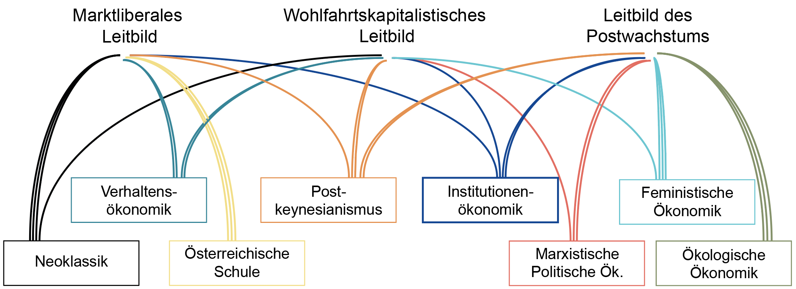

Leitfrage: Wie kann eine Gesellschaft dafür sorgen, dass ihre Wirtschaft tatsächlich das Ziel erreicht, das wir in Kapitel 2 als Ausgangspunkt genommen haben – Wohlstand für alle, innerhalb ökologischer Grenzen?

*↗ Lehrbuchkapitel 10 und 21*

Wir haben in diesem Skript einen weiten Bogen zurückgelegt: In Kapitel 1 haben wir gesehen, dass es nicht die eine Ökonomik gibt, sondern verschiedene Denkschulen mit je eigenen Grundannahmen. In Kapitel 2 haben wir uns mit Wohlstand als eigentlichem Ziel von wirtschaftlichem Handeln auseinandergesetzt und haben uns gefragt, womit dieser Wohlstand bereitgestellt wird (Produktionsfaktoren, Güter) und wie diese Bereitstellung koordiniert wird. In Kapitel 3 haben wir gesehen, dass unsere heutige Wirtschaft dieses Ziel in mehrfacher Hinsicht verfehlt, und in Kapitel 4 haben wir mit Effizienz, Konsistenz und Suffizienz drei Strategien kennengelernt, wie sich diesen Problemen begegnen liesse. Damit schliesst sich der Kreis zur ursprünglichen Frage aus Kapitel 2: Wie muss eine Wirtschaft koordiniert werden, damit Wohlstand für alle, innerhalb ökologischer Grenzen tatsächlich erreicht wird?

Somit stellt sich jetzt die Umsetzungsfrage: Wer sorgt eigentlich dafür, dass es so weit kommt? Der Markt allein, oder braucht es dafür den Staat? Und diese Frage lässt sich nicht unabhängig davon beantworten, was wir bereits gesehen haben: Je nachdem, welches Verständnis von Wirtschaft, Märkten und Kapitalismus man vertritt, fällt auch die Antwort auf die Rolle des Staates unterschiedlich aus – von einem auf Marktversagen beschränkten Eingreifen bis hin zu einem aktiv gestaltenden oder gar grenzensetzenden Staat.

Diese unterschiedlichen Vorstellungen von Staat und Markt stehen dabei nicht einfach isoliert nebeneinander. Sie verdichten sich in der Praxis zu grösseren, kohärenten **wirtschaftspolitischen Leitbildern** – also zu Gesamtbildern davon, wie Staat, Markt und Gesellschaft zusammenspielen sollen, damit das gemeinsame Ziel erreicht wird. In unserer Veranstaltung unterscheiden wir in Anlehnung an Novy et al. [-@novyZukunftsfaehigesWirtschaften2023] drei grundlegende wirtschaftspolitische Leitbilder, die aus den Einflüssen verschiedenen Denkschulen heute beobachtbar sind: den **Marktliberalismus**, den **Wohlfahrtskapitalismus** und das **Postwachstum**. Jedes davon lässt sich auf die Denkstile zurückführen, die uns durch das ganze Skript begleiten.

## Warum "Markt vs. Staat" historisch keine Selbstverständlichkeit ist

Dass wir überhaupt davon sprechen können, der Staat „greife in den Markt ein“, ist keine allgemeine historische Wahrheit. Für Menschen, die vor der Entstehung des modernen Kapitalismus gelebt haben, hätte diese Formulierung schlicht keinen Sinn ergeben. In diesem Kapitel wollen wir der Frage nachgehen, was die spezifische Rolle des Staates im Kapitalismus ist und wie sich das Handeln staatlicher Institutionen in Bezug auf die Ökonomie erklären lassen.

Wie wir im Einführungskapitel gesehen haben, wurde erst mit dem Übergang vom Feudalismus zum industriellen Kapitalismus die Wirtschaft als vermeintlich eigene, von politischer Macht getrennte Sphäre gedacht. Ellen Meiksins Wood [-@woodOriginCapitalismLonger2017] zeigt, dass im Feudalismus ökonomische und politische Herrschaft untrennbar verbunden waren: der Adel nahm Leibeigenen per direktem politischem Zwang einen Teil ihrer Produktion ab. Lohnarbeit war zu dieser Zeit eine Randerscheinung und die Produktion war durch Handwerksbetriebe, Landwirtschaft und Subsistenzproduktion geprägt. Im Übergang zum industriellen Kapitalismus und dem aufkommenden Liberalismus wurde der Staat als die Sphäre der Macht, ihrer Verteilung und Begrenzung sowie zunehmend der demokratischen Mitbestimmung verstanden. Demgegenüber stand die bürgerliche Gesellschaft, die als vom Staat getrennter, durch Rechte geschützter und von der individuellen, rationalen Verfolgung ökonomischer Interessen geprägter Teilbereich der Gesellschaft verstanden wurde. Die Ökonomie wurde also insbesondere durch das Recht auf Privateigentum als separater und vor dem Staat geschützter Raum gedacht, der als weitgehend frei von Machtbeziehungen verstanden wurde.

Wenn wir heute von der richtigen Form des Staates reden, dann meinen wir in der Regel die liberale parlamentarische Demokratie, in der zwar Wahlen stattfinden, die aber auch das Privateigentum vor Eingriffen des Staates schützt. Die Ökonomie ist damit kein Bereich, in dem demokratische Verfahren Platz haben. Wenn wir in den Supermarkt gehen, dann stehen wir dort nicht vor Gütern, über die wir uns gesellschaftlich geeinigt haben, sondern vor solchen, die die Supermarktkette für profitabel hält. Wenn wir zur Arbeit gehen, erwarten wir nicht, dort über die Produktionsziele und die Verteilung der Gewinne mitzureden, sondern akzeptieren die Bestimmung unseres Arbeitgebers im Gegenzug für einen Lohn. Demokratie findet also zwar in der politischen Sphäre durch Wahlen statt, in der praktischen Lebensrealität, die vor allem auch durch Lohnarbeit und Warenkauf geprägt ist, ist die Möglichkeit, demokratischen Einfluss auf unsere Lebensumstände zu nehmen, jedoch begrenzt (Anderson 2019).

Dass wir heute überhaupt sinnvoll von „staatlichen Eingriffen in den Markt“ sprechen können, ist also selbst ein Produkt einer bestimmten historischen und politischen Konstellation, und deshalb kein neutraler Ausgangspunkt. Diese Erkenntnis ist zentral für die folgenden Abschnitte: Wenn die Trennung zwischen Markt und Staat historisch gemacht ist, dann ist auch die Frage, *wie* Staat und Markt zueinanderstehen sollen, keine rein technische, sondern immer auch eine politische Frage.

## Marktliberales Leitbild: Der Staat als Nachtwächter

Im meistverbreiteten Lehrbuch für Ökonomie [@mankiwEconomics2020] wird die Staatsrolle über vier Begriffe definiert: Eigentumsrechte, Marktmacht, Marktversagen, Externalitäten. Der Markt gilt als grundsätzlich effizient und Abweichungen bedürfen der Begründung. Daraus entsteht jedoch ein gewisser Zirkelschluss: Führt der Markt zu schlechten Ergebnissen, liegt das nie am Markt selbst, sondern an unvollständigen Eigentumsrechten oder unvollständigen Märkten. Demzufolge müssen neue Märkte geschaffen werden, statt der Markt als Organisationsprinzip infrage gestellt werden. Genau dieser Zirkelschluss ist der Ansatzpunkt, an dem Samuel Bowles ansetzt (siehe unten).

David Harvey fasst die vorherrschende Grundidee der Rolle des Staates aus einer neoklassischen Perspektive folgendermassen zusammen:

> “Staatliche Eingriffe in Märkte (sobald sie geschaffen wurden) müssen auf ein absolutes Minimum beschränkt werden, weil der Staat nach der Theorie unmöglich über genügend Informationen verfügen kann, um Marktsignale (Preise) zu antizipieren“ (Harvey 2005, S. 2)

Heute wird häufig auch mit dem Begriff des *Nachtwächterstaats* auf dieses Verständnis verwiesen. Demgegenüber weisen Kritiker\*innen wie u.a. Michel Foucault oder Quinn Slobodian darauf hin, dass die Durchsetzung, Aufrechterhaltung und das Management von Märkten keinesfalls einen schwachen Staat ergeben, sondern einen starken Staat bedingen [@slobodianGlobalistsEndEmpire2018].

Die hier basierend auf einem neoklassischen Verständnis beschriebene Rolle des Staates, die sich auf die Gewährleistung von Privateigentum an Produktionsmitteln (Eigentumsrechte), der Verhinderung von Monopolen (Marktmacht) und begrenzten Eingriffen zur Korrektur des Marktgeschehens (Marktversagen und Externalitäten) beschränkt, bezeichnen wir als **marktliberales Leitbild**.

### Kritik am marktliberalen Leitbild: Märkte sind nicht neutral - sie konstituieren

Eine wichtige Kritik des marktliberalen Leitbilds und der von ihm zugewiesenen Rolle des Staats entstammt der Beobachtung, dass dessen Konzept des Marktversagens häufig zu eng gefasst ist. Der Ökonom Samuel Bowles argumentiert etwa, dass Märkte nicht nur Ressourcen allozieren und Einkommen verteilen, sondern dass sie auch **Kultur, Präferenzen und Machtstrukturen formen**. Damit sind sie „ebenso sehr politische und kulturelle Institutionen wie ökonomische“ [@bowlesWelcheGueterSollen2014, p. 471]. Vier Bausteine tragen dieses Argument:

**Endogene vs. exogene Teilnehmende.** Der abstrakte Markt aus dem Lehrbuch, wie wir ihn in Kapitel 2.5 diskutiert haben, unterstellt exogene, unveränderliche Präferenzen. Sobald Teilnehmende *endogen* sind (der Markt selbst hat Auswirkungen auf ihre Fähigkeiten, Werte, Wünsche) funktioniert die Allokation auf Märkten nicht mehr so effizient, wie im Model beschrieben, weil es auf genau dieser Exogenitätsannahme beruht [@bowlesWelcheGueterSollen2014, p. 481].

**Umstrittene Märkte. **Wo Durchsetzung von Ansprüchen endogen erfolgt (durch die Teilnehmenden selbst statt durch Dritte), entsteht eine Machtbeziehung zwischen der Seite mit der grösseren Knappheit und der anderen “selbst dann, wenn der Austauschprozess unter voller Information stattfindet, ohne Zwang und unter vollständigen Wettbewerbsbedingungen“ [@bowlesWelcheGueterSollen2014, p. 478].

**Unvollständige Verträge als Regelfall, nicht Ausnahme.** Weil Verträge nie alle Eventualitäten abdecken können, braucht es politische oder soziale Mechanismen, um die Lücken zu füllen. Genau deshalb sind Märkte politisch.

**Konstitutive Austauschprozesse.** "Wenn Freunde sich Geschenke machen, machen Geschenke Freunde" [@bowlesWelcheGueterSollen2014, p. 475] — wie Arbeit organisiert und verteilt wird, prägt die Entwicklung unserer Fähigkeiten und Normen. Das heisst Märkte sind konstitutiv.

Folgen wir den Argumenten von Bowles, ist Marktversagen kein seltener Ausnahmefall, sondern strukturell fast überall vorhanden ausserhalb vom abstrakten Modell aus dem (marktliberalen) Lehrbuch.

## Wohlfahrtskapitalistisches Leitbild: Der Staat als Stabilisator und Mitgestalter

Eine weitere, weit anerkannte Kritik des marktliberalen Leitbilds stammt vom Ökonomen John Maynard Keynes, der diese im Nachgang zur Grossen Depression (ab 1929) formulierte. Eine zentrale Einsicht bei Keynes ist, dass Marktwirtschaften aus ihren eigenen Logiken heraus Unsicherheit und Instabilität generieren. Märkte und insbesondere die gesamtwirtschaftliche Nachfrage stabilisieren sich nicht von selbst, sondern sind immer krisenanfällig, da langfristig orientierte, rationale Entscheidungen in einem von starker Unsicherheit geprägten Umfeld kaum möglich sind. In Krisenzeiten kann die Unsicherheit über die Zukunft zu Unterinvestitionen und Konsumverzicht führen und damit zu einer suboptimalen Nutzung gesellschaftlicher Ressourcen. Der Staat hat nach der keynesianischen Theorie insofern die Rolle, durch antizyklisches Handeln (also notfalls auch schuldenfinanzierte Erhöhung seiner Ausgaben in Krisenzeiten) die gesamtwirtschaftliche Nachfrage zu stabilisieren. Grundsätzlich soll der Staat ausserdem auch die gesellschaftlichen Investitionen stabilisieren, etwa durch öffentliche Investitionsprogramme.

> _"The most important thing for Government is not to do things which individuals are doing already, and to do them a little better or a little better; but to do those things which at present are not done at all."_ John Maynard Keynes (1926) in The End of Laissez-Faire [@keynesEndLaissezFaireEconomic2020] S. xx [[1](http://www.chaloupek.eu/wp-content/uploads/End-of-Laissez-Faire1.docx.pdf)]

Die Rolle des Staates erweitert sich im Vergleich zu jener der Neoklassik. Basierend auf den Ideen von Keynes hat der Staat die Aufgabe, den materiellen Wohlstand sicherzustellen und zu schützen bspw. durch den Aufbau eines Sozialstaates. So sollen wettbewerbsfähige Wirtschaftsmassnahmen mit sozialer Gerechtigkeit und in grünen Varianten auch mit Umweltschutz zu verknüpfen werden. Dieses Verständnis der Rolle des Staates beschreiben wir als **wohlfahrtskapitalistisches Leitbild**.

### Kritik am wohlfahrtskapitalistischen Leitbild: von "correcting" zu "shaping"

Die Beobachtung von Bowles’ aufgreifend argumentiert die Ökonomin Mariana Mazzucato, dass die korrigierende Funktion des Staats, wie von Keynes begründet, letztlich nicht ausreichend sein wird: wenn Märkte konstitutiv wirken, reicht Korrektur nicht – der Staat muss Märkte proaktiv mitgestalten ("market shaping not fixing"). Mazzucato [-@mazzucatoMissionEconomyMoonshot2022; -@mazzucatoValueEverythingMaking2018] macht daraus ein Regierungsprogramm: Marktversagen soll nicht als Ausnahme, sondern als Regelfall behandelt werden. Ihre Arbeit fusst auf der historischen Beobachtung, dass viele bahnbrechende Technologien mindestens anfänglich nur durch (häufig massive) staatliche Investitionen ermöglicht wurden. Das berühmteste Beispiel dafür ist das Internet, dessen Vorläufer, das Arpanet, als militärische Technologie entwickelt wurde. Ebenso weist sie auf unzählige zivile Anwendungen von Innovationen hin, die ursprünglich mit viel staatlichem Geld für die Weltraumprogramme der NASA entwickelt wurden. Mit anderen Worten: Hätten Staaten nicht den Anfang gemacht und die für private Geldgeber viel zu teuren und risikoreichen Investitionen in die Entwicklung von Kerntechnologien getätigt, hätten viele später darauf basierende Innovationen ebenfalls nicht entwickelt werden können. Solche staatliche Vorfinanzierung könnte man entsprechend als „vorhersehende“ Korrektur von Marktversagen verstehen, doch wäre es treffender, stattdessen von aktivem Formen und Co-Design zu sprechen.

Mazzucato als auch Bowles sprechen somit dem Staat eine deutlich aktivere und präsentere Rolle zu als es aus einer neoklassischen (wie auch wohlfahrtskapitalistischen) Perspektive gemacht wird. Bornemann et al. (2018) beschreiben drei unterschiedliche Rollen der Funktionen, welche ein Staat für eine gesellschaftliche Transformation einnehmen kann: (1) **Regulierer** mit Fokus auf Begrenzen und Bewahren, (2) Innovator und Exnovator mit Fokus auf der **Gestaltung** von Märkten und (3) als **Ermöglicher** bspw. von Experimenten und sozialen Innovationen für nachhaltigere Produktions- und Konsumptionsmuster.

Die unterschiedlichen staatlichen Interventionen während der Covid-Pandemie zeigen die unterschiedlichen Vorstellungen der Rolle und Funktion eines Staates beispielhaft. Während in der Schweiz Covid-Kredite beinahe gänzlich ohne Auflagen vergeben wurden (bspw. wurde der Swiss ein Milliardenkredit gewährt ohne Auflagen wie jene eines Dividendenauszahlverbots während den Folgejahren der Pandemie), wurden in anderen Ländern die Covid Kredite an Bedingungen geknüpft: Dänemark vergab keine Rettungskredite an Firmen in Steueroasen oder Frankreich verband die Kredite an die Air France mit Klimakonditionen (bspw. weniger Inlandflüge, rechtlich allerdings nicht bindend).

## Postwachstumsleitbild: Der Staat als Hüter von Grenzen – oder Teil des Problems?

Das Hauptziel des Postwachstumsansatzes ist ein erfülltes Leben in einer nachhaltigen Gesellschaft, die sich in harmonischer Weise zur Natur verhält, indem der Zwang zum ständigen Wirtschaftswachstum im kapitalistischen System überwunden wird. Angestrebt wird eine Wirtschaft, die in einem stabilen Zustand verharrt (*steady-state economy*) oder unabhängig von Wirtschaftswachstum funktionieren kann und die grundlegende Versorgung der Menschen sicherstellt, insbesondere über das Prinzip der Suffizienz (die richtige, nicht die maximale Menge an Ressourcennutzung).

Die ökologische Ökonomik versteht die Wirtschaft als eingebettetes Teilsystem der Erde und nicht als isolierten Kreislauf zwischen Haushalten und Firmen. Damit verschiebt sich auch die Frage nach der Rolle des Staates: Es geht nicht in erster Linie um die Korrektur einzelner Marktversagen, sondern darum, den gesamten ökonomischen Durchsatz (throughput) innerhalb der Tragfähigkeit des Planeten zu halten [@rockstromSafeOperatingSpace2009d]. Herman Daly [-@dalyNewEconomicsOur2017], eine Gründerfigur der ökologischen Ökonomik, leitet daraus ein explizit staatszentriertes Institutionendesign für eine "steady-state economy" ab. Drei Instrumente, für die es einen starken, gestaltenden Staat braucht, weil kein Markt sie sich selbst geben kann:

- Cap-auction-trade-Systeme: Der Staat legt eine physische Obergrenze für Ressourcenentnahme und Schadstoffausstoss fest (den "cap"), versteigert Nutzungsrechte und überlässt erst innerhalb dieser Grenze die Allokation dem Markt.

- Grenzen für Einkommens- und Vermögensverteilung (Mindest- und Höchsteinkommen), damit eine gedeckelte Ressourcennutzung nicht einfach zu schärferer Verteilungskonkurrenz um ein fixes "Kuchenstück" führt.

- Bevölkerungspolitische Instrumente zur Stabilisierung des Ressourcenbedarfs.

Der Markt bleibt als Allokationsmechanismus innerhalb der Grenzen durchaus erwünscht, aber nur der Staat kann die Grenze selbst legitim setzen und durchsetzen. Diese Logik deckt sich mit den bereits oben diskutierten Funktionen eines "gestaltenden Staates" oder auch Gabor & Braun ([@schmelzerDegrowthPostwachstum2019]"big green state"), die vier Modelle staatlich gelenkter ökologischer Transformation unterscheiden. Diese Modelle bewegen sich zwischen zwei Polen: (1) **Carbon shock therapy**: Erzwingung der Transformation über einen sehr hohen, der Klimakrise angemessenen CO~2~-Preis. Ein Beispiel für eine volle marktwirtschaftliche Steuerung und (2) **Big green state**: ein massiv intervenierender Staat mit eigenen Anteilen an der Ökonomie, der ökologische Planung betreibt und private Investor\*innen zu ökologischem Handeln zwingt.

### Kritik am Postwachstumsleitbild: Der Staat als ideeller Gesamtkapitalist

So weitreichend das Instrumentarium der ökologischen Ökonomik auch ist – es teilt mit dem wohlfahrtskapitalistischen Leitbild eine Grundannahme, die aus Sicht der Marxistischen Politischen Ökonomie (MPÖ) das eigentliche Problem ist: dass der Staat eine im Prinzip neutrale, im Gemeinwohl handelnde Instanz sei, die man nur mit den richtigen Kompetenzen und dem richtigen Mandat ausstatten müsse. Die MPÖ begreift den Staat dagegen dezidiert nicht als neutral, sondern als Instrument der jeweils herrschenden Klasse: “Der moderne Staat, was auch seine Form, ist […] der ideelle Gesamtkapitalist“ (Engels 1975, S. 260). Der Staat handelt nicht im Interesse einzelner Kapitalfraktionen, sondern im Interesse der Aufrechterhaltung des Kapitalismus insgesamt, was durchaus Sozialpolitik oder Mitbestimmung einschliessen kann, solange das Privateigentum an Produktionsmitteln nicht infrage gestellt wird.

Für die Rolle des Staates im Postwachstum bedeutet das u.a., dass auch ein "big green state" strukturell an die Reproduktion des Kapitalverhältnisses gebunden bleibt. Ein Cap-auction-trade-System etwa versteigert Nutzungsrechte an dieselben Akteure, die zuvor von der Übernutzung profitiert haben, und die Erträge daraus fliessen in denselben Staat zurück, der über Wachstum, Beschäftigung und Steuereinnahmen strukturell an eben diese kapitalistische Produktion gebunden bleibt. Der Staat kann Grenzen verwalten – er kann aber, so die MPÖ, die Wachstumsabhängigkeiten nur schwer von innen heraus auflösen, weil er selbst Teil davon ist (Wachstumszwang über Steuersystem, Sozialversicherung, Legitimation über Beschäftigung).

Die MPÖ sucht die Alternative deshalb konsequenter ausserhalb von Markt und (kapitalistischem) Staat: in Commons, Genossenschaften und kollektiver Selbstverwaltung.

## Jenseits von Markt und Staat

Mit den Commons, Genossenschaften und Formen kollektiver Selbstverwaltung, die die MPÖ als Alternative ins Spiel bringt, ist bereits ein Weg jenseits der Alternative „Markt oder Staat“ angedeutet. Aus einer pluralen Betrachtung, die die verschiedenen vorgestellten Perspektiven nebeneinanderstellt, wird zugleich deutlich: Was der Staat macht und machen darf, ist das Ergebnis politischer und gesellschaftlicher Aushandlungsprozesse. Wenn – wie wir in Kapitel 5.1 gesehen haben – schon die Trennung zwischen Markt und Staat selbst historisch entstanden und keineswegs selbstverständlich ist, dann drängen sich erst recht neue Fragen auf: Wie sieht demokratische und gemeinwohlorientierte Kontrolle von ökonomischen Prozessen konkret aus? Wer entscheidet auf welche Weise darüber, was, wie viel und wie produziert wird? Wie lassen sich Marktkonzentration und Missbrauch verhindern und langfristige Orientierung am Gemeinwohl sicherstellen?

In diesem Kapitel haben wir drei wirtschaftspolitische Leitbilder – Marktliberalismus, Wohlfahrtskapitalismus und Postwachstum – kennengelernt, die die Rolle des Staates unterschiedlich interpretieren. Sie stützen sich auf die wissenschaftlichen Konzepte der verschiedenen Denkstile, prägen umgekehrt aber auch die wissenschaftliche Debatte selbst mit – schliesslich ist auch die Ökonomik, wie eingangs diskutiert, nicht frei von normativen Prägungen.

Im Vertiefungsblock orientieren wir uns an diesen Leitbildern und den ihnen zugrunde liegenden Denkstilen, mit Fokus auf das Postwachstumsleitbild sowie – in geringerem Mass – auf Ansätze des grünen Wachstums im wohlfahrtskapitalistischen Leitbild. Die folgende Übersicht zeigt, wie die Denkstile in die drei Leitbilder einfliessen. Diese Zuordnung ist allerdings nicht in Stein gemeisselt: Sie kann je nach Standpunkt variieren, und manche Denkschulen lassen sich nicht eindeutig einem der drei Leitbilder zuordnen.

*Abbildung 30: Eigene Darstellung in Anlehnung an die Darstellungen von Exploring Economics*

